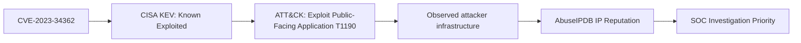
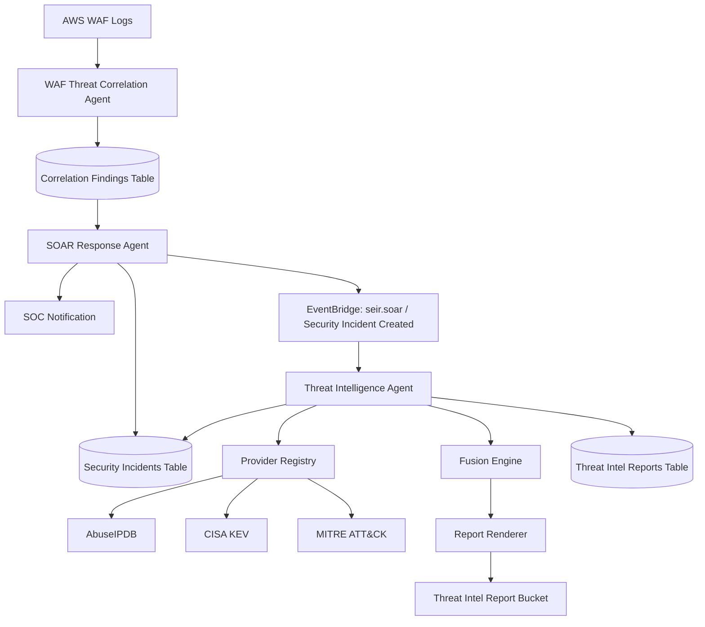

# Security Intelligence Foundations

## Table Of Contents

- [Purpose](#purpose)
- [Audience](#audience)
- [Threat Intelligence In This Repository](#threat-intelligence-in-this-repository)
- [Core Concepts](#core-concepts)
- [AbuseIPDB](#abuseipdb)
- [CISA Known Exploited Vulnerabilities](#cisa-known-exploited-vulnerabilities)
- [CVEs](#cves)
- [MITRE ATT&CK](#mitre-attck)
- [How The Systems Relate](#how-the-systems-relate)
- [Repository Integration](#repository-integration)
- [Operational Considerations](#operational-considerations)
- [Extension Guidance](#extension-guidance)
- [Troubleshooting](#troubleshooting)
- [References](#references)

## Purpose

This document is permanent engineering documentation for the threat intelligence infrastructure in this repository. It explains the security concepts, external intelligence sources, repository code paths, operational constraints, and extension points needed to maintain and evolve the implementation.

The current implementation is centered on the Lab 12d Threat Intelligence Agent. That agent receives incident-created events from the SOAR Response Agent, extracts an indicator, queries compatible threat intelligence providers, fuses provider evidence, renders reports, stores artifacts, and updates the original incident record.

## Audience

This document assumes the reader has general software engineering experience but little or no prior background in cyber threat intelligence. It explains concepts from first principles, then maps them to the repository implementation.

## Threat Intelligence In This Repository

Threat intelligence is structured information about adversaries, vulnerable systems, attacker behavior, malicious infrastructure, and observed exploitation. In this project, threat intelligence is not used for automatic containment. It is used to support human investigation.

The current threat intelligence architecture answers questions like:

- Is this source IP known for abusive behavior?
- Is this CVE known to be exploited in the wild?
- Does this attack behavior map to a known ATT&CK technique?
- How confident are we in the available evidence?
- What should an analyst check next?

The implementation currently uses three external intelligence sources:

- AbuseIPDB for IP reputation.
- CISA Known Exploited Vulnerabilities for CVE exploitation status.
- MITRE ATT&CK for adversary behavior and technique context.

> [!IMPORTANT]
> The current IP-only SOAR workflow depends primarily on AbuseIPDB for external IP intelligence. If `ABUSEIPDB_API_KEY` is not configured, the agent can still complete, but the report will likely be `PARTIAL` with unknown risk and low confidence. This is expected behavior with the current provider coverage.

## Core Concepts

### Indicator

An indicator is the object being investigated. Examples include:

- IP address: `73.166.82.125`
- CVE: `CVE-2023-34362`
- ATT&CK technique: `T1190`
- Domain name, URL, file hash, or email address in future extensions

In this repository, the shared provider model represents an indicator with:

```python
@dataclass(frozen=True)
class Indicator:
    value: str
    indicator_type: str

    @property
    def indicator_id(self) -> str:
        return f"{self.indicator_type.upper()}:{self.value}"
```

This creates stable identifiers such as `IP:73.166.82.125` and `CVE:CVE-2023-34362`.

### Provider

A provider is a component that knows how to query one source of intelligence. Providers return normalized results so the rest of the system does not need to understand each external API shape.

The provider contract lives in:

```text
phase_2/lab_12d/terraform/lambda/src/threat_intelligence_agent/providers/base.py
```

### Evidence

Evidence is the normalized set of facts returned by providers. Evidence is not a final decision. For example, an AbuseIPDB score of `85` is evidence; the repository's fusion engine decides how that affects risk and confidence.

### Fusion

Fusion is the process of combining multiple provider results into one assessment. The fusion engine lives in:

```text
phase_2/lab_12d/terraform/lambda/src/threat_intelligence_agent/fusion.py
```

It creates two outputs:

- `ThreatEvidence`: normalized facts and provider coverage.
- `ThreatSummary`: final risk, confidence, priority, reasons, and limitations.

### Report

The report layer turns fused intelligence into analyst-facing JSON, Markdown, and console output. It lives in:

```text
phase_2/lab_12d/terraform/lambda/src/threat_intelligence_agent/report.py
```

Reports are stored in S3 as full artifacts and summarized in DynamoDB.

## AbuseIPDB

### What It Is

AbuseIPDB is a community-driven IP reputation platform. It collects reports of IP addresses involved in abuse such as scanning, brute forcing, spam, web attacks, bot activity, and other unwanted behavior. Its official API documentation describes APIs for checking, reporting, and bulk handling IP address reputation data: <https://www.abuseipdb.com/api.html>.

### Why It Exists

Many attacks come from reusable infrastructure: compromised hosts, proxies, VPN exit nodes, botnets, misconfigured servers, and intentionally malicious systems. AbuseIPDB exists so defenders can share observations about abusive IP addresses and use those shared observations during investigation.

### What Problem It Solves

A WAF event can show that an IP address sent suspicious traffic, but WAF metadata alone does not tell whether that IP has a broader history of abuse. AbuseIPDB helps answer:

- Has this IP been reported by other defenders?
- How many times has it been reported?
- How recently was it reported?
- What types of abuse were reported?
- Is the IP associated with Tor, hosting, ISP, or other context?

### How It Works Internally

AbuseIPDB combines community reports into reputation data. Each report identifies an IP address, one or more abuse categories, and optional context. The API returns normalized reputation fields, including an abuse confidence score. The official API docs describe the `check` API and the account/API-key model: <https://www.abuseipdb.com/api.html>.

Important concepts:

- **Abuse confidence score:** a 0-100 score representing AbuseIPDB's confidence that an IP is associated with abusive activity.
- **Total reports:** count of reports against the IP in the selected time window.
- **Distinct reporting users:** number of unique reporters.
- **Max age:** the lookback window, such as 90 days.
- **Verbose mode:** asks the API for additional report details.
- **Whitelist status:** an indicator that the IP should not be treated as abusive solely from raw report count.

### APIs And Responses

This repository uses the API v2 `check` endpoint:

```text
https://api.abuseipdb.com/api/v2/check
```

The provider sends:

```python
params = urllib.parse.urlencode(
    {
        "ipAddress": indicator.value,
        "maxAgeInDays": self.max_age_days,
        "verbose": "true",
    }
)

request = urllib.request.Request(
    f"{self.endpoint}?{params}",
    headers={
        "Accept": "application/json",
        "Key": self.api_key,
    },
    method="GET",
)
```

The API key is sent in the `Key` header. This is preferable to putting the key in a query string because URLs may be logged by tools, proxies, and monitoring systems.

The provider normalizes the response into fields such as:

```python
normalized = {
    "abuse_confidence_score": data.get("abuseConfidenceScore", 0),
    "total_reports": data.get("totalReports", 0),
    "distinct_reporting_users": data.get("numDistinctUsers", 0),
    "country_code": data.get("countryCode"),
    "domain": data.get("domain"),
    "isp": data.get("isp"),
    "usage_type": data.get("usageType"),
    "is_tor": data.get("isTor", False),
    "is_whitelisted": data.get("isWhitelisted", False),
    "last_reported_at": data.get("lastReportedAt"),
}
```

### Rate Limits And Plans

AbuseIPDB documents free and paid plan limits on its pricing page: <https://www.abuseipdb.com/pricing>. The free tier is useful for development and lab validation, but production usage should account for request volume, test traffic, and retry behavior.

Common operational mistake: using high-volume synthetic WAF testing can quickly consume API quota if every SOAR incident triggers an IP reputation lookup.

### Authentication And API Key Management

AbuseIPDB requires an account and API key. According to its API documentation, keys are created from the account's API settings page and can be regenerated. Treat the key like a password because it can be used to query and submit reports on behalf of the account.

Current repository behavior:

```text
ABUSEIPDB_API_KEY
ABUSEIPDB_ENDPOINT
ABUSEIPDB_MAX_AGE_DAYS
```

Terraform currently passes the key as a Lambda environment variable in:

```text
phase_2/lab_12d/terraform/new-code.tf
```

```hcl
ABUSEIPDB_API_KEY      = var.abuseipdb_api_key
ABUSEIPDB_ENDPOINT     = "https://api.abuseipdb.com/api/v2/check"
ABUSEIPDB_MAX_AGE_DAYS = "90"
```

> [!WARNING]
> This is acceptable for the current lab iteration but should not be treated as the final secrets pattern. A production implementation should retrieve the key from AWS Secrets Manager or AWS Systems Manager Parameter Store and should rotate it on an operational schedule.

### Best Practices

- Store API keys outside source control.
- Prefer Secrets Manager or SSM Parameter Store over plain environment variables for long-lived secrets.
- Use the header authentication pattern.
- Avoid repeated lookups for the same indicator in tight loops.
- Cache recent results when practical.
- Treat reputation as supporting evidence, not proof of maliciousness.
- Validate external intelligence against internal telemetry before containment.

### Repository Usage

The AbuseIPDB provider lives in:

```text
phase_2/lab_12d/terraform/lambda/src/threat_intelligence_agent/providers/abuseipdb.py
```

It supports:

```python
supported_indicator_types = {"IP", "IPV4", "IPV6"}
```

If `ABUSEIPDB_API_KEY` is missing, it returns a provider result with status `ERROR`. The Lambda should still complete, but the report will show incomplete coverage.

## CISA Known Exploited Vulnerabilities

### What CISA Is

CISA is the Cybersecurity and Infrastructure Security Agency, a United States government agency focused on cybersecurity, infrastructure security, and resilience. Its Known Exploited Vulnerabilities Catalog is an authoritative list of vulnerabilities known to have been exploited in the wild. CISA describes the KEV catalog as a source organizations should use in vulnerability management prioritization: <https://www.cisa.gov/known-exploited-vulnerabilities-catalog>.

### What The KEV Catalog Is

The KEV Catalog is a curated catalog of CVEs that CISA has determined are known to be actively exploited. It includes fields such as:

- CVE ID.
- Vendor or project.
- Product.
- Vulnerability name.
- Date added.
- Required action.
- Due date.
- Ransomware campaign usage indicator.
- Notes.

CISA provides the catalog in formats including CSV, JSON, and JSON Schema from the official KEV page: <https://www.cisa.gov/known-exploited-vulnerabilities-catalog>.

### Why KEV Exists

Traditional vulnerability feeds can include tens or hundreds of thousands of CVEs. Many have no known exploitation in the wild. KEV exists to identify vulnerabilities that defenders should prioritize because real attackers are using them.

This makes KEV more actionable than broad vulnerability feeds. A CVE with a critical CVSS score may be dangerous in theory, but a CVE in KEV has confirmed exploitation evidence.

### How Vulnerabilities Are Added

CISA adds vulnerabilities when there is reliable evidence that they have been exploited in the wild and they meet CISA's catalog criteria. The catalog is curated rather than mechanically generated from all CVEs.

### Data Format

This repository consumes the KEV JSON feed:

```text
https://www.cisa.gov/sites/default/files/feeds/known_exploited_vulnerabilities.json
```

The CISA provider reads the `vulnerabilities` array and searches for a matching `cveID`:

```python
match = next(
    (
        item
        for item in vulnerabilities
        if str(item.get("cveID", "")).upper() == cve
    ),
    None,
)
```

When a match is found, the provider returns high-confidence evidence:

```python
data = {
    "cve_id": cve,
    "known_exploited": True,
    "ransomware_associated": (...),
    "vendor_project": match.get("vendorProject"),
    "product": match.get("product"),
    "vulnerability_name": match.get("vulnerabilityName"),
    "date_added": match.get("dateAdded"),
    "due_date": match.get("dueDate"),
    "required_action": match.get("requiredAction"),
    "confidence": 95,
    "risk": "HIGH",
}
```

### Repository Usage

The CISA provider lives in:

```text
phase_2/lab_12d/terraform/lambda/src/threat_intelligence_agent/providers/cisa_kev.py
```

It supports:

```python
supported_indicator_types = {"CVE"}
```

That means it does not run for IP-only SOAR events. It runs when the agent receives or derives an indicator such as `CVE-2023-34362`.

## CVEs

### What A CVE Is

CVE stands for Common Vulnerabilities and Exposures. The CVE Program's mission is to identify, define, and catalog publicly disclosed cybersecurity vulnerabilities: <https://www.cve.org/ResourcesSupport/FAQs>.

A CVE gives the security community one shared identifier for a vulnerability. Without CVEs, different vendors, tools, and advisories might refer to the same flaw using unrelated names.

### Why CVEs Exist

CVEs solve the naming problem in vulnerability management. They make it possible for scanners, advisories, patch systems, threat intelligence, compliance tools, and ticketing systems to refer to the same vulnerability consistently.

### CVE Numbering

A CVE ID uses this format:

```text
CVE-YYYY-NNNN...
```

Examples:

```text
CVE-2021-44228
CVE-2023-34362
```

The year is associated with the CVE ID assignment process. The numeric sequence has four or more digits.

### CNAs

CVE Numbering Authorities are organizations authorized by the CVE Program to assign CVE IDs and publish CVE Records within their scope. The CVE Program describes CNAs as vendors, researchers, open source projects, CERTs, hosted service providers, bug bounty providers, and consortium organizations authorized to assign IDs and publish records: <https://www.cve.org/programorganization/cnas>.

### Reserved And Published CVEs

A CVE may be reserved before full details are public. A reserved ID means an identifier exists, but the public record may not yet contain full details. A published CVE Record contains the public vulnerability information. The CVE Services documentation describes automated ID reservation and record publishing for CNAs: <https://www.cve.org/AllResources/CveServices>.

### CVE Records

A CVE Record generally contains:

- CVE ID.
- Description.
- Affected products or versions when available.
- References.
- Problem type details.
- Data contributed by the CNA.
- Optional enrichment from Authorized Data Publishers.

The CVE Program also describes Authorized Data Publishers as organizations that enrich CVE Records with additional information such as risk scores and references: <https://www.cve.org/ProgramOrganization/ADPs>.

### Severity Versus Exploitability

A CVE identifies a vulnerability. It does not automatically mean:

- the vulnerability is exploitable in this environment,
- the vulnerability is being exploited in the wild,
- the vulnerability is high risk to this organization,
- or the vulnerability has a public exploit.

Severity and exploitability are related but different.

### Relationship With NVD

The National Vulnerability Database enriches published CVE records with additional analysis such as CVSS vectors and severity scores. NVD explains that it provides CVSS enrichment for published CVE records and that CVSS is a severity scoring method, not a direct risk measure: <https://nvd.nist.gov/vuln-metrics>.

### Relationship With CVSS

CVSS is the Common Vulnerability Scoring System. FIRST describes CVSS as an open framework for communicating vulnerability characteristics and severity: <https://www.first.org/cvss/v4.0/specification-document>. CVSS scores range from 0 to 10 and are represented by vector strings.

CVSS helps compare technical severity. It does not replace environmental risk assessment. For example, a high-CVSS vulnerability on an unreachable test system may be less urgent than a medium-CVSS vulnerability that is actively exploited against internet-facing production systems.

### Relationship With KEV

KEV is narrower than CVE. Every KEV entry references a CVE, but most CVEs are not in KEV. KEV means there is known exploitation evidence. CVE means the vulnerability has a shared identifier.

### Repository Usage

The repository currently references CVEs through the Threat Intelligence Agent's CISA KEV provider. CVE indicators can be passed directly in an event or derived by future upstream agents.

Supported extraction fields include:

```python
[
    "cve_id",
    "cve",
]
```

## MITRE ATT&CK

### What MITRE Is

MITRE is a not-for-profit organization that operates federally funded research and development centers and maintains several cybersecurity knowledge bases. MITRE ATT&CK is one of those knowledge bases.

### What ATT&CK Is

ATT&CK is a knowledge base of adversary behavior based on real-world observations. MITRE explains that ATT&CK categorizes how adversaries interact with systems during operations and reflects phases of the attack lifecycle: <https://attack.mitre.org/resources/>.

### ATT&CK Domains

ATT&CK is organized into domains:

- Enterprise ATT&CK for enterprise IT environments.
- Mobile ATT&CK for mobile platforms.
- ICS ATT&CK for industrial control systems.

This repository currently treats ATT&CK as a technique enrichment source rather than a full detection coverage framework.

### Tactics

Tactics represent the adversary's objective: the reason an action is performed. MITRE describes tactics as the why of a technique or sub-technique: <https://attack.mitre.org/tactics/>.

Examples:

- Initial Access.
- Execution.
- Credential Access.
- Discovery.
- Command and Control.
- Exfiltration.

### Techniques And Sub-Techniques

Techniques represent how an adversary achieves a tactical goal. MITRE describes Enterprise techniques as the how of adversary behavior: <https://attack.mitre.org/techniques/>.

Examples:

- `T1190` - Exploit Public-Facing Application.
- `T1059` - Command and Scripting Interpreter.
- `T1059.001` - PowerShell sub-technique.

Sub-techniques are more specific forms of techniques.

### Procedures

Procedure examples describe concrete observed uses of a technique by a group, tool, or campaign. For example, an actor exploiting a public-facing web application to gain initial access may map to `T1190`, while the exact product exploit and tooling are procedure-level details.

### Data Sources And Matrices

ATT&CK includes matrices that organize tactics and techniques. It also includes data sources and data components that help defenders understand what telemetry may detect a technique. MITRE documents ATT&CK data and tools, including Navigator and downloadable data, at <https://attack.mitre.org/resources/attack-data-and-tools/>.

### Navigator

ATT&CK Navigator is a web-based tool for visualizing ATT&CK coverage. It can show which techniques are detected, tested, prioritized, or observed. This repository does not currently generate Navigator layers, but future work could produce layers from correlated WAF findings or incident tags.

### Repository Usage

The MITRE provider lives in:

```text
phase_2/lab_12d/terraform/lambda/src/threat_intelligence_agent/providers/mitre_attack.py
```

It supports:

```python
supported_indicator_types = {"TECHNIQUE", "ATTACK_TECHNIQUE"}
```

If `MITRE_STIX_URL` is empty, the provider preserves the technique ID and returns fallback evidence. If configured, it can download STIX JSON and resolve technique metadata.

## How The Systems Relate

These systems answer different questions.

- CVE asks: what vulnerability is being discussed?
- KEV asks: is this vulnerability known to be exploited in the wild?
- ATT&CK asks: what adversary behavior does this activity represent?
- AbuseIPDB asks: does this IP address have a reputation for abuse?

### Example: Exploited Vulnerability Path



A real-world exploitation chain may look like this:

1. A vendor or researcher identifies a vulnerability and a CVE is assigned.
2. Attackers begin exploiting the vulnerability in public-facing systems.
3. CISA adds the CVE to KEV after confirming known exploitation.
4. The behavior maps to ATT&CK, such as `T1190` for exploiting a public-facing application.
5. Infrastructure used in exploitation may appear in AbuseIPDB if defenders report the attacking IPs.
6. A SOC uses all of these signals to prioritize investigation.

### Example: WAF Event In This Repository

A WAF finding may include:

```json
{
  "primary_source_ip": "73.166.82.125",
  "primary_target": "/prod",
  "event_count": 151,
  "severity": "MEDIUM"
}
```

The Threat Intelligence Agent extracts the IP and runs compatible providers. Today that means AbuseIPDB. CISA KEV and MITRE ATT&CK will not run unless the indicator is a CVE or technique ID.

This is why an IP-only report can be partial if AbuseIPDB is not configured.

## Repository Integration

### Main Components

```text
phase_2/lab_12d/terraform/lambda/src/soar_response_agent/soar-response-agent.py
phase_2/lab_12d/terraform/lambda/src/threat_intelligence_agent/threat-intelligence-agent.py
phase_2/lab_12d/terraform/lambda/src/threat_intelligence_agent/provider_registry.py
phase_2/lab_12d/terraform/lambda/src/threat_intelligence_agent/fusion.py
phase_2/lab_12d/terraform/lambda/src/threat_intelligence_agent/report.py
phase_2/lab_12d/terraform/lambda/src/threat_intelligence_agent/providers/
phase_2/lab_12d/terraform/new-code.tf
```

### Overall Architecture



### SOAR Event Publication

SOAR publishes the event after incident creation, SNS notification, and finding status update.

```python
threat_intel_event_id = publish_threat_intelligence_event(
    finding=finding,
    incident_id=incident_id,
    playbook=playbook,
    incident_created=incident_created,
)
```

The event uses:

```text
source = seir.soar
detail-type = Security Incident Created
```

### Threat Intelligence Handler Flow

The handler normalizes EventBridge and direct test events:

```python
def parse_event_contract(event: Mapping[str, Any]) -> dict[str, Any]:
    detail = event.get("detail")

    if not isinstance(detail, Mapping):
        detail = event
```

It extracts indicators from direct fields or common incident fields:

```python
[
    "indicator_value",
    "primary_source_ip",
    "source_ip",
    "ip_address",
    "ip",
    "cve_id",
    "cve",
    "technique_id",
    "attack_technique",
]
```

If the event does not contain an indicator, it attempts to retrieve the incident or finding from DynamoDB.

### Provider Registry

The registry runs only providers compatible with the indicator type:

```python
for provider in self.compatible_providers(indicator):
    if enabled_providers is not None and provider.name not in enabled_providers:
        continue

    result = provider.enrich(indicator, context=context)
    results.append(result)
```

This is clean and maintainable, but it means IP-only events currently depend on IP-compatible providers.

### Outputs

Successful enrichment should produce:

- A Lambda response containing `report_id`, `summary`, `evidence`, `provider_results`, and `artifact_locations`.
- S3 report artifacts:
  - `threat-intelligence/TIR-....json`
  - `threat-intelligence/TIR-....md`
- A DynamoDB report metadata item in the threat intelligence reports table.
- Updated fields on the source incident:
  - `threat_intel_report_id`
  - `threat_intel_status`
  - `threat_intel_risk`
  - `threat_intel_confidence`
  - `threat_intel_priority`
  - `threat_intel_updated_at`
  - `threat_intel_json_s3_key`
  - `threat_intel_markdown_s3_key`

## Operational Considerations

### API Rate Limiting

External APIs may rate-limit requests. AbuseIPDB publishes plan-based request limits at <https://www.abuseipdb.com/pricing>. Keep test volume low and avoid flood tests that produce unnecessary enrichment events.

### Failure Handling

Provider failures are captured as evidence when possible. AWS service failures during S3 or DynamoDB persistence are treated as Lambda failures because they affect report storage and incident update behavior.

### Retry Strategy

EventBridge-to-Lambda invocation can retry failed invocations according to AWS service behavior and target configuration. Provider calls should be idempotent and safe to retry. The report ID is deterministic so repeated processing for the same incident/finding/indicator is easier to correlate.

### Secrets Management

Current lab behavior uses `ABUSEIPDB_API_KEY` as a Terraform variable and Lambda environment variable. Production behavior should prefer:

- AWS Secrets Manager for managed secret storage and rotation workflows.
- AWS Systems Manager Parameter Store for simpler parameter storage.
- IAM permissions scoped only to the required secret or parameter.

### Least Privilege

The Threat Intelligence Agent should only have permissions to:

- read incident and finding context,
- write threat intelligence report metadata,
- write report artifacts,
- update threat intelligence fields on the source incident,
- write logs.

The SOAR Response Agent should only receive `events:PutEvents` for the intended event bus.

### Data Freshness

Threat intelligence ages quickly. AbuseIPDB has a configurable lookback window. CISA KEV changes as new exploited vulnerabilities are added. MITRE ATT&CK changes as the framework evolves. Reports should preserve retrieval time and provider names so analysts can understand the freshness of each conclusion.

### Monitoring And Logging

Check these logs during troubleshooting:

```text
/aws/lambda/<threat-intelligence-agent-function-name>
/aws/lambda/<soar-response-agent-function-name>
```

Useful log markers:

```text
Starting Threat Intelligence Agent
Threat intelligence target:
THREAT INTELLIGENCE SUMMARY
Threat intelligence workflow result
Published Threat Intelligence Agent event
```

### Scalability

The current architecture scales by events: each incident-created event invokes one agent run. Future scaling considerations include:

- caching provider responses by indicator,
- adding a dead-letter queue for failed asynchronous processing,
- controlling concurrency to protect provider quotas,
- separating providers into independent Lambdas if provider latency grows,
- adding more IP-compatible providers or internal context providers.

## Extension Guidance

### Add A New Provider

1. Create a module in:

```text
phase_2/lab_12d/terraform/lambda/src/threat_intelligence_agent/providers/
```

2. Subclass `BaseThreatIntelProvider`.
3. Set `name` and `supported_indicator_types`.
4. Implement `enrich()` so it always returns a `ProviderResult`.
5. Normalize API-specific fields into generic evidence fields.
6. Export the provider in `providers/__init__.py`.
7. Add it to `build_default_registry()` in `provider_registry.py`.
8. Add environment variables to `.env.lambda` and Terraform.
9. Update provider documentation.

### Add Internal WAF/SOAR Context Provider

This is the most useful next step for the current architecture.

Problem: IP-only SOAR events rely on AbuseIPDB. If AbuseIPDB is not configured, no provider returns successful intelligence.

Solution: add an internal provider that supports `IP` and uses existing WAF/SOAR evidence:

- event count,
- source IP,
- target URI,
- block rate,
- WAF rule group,
- risk score,
- severity,
- deterministic correlation findings.

This provider would not be an external reputation source. It would be an internal context source that ensures every SOAR-triggered IP investigation has at least one successful evidence record.

### Add ATT&CK Mapping Upstream

WAF correlation could infer technique IDs such as:

- `T1190` for exploit attempts against public-facing applications.
- `T1595` for active scanning where appropriate.

If SOAR emits `technique_id`, the MITRE provider can enrich technique context.

### Enable Provider Appendix In Markdown

The local report renderer currently defaults Markdown provider appendix rendering to disabled:

```python
def render_markdown(
    report: ThreatIntelligenceReport,
    *,
    include_provider_appendix: bool = False,
) -> str:
```

For this lab, enabling provider appendix output would make reports easier to troubleshoot because analysts could see which providers ran, failed, or returned no match.

## Troubleshooting

### Report Is PARTIAL With UNKNOWN Risk

Likely causes:

- No compatible provider ran for the indicator type.
- AbuseIPDB key is missing for IP indicators.
- Provider API request failed.
- Provider returned no data.

Check the report limitations and provider results.

### AbuseIPDB Says API Key Is Not Configured

Check Terraform variable values and deployed Lambda environment variables:

```text
ABUSEIPDB_API_KEY
```

If using the current lab design, pass `abuseipdb_api_key` through Terraform. If using a hardened design, confirm the Lambda can read the secret or parameter.

### CISA KEV Does Not Run

CISA KEV only supports `CVE` indicators. It will not run for an IP address.

### MITRE ATT&CK Does Not Run

MITRE ATT&CK only supports `TECHNIQUE` and `ATTACK_TECHNIQUE` indicators. It will not run for an IP address unless an upstream agent emits or derives a technique ID.

### No S3 Report Artifact

Check:

- `STORE_REPORTS`
- `REPORT_BUCKET`
- S3 `PutObject` permissions
- Lambda logs for AWS service errors

### Incident Not Updated

Check:

- `UPDATE_INCIDENT`
- `SECURITY_INCIDENTS_TABLE`
- DynamoDB `UpdateItem` permissions
- Incident ID in the event detail

## References

### AbuseIPDB

- AbuseIPDB API documentation: <https://www.abuseipdb.com/api.html>
- AbuseIPDB pricing and plan limits: <https://www.abuseipdb.com/pricing>

### CISA KEV

- CISA Known Exploited Vulnerabilities Catalog: <https://www.cisa.gov/known-exploited-vulnerabilities-catalog>
- CISA KEV JSON feed: <https://www.cisa.gov/sites/default/files/feeds/known_exploited_vulnerabilities.json>

### CVE And Vulnerability Scoring

- CVE Program FAQ: <https://www.cve.org/ResourcesSupport/FAQs>
- CVE Numbering Authorities: <https://www.cve.org/programorganization/cnas>
- CVE Program structure: <https://www.cve.org/ProgramOrganization/Structure>
- CVE Services: <https://www.cve.org/AllResources/CveServices>
- NVD vulnerability metrics: <https://nvd.nist.gov/vuln-metrics>
- NVD CVE FAQ: <https://nvd.nist.gov/general/FAQ-Sections/CVE-FAQs>
- FIRST CVSS v4.0 specification: <https://www.first.org/cvss/v4.0/specification-document>

### MITRE ATT&CK

- ATT&CK resources and overview: <https://attack.mitre.org/resources/>
- Enterprise tactics: <https://attack.mitre.org/tactics/>
- Enterprise techniques: <https://attack.mitre.org/techniques/>
- ATT&CK data and tools: <https://attack.mitre.org/resources/attack-data-and-tools/>
- ATT&CK Data Model: <https://mitre-attack.github.io/attack-data-model/>

### AWS And Terraform

- Amazon EventBridge PutEvents API: <https://docs.aws.amazon.com/eventbridge/latest/APIReference/API_PutEvents.html>
- Amazon EventBridge event patterns: <https://docs.aws.amazon.com/eventbridge/latest/userguide/eb-event-patterns.html>
- AWS Lambda Python handler documentation: <https://docs.aws.amazon.com/lambda/latest/dg/python-handler.html>
- AWS Lambda Python deployment packages: <https://docs.aws.amazon.com/lambda/latest/dg/python-package.html>
- Terraform AWS Lambda function resource: <https://registry.terraform.io/providers/hashicorp/aws/latest/docs/resources/lambda_function>
