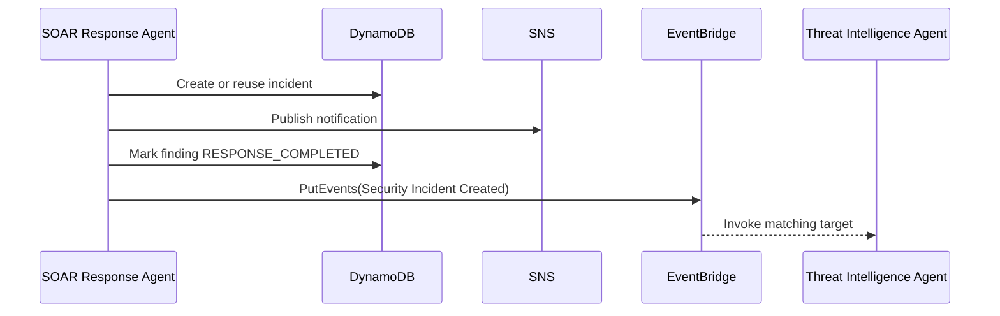

# SOAR Response Agent Changes

## Table Of Contents

- [Scope](#scope)
- [What Changed](#what-changed)
- [Why This Design](#why-this-design)
- [Event Contract](#event-contract)
- [Execution Flow](#execution-flow)
- [Operational Considerations](#operational-considerations)
- [Manual Implementation Guide](#manual-implementation-guide)
- [Project Evolution](#project-evolution)
- [References](#references)

## Scope

This document covers the SOAR Response Agent change that publishes an EventBridge event for downstream Threat Intelligence Agent enrichment.

SOAR still owns incident creation, SNS notification, and finding status updates. The new event publish is a follow-on handoff, not a replacement for SOAR behavior.

## What Changed

### EventBridge Client

```python
eventbridge_client = boto3.client("events")
```

SOAR can now publish custom events to EventBridge.

### Event Contract Configuration

```python
THREAT_INTEL_EVENT_BUS = os.environ.get("THREAT_INTEL_EVENT_BUS", "default")
THREAT_INTEL_EVENT_SOURCE = os.environ.get("THREAT_INTEL_EVENT_SOURCE", "seir.soar")
THREAT_INTEL_DETAIL_TYPE = os.environ.get("THREAT_INTEL_DETAIL_TYPE", "Security Incident Created")
```

Defaults match the EventBridge rule in `new-code.tf`. The values can be changed later through Lambda environment variables.

### Threat Intelligence Event Publisher

```python
detail = {
    "incident_id": incident_id,
    "finding_id": finding["finding_id"],
    "severity": playbook["severity"],
    "playbook": playbook["name"],
    "incident_created": incident_created,
    "primary_source_ip": finding.get("primary_source_ip"),
    "source_ip": finding.get("primary_source_ip"),
    "primary_target": finding.get("primary_target"),
    "event_count": finding.get("event_count", 0),
    "risk_score": finding.get("risk_score", 0),
    "human_review_required": True,
    "containment_performed": False,
}
```

The payload gives downstream agents enough context to enrich without re-parsing the full SOAR summary.

```python
except (ClientError, BotoCoreError) as error:
    print("Threat intelligence event publish failed. SOAR workflow will continue.")
    return None
```

EventBridge publish failure is logged but does not fail the SOAR workflow.

## Why This Design

Threat intelligence providers can be slow, unavailable, or rate-limited. Keeping enrichment outside SOAR protects the core incident workflow. EventBridge also allows more downstream agents to subscribe to the same incident-created event later.

## Event Contract

SOAR emits:

```json
{
  "Source": "seir.soar",
  "DetailType": "Security Incident Created",
  "EventBusName": "default",
  "Detail": "{...}"
}
```

The `Detail` JSON includes `incident_id`, `finding_id`, severity, playbook, source IP, target, event count, risk score, and safety flags.

## Execution Flow



The event is published after the finding status update so the downstream agent sees a processed incident/finding pair.

## Operational Considerations

Required IAM:

```text
events:PutEvents on arn:${partition}:events:${region}:${account_id}:event-bus/default
```

Troubleshooting:

- If `threat_intel_event_published` is false, inspect SOAR logs for EventBridge errors.
- If SOAR logs an event ID but the Threat Intelligence Agent does not run, check the EventBridge rule pattern and Lambda permission.
- If a custom event bus is introduced, update SOAR environment variables and Terraform IAM resource ARNs together.
- If EventBridge accepts an event for a bus that does not exist, AWS documents that matching can silently fail even when `PutEvents` returns HTTP 200.

## Manual Implementation Guide

1. Add an EventBridge boto3 client.
2. Add environment-backed event contract defaults.
3. Add a helper that builds event detail and calls `put_events`.
4. Catch AWS client errors so SOAR remains non-blocking.
5. Check `FailedEntryCount` and log failed responses.
6. Call the helper after incident creation, notification, and finding update.
7. Add result fields for publish status and event ID.
8. Add Terraform IAM and EventBridge resources.

## Project Evolution

SOAR evolved from being the end of the response workflow into an event publisher for later agents. This supports a cleaner multi-agent architecture because each agent can own one operational concern.

The direct-invocation alternative was avoided because it would couple SOAR to a specific downstream Lambda and make future fan-out harder.

## References

- [Amazon EventBridge PutEvents API](https://docs.aws.amazon.com/eventbridge/latest/APIReference/API_PutEvents.html) documents the API used by SOAR.
- [Sending events with PutEvents](https://docs.aws.amazon.com/eventbridge/latest/userguide/eb-putevents.html) documents failed entries and event bus behavior.
- [Amazon EventBridge event patterns](https://docs.aws.amazon.com/eventbridge/latest/userguide/eb-event-patterns.html) explains how the downstream rule matches SOAR events.
- [AWS Lambda permissions](https://docs.aws.amazon.com/lambda/latest/dg/lambda-permissions.html) explains service permissions and Lambda execution roles.

