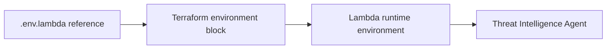

# Lambda Source Directory Changes

## Table Of Contents

- [Scope](#scope)
- [What Changed](#what-changed)
- [How It Works](#how-it-works)
- [Operational Considerations](#operational-considerations)
- [References](#references)

## Scope

This document covers shared changes in `terraform/lambda/src`. Agent-specific implementation details are documented beside each agent.

Related documents:

- [Threat Intelligence Agent](./threat_intelligence_agent/agent-changes.md)
- [Threat Intelligence Providers](./threat_intelligence_agent/providers/providers-changes.md)
- [SOAR Response Agent](./soar_response_agent/soar_response_agent-changes.md)

## What Changed

`.env.lambda` was extended with Threat Intelligence Agent configuration names:

```text
THREAT_INTEL_REPORTS_TABLE
SECURITY_INCIDENTS_TABLE
CORRELATION_FINDINGS_TABLE
REPORT_BUCKET
REPORT_PREFIX
ENABLED_PROVIDERS
STORE_REPORTS
UPDATE_INCIDENT
DEFAULT_INDICATOR_TYPE
ABUSEIPDB_API_KEY
ABUSEIPDB_ENDPOINT
ABUSEIPDB_MAX_AGE_DAYS
CISA_KEV_URL
MITRE_STIX_URL
```

This file is a source-tree reference. It does not deploy values by itself. Terraform supplies deployed Lambda environment variables in `new-code.tf`.

## How It Works



The reference file helps engineers keep code expectations and Terraform configuration aligned.

## Operational Considerations

> [!IMPORTANT]
> Do not commit real account IDs, API keys, or secrets into `.env.lambda`.

When adding a new Lambda setting:

1. Add the variable name to `.env.lambda`.
2. Add the deployed value to the Terraform `aws_lambda_function` environment block.
3. Read the value in Python using `os.environ.get(...)` for optional settings or `os.environ[...]` for required settings.
4. Validate with a local compile check and Terraform plan.

## References

- [AWS Lambda Python handler docs](https://docs.aws.amazon.com/lambda/latest/dg/python-handler.html) explain how Python handlers access runtime inputs and environment configuration.
- [Terraform `aws_lambda_function`](https://registry.terraform.io/providers/hashicorp/aws/latest/docs/resources/lambda_function) documents the Lambda `environment` block used by Terraform.

