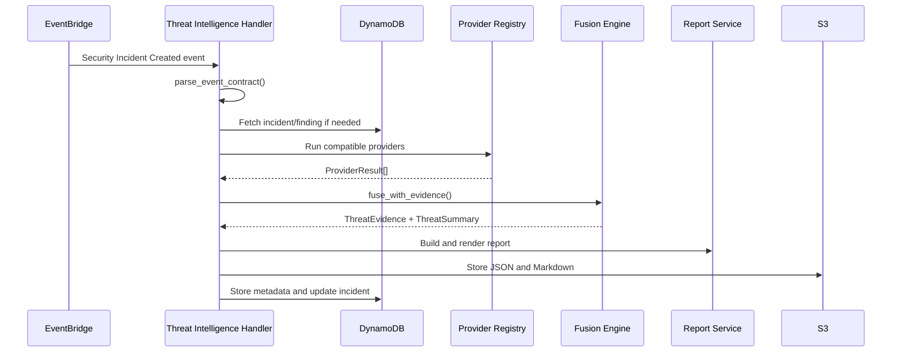

# Threat Intelligence Agent Changes

## Table Of Contents

- [Scope](#scope)
- [What Changed](#what-changed)
- [Why This Design](#why-this-design)
- [Execution Flow](#execution-flow)
- [Key Code Paths](#key-code-paths)
- [Operational Considerations](#operational-considerations)
- [Manual Implementation Guide](#manual-implementation-guide)
- [Project Evolution](#project-evolution)
- [References](#references)

## Scope

This directory contains the deployable Threat Intelligence Agent Lambda package.

The agent receives a SOAR incident event, extracts or retrieves an indicator, runs compatible providers, fuses provider evidence, renders reports, stores artifacts, and updates the source incident with enrichment metadata.

Provider details live in [providers/providers-changes.md](./providers/providers-changes.md). Terraform details live in [../../../terraform-changes.md](../../../terraform-changes.md).

## What Changed

The new deployable package includes:

- `threat-intelligence-agent.py` for Lambda orchestration.
- `provider_registry.py` for provider selection and execution.
- `fusion.py` for deterministic risk, confidence, and priority decisions.
- `report.py` for structured JSON, Markdown, and console reports.
- `providers/` for provider contracts and implementations.
- `event-contract.md` for event contract notes.
- `test_events/threat-intelligence-test.json` for direct Lambda testing.

Before this change, the threat-intelligence work existed as exploratory modules. The new package gives the code a Lambda handler, a stable event contract, local import-safe module names, persistence behavior, and a clear AWS integration path.

## Why This Design

The agent separates collection, fusion, reporting, and persistence:

- Providers collect facts.
- Fusion converts facts into a deterministic assessment.
- Reporting formats the assessment for analysts and storage.
- The handler owns AWS I/O and orchestration.

This was chosen over adding provider calls to SOAR because external APIs can fail or add latency. SOAR should create incidents reliably; enrichment should happen as an asynchronous follow-on.

## Execution Flow



## Key Code Paths

### Event Contract Parsing

```python
detail = event.get("detail")

if not isinstance(detail, Mapping):
    detail = event

context = {
    "source": event.get("source") or detail.get("source"),
    "detail_type": (
        event.get("detail-type")
        or event.get("detail_type")
        or detail.get("detail-type")
        or detail.get("detail_type")
    ),
    "incident_id": detail.get("incident_id") or event.get("incident_id"),
    "finding_id": detail.get("finding_id") or event.get("finding_id"),
}
```

This supports both EventBridge payloads and direct Lambda test events.

### Indicator Extraction

```python
indicator_value = indicator_value or first_present(
    data,
    [
        "indicator_value",
        "primary_source_ip",
        "source_ip",
        "ip_address",
        "ip",
        "cve_id",
        "cve",
        "technique_id",
        "attack_technique",
    ],
)
```

The agent accepts explicit indicators and common incident fields. If the event does not contain an indicator, it uses DynamoDB context when incident or finding IDs are present.

### Retry-Stable Report ID

```python
seed = "|".join(
    item for item in [incident_id, finding_id, indicator.indicator_id] if item
)
digest = hashlib.sha256(seed.encode("utf-8")).hexdigest()[:16]
return f"TIR-{digest}"
```

The report ID is deterministic, which makes repeated processing easier to trace.

### Persistence

```python
artifact_locations = store_report_artifacts(
    report_id=report_id,
    report_json=report_json,
    report_markdown=report_markdown,
)

store_report_record(...)
update_incident_record(...)
```

Full reports go to S3. Summary metadata goes to DynamoDB. The source incident receives report pointers and final threat-intelligence status.

## Operational Considerations

Environment variables:

- `THREAT_INTEL_REPORTS_TABLE`
- `SECURITY_INCIDENTS_TABLE`
- `CORRELATION_FINDINGS_TABLE`
- `REPORT_BUCKET`
- `REPORT_PREFIX`
- `ENABLED_PROVIDERS`
- `STORE_REPORTS`
- `UPDATE_INCIDENT`
- `DEFAULT_INDICATOR_TYPE`
- `ABUSEIPDB_API_KEY`
- `ABUSEIPDB_ENDPOINT`
- `ABUSEIPDB_MAX_AGE_DAYS`
- `CISA_KEV_URL`
- `MITRE_STIX_URL`

> [!WARNING]
> AbuseIPDB remains environment-variable based for now. Do not treat this as the final secrets pattern.

Troubleshooting:

- If the agent reports no indicator, inspect the EventBridge `detail` payload and the referenced DynamoDB incident/finding records.
- If providers are skipped, check `ENABLED_PROVIDERS` and the inferred indicator type.
- If S3 writes fail, verify bucket permissions and `REPORT_BUCKET`.
- If incident enrichment is missing, verify `UPDATE_INCIDENT`, `SECURITY_INCIDENTS_TABLE`, and `dynamodb:UpdateItem` permissions.
- If Lambda import fails, confirm the deployment zip includes `fusion.py`, `provider_registry.py`, `report.py`, and `providers/` at the package root.

## Manual Implementation Guide

1. Create `lambda/src/threat_intelligence_agent`.
2. Place handler and support modules at the package root.
3. Place provider modules under `providers/`.
4. Implement event parsing before provider calls.
5. Keep provider execution behind `ProviderRegistry`.
6. Keep risk decisions in `fusion.py`.
7. Keep rendering in `report.py`.
8. Store large report bodies in S3 and summary metadata in DynamoDB.
9. Update only threat-intelligence metadata on the source incident.
10. Compile-check before deployment.

## Project Evolution

The agent evolved from split conceptual modules into one deployable package. The main lesson is that AWS Lambda packaging needs import-safe module names and a clear root layout. The current design also keeps threat intelligence advisory only; it does not block IPs, revoke credentials, or alter infrastructure.

## References

- [AWS Lambda Python handler docs](https://docs.aws.amazon.com/lambda/latest/dg/python-handler.html) explains the handler entry point pattern.
- [AWS Lambda Python zip deployment packages](https://docs.aws.amazon.com/lambda/latest/dg/python-package.html) explains why local modules must be packaged where Lambda can import them.
- [Boto3 DynamoDB guide](https://docs.aws.amazon.com/boto3/latest/guide/dynamodb.html) explains the DynamoDB operations used for context reads, report records, and incident updates.
- [Amazon EventBridge event patterns](https://docs.aws.amazon.com/eventbridge/latest/userguide/eb-event-patterns.html) explains how SOAR events route into the agent.
- [CISA Known Exploited Vulnerabilities Catalog](https://www.cisa.gov/known-exploited-vulnerabilities-catalog) documents the CVE exploitation source used by the CISA provider.
- [MITRE ATT&CK data and tools](https://attack.mitre.org/resources/attack-data-and-tools/) documents ATT&CK STIX/TAXII data access.
- [AbuseIPDB API v2 docs](https://docs.abuseipdb.com/) documents the IP reputation endpoint used by the AbuseIPDB provider.

