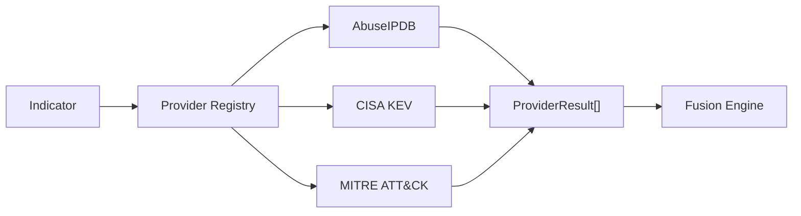

# Threat Intelligence Provider Changes

## Table Of Contents

- [Scope](#scope)
- [What Changed](#what-changed)
- [Provider Contract](#provider-contract)
- [Provider Implementations](#provider-implementations)
- [Execution Flow](#execution-flow)
- [Operational Considerations](#operational-considerations)
- [Manual Implementation Guide](#manual-implementation-guide)
- [Project Evolution](#project-evolution)
- [References](#references)

## Scope

This directory contains the provider layer for the Threat Intelligence Agent.

Providers collect facts and return normalized `ProviderResult` records. Providers do not calculate final risk, write to AWS services, update incidents, or perform containment.

## What Changed

The provider package now includes:

- `base.py`, which defines `Indicator`, `ProviderResult`, `ProviderStatus`, and `BaseThreatIntelProvider`.
- `abuseipdb.py`, which enriches IP indicators.
- `cisa_kev.py`, which checks CVE indicators against CISA KEV.
- `mitre_attack.py`, which enriches ATT&CK technique indicators.
- `__init__.py`, which exports provider classes for the registry.

## Provider Contract

```python
@dataclass(frozen=True)
class Indicator:
    value: str
    indicator_type: str

    @property
    def indicator_id(self) -> str:
        return f"{self.indicator_type.upper()}:{self.value}"
```

`Indicator` gives every provider the same input shape.

```python
@dataclass(frozen=True)
class ProviderResult:
    provider: str
    indicator_id: str
    indicator: str
    indicator_type: str
    status: str
    retrieved_at: str
    data: Mapping[str, Any] = field(default_factory=dict)
    error: str | None = None
```

`ProviderResult` gives the fusion engine a provider-independent result shape.

```python
def supports(self, indicator: Indicator) -> bool:
    return indicator.indicator_type.upper() in self.supported_indicator_types
```

The registry uses `supports()` to run only compatible providers.

## Provider Implementations

### AbuseIPDB

The AbuseIPDB provider supports `IP`, `IPV4`, and `IPV6` indicators.

```python
headers={
    "Accept": "application/json",
    "Key": self.api_key,
}
```

The API key is sent in the HTTP header, which aligns with AbuseIPDB API guidance. Normalized fields include abuse score, report counts, ISP, domain, usage type, Tor status, and whitelist status.

> [!IMPORTANT]
> AbuseIPDB credential storage is intentionally unchanged. SSM Parameter Store or Secrets Manager can be added later without changing the provider contract.

### CISA KEV

The CISA provider supports `CVE` indicators and downloads the CISA KEV JSON feed.

```python
if str(item.get("cveID", "")).upper() == cve:
    ...
```

A KEV match sets `known_exploited = True`, assigns high confidence, and carries remediation-oriented fields such as due date and required action.

### MITRE ATT&CK

The MITRE provider supports `TECHNIQUE` and `ATTACK_TECHNIQUE` indicators.

```python
if not self.url:
    return self.result(
        indicator,
        status=ProviderStatus.SUCCESS,
        data={
            "matched_technique_ids": [indicator.value.upper()],
            "confidence": 60,
            "risk": "MEDIUM",
        },
    )
```

The fallback mode preserves technique identity without requiring a STIX feed during lab testing. If `MITRE_STIX_URL` is configured, the provider downloads STIX JSON and resolves technique metadata.

## Execution Flow



Provider errors return `ProviderResult(status="ERROR")`. This makes provider availability part of the evidence instead of a hard Lambda failure.

## Operational Considerations

| Provider | Indicator Type | External Source | Credential |
| --- | --- | --- | --- |
| AbuseIPDB | IP/IPV4/IPV6 | AbuseIPDB API v2 | `ABUSEIPDB_API_KEY` |
| CISA KEV | CVE | CISA KEV JSON feed | None |
| MITRE ATT&CK | TECHNIQUE | Optional STIX JSON URL | None |

Troubleshooting:

- If no provider runs, check the inferred indicator type and `ENABLED_PROVIDERS`.
- If AbuseIPDB returns errors, check key presence, rate limits, endpoint URL, and network egress.
- If CISA KEV returns `NOT_FOUND`, the CVE was not in the catalog at retrieval time.
- If MITRE returns fallback output, `MITRE_STIX_URL` is empty by design.

## Manual Implementation Guide

1. Add a provider module under `providers/`.
2. Subclass `BaseThreatIntelProvider`.
3. Set `name` and `supported_indicator_types`.
4. Implement `enrich()` and always return `ProviderResult`.
5. Normalize API-specific fields before returning.
6. Add the provider to `build_default_registry()`.
7. Add any new environment variables to `.env.lambda` and Terraform.
8. Update this document with provider behavior and troubleshooting.

## Project Evolution

The provider package replaced direct, scattered API handling. This makes the agent easier to extend and keeps provider-specific schemas out of the fusion and report layers.

## References

- [AbuseIPDB API v2 docs](https://docs.abuseipdb.com/) documents the `check` endpoint and API key header behavior.
- [CISA Known Exploited Vulnerabilities Catalog](https://www.cisa.gov/known-exploited-vulnerabilities-catalog) documents the authoritative KEV source.
- [MITRE ATT&CK data and tools](https://attack.mitre.org/resources/attack-data-and-tools/) documents ATT&CK STIX/TAXII data access.
- [Python `urllib.request`](https://docs.python.org/3/library/urllib.request.html) documents the standard-library HTTP client used to avoid adding third-party dependencies.

