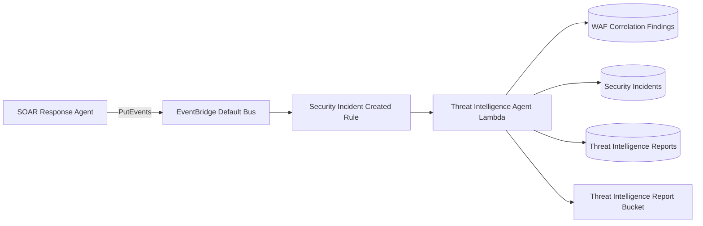

# Lab 12d Terraform Changes

## Table Of Contents

- [Scope](#scope)
- [What Changed](#what-changed)
- [Architecture](#architecture)
- [Key Terraform Snippets](#key-terraform-snippets)
- [Operational Considerations](#operational-considerations)
- [Manual Implementation Guide](#manual-implementation-guide)
- [Project Evolution](#project-evolution)
- [References](#references)

## Scope

This file documents the Terraform implementation added in `new-code.tf` for the Threat Intelligence Agent integration.

The implementation adds storage, IAM, logging, Lambda packaging, Lambda runtime configuration, EventBridge routing, and outputs for an asynchronous post-SOAR enrichment agent.

> [!NOTE]
> The resources intentionally remain in `new-code.tf` for this iteration so the new design can be reviewed before moving resources into the established numbered Terraform files.

## What Changed

The Terraform module now defines:

- `var.abuseipdb_api_key`, a sensitive optional API key variable.
- `var.threat_intelligence_enabled_providers`, a comma-separated provider allow-list.
- Threat Intelligence Agent naming locals.
- A DynamoDB table for report metadata.
- An S3 bucket for JSON and Markdown report artifacts.
- IAM permissions for the Threat Intelligence Agent.
- IAM permissions allowing SOAR to publish EventBridge events.
- A CloudWatch Logs group for the agent.
- A Terraform `archive_file` Lambda zip package.
- The Threat Intelligence Agent Lambda function.
- An EventBridge rule and target for `seir.soar` incident events.
- Outputs for the agent and a test invocation command.

## Architecture



SOAR remains responsible for incident creation and notification. Threat intelligence enrichment runs after SOAR through EventBridge, so provider latency or failure does not block the incident workflow.

## Key Terraform Snippets

### Report Metadata Table

```hcl
resource "aws_dynamodb_table" "threat_intelligence_reports" {
  name         = local.threat_intelligence_reports_table_name
  billing_mode = "PAY_PER_REQUEST"
  hash_key     = "report_id"

  attribute {
    name = "report_id"
    type = "S"
  }

  server_side_encryption {
    enabled = true
  }

  point_in_time_recovery {
    enabled = true
  }
}
```

`PAY_PER_REQUEST` fits this lab because enrichment is event-driven and test volume is uneven. Point-in-time recovery provides a recovery path for accidental table item changes.

### Report Artifact Bucket

```hcl
resource "aws_s3_bucket_public_access_block" "threat_intelligence_report_bucket" {
  bucket                  = aws_s3_bucket.threat_intelligence_report_bucket.id
  block_public_acls       = true
  block_public_policy     = true
  ignore_public_acls      = true
  restrict_public_buckets = true
}
```

Threat-intelligence reports can contain incident details and provider evidence, so the bucket blocks public access by default.

### Lambda Package

```hcl
data "archive_file" "threat_intelligence_agent" {
  type        = "zip"
  source_dir  = "${path.module}/lambda/src/threat_intelligence_agent"
  output_path = "${path.module}/lambda/src/threat-intelligence-agent.zip"

  excludes = [
    "test_events/**",
    "**/.DS_Store",
    "**/__pycache__",
    "**/*.pyc",
  ]
}
```

The package excludes local-only files so the Lambda zip stays focused on runtime code.

### Lambda Function

```hcl
resource "aws_lambda_function" "threat_intelligence_agent" {
  filename         = data.archive_file.threat_intelligence_agent.output_path
  source_code_hash = data.archive_file.threat_intelligence_agent.output_base64sha256
  handler          = "threat-intelligence-agent.lambda_handler"
  runtime          = "python3.14"

  environment {
    variables = {
      THREAT_INTEL_REPORTS_TABLE = aws_dynamodb_table.threat_intelligence_reports.name
      SECURITY_INCIDENTS_TABLE   = aws_dynamodb_table.waf_security_incidents.name
      CORRELATION_FINDINGS_TABLE = aws_dynamodb_table.waf_correlation_findings.name
      REPORT_BUCKET              = aws_s3_bucket.threat_intelligence_report_bucket.id
      ENABLED_PROVIDERS          = var.threat_intelligence_enabled_providers
      ABUSEIPDB_API_KEY          = var.abuseipdb_api_key
    }
  }
}
```

`source_code_hash` ties source changes to Lambda updates. The environment block wires Terraform-managed resource names into the handler.

### EventBridge Rule

```hcl
resource "aws_cloudwatch_event_rule" "threat_intelligence_agent_soar_event" {
  event_pattern = jsonencode({
    source      = ["seir.soar"]
    detail-type = ["Security Incident Created"]
    detail = {
      incident_id = [{ exists = true }]
      finding_id  = [{ exists = true }]
    }
  })
}
```

The rule subscribes to the SOAR event contract instead of invoking the agent directly from SOAR.

## Operational Considerations

> [!WARNING]
> `ABUSEIPDB_API_KEY` is currently passed as a Lambda environment variable because secrets retrieval is intentionally deferred. A later hardening pass should move it to Secrets Manager or Systems Manager Parameter Store.

Deployment checks:

- Run `terraform fmt new-code.tf` after edits.
- Run `terraform validate` before planning.
- Run `terraform plan` and inspect new IAM, S3, DynamoDB, Lambda, and EventBridge resources.
- Do not rename Terraform resource labels after apply unless state is moved intentionally.

Failure checks:

- If SOAR logs show failed EventBridge publish, verify `events:PutEvents` on the default event bus.
- If the agent is not invoked, verify the EventBridge pattern and Lambda permission.
- If reports are not stored, verify S3 and DynamoDB permissions and environment variable names.

## Manual Implementation Guide

1. Add the Threat Intelligence Agent source package under `lambda/src/threat_intelligence_agent`.
2. Add the two Terraform variables and the naming locals.
3. Add the DynamoDB report table.
4. Add the S3 bucket, versioning, encryption, and public access block.
5. Add the Threat Intelligence Agent execution role, policies, and attachments.
6. Add the SOAR `events:PutEvents` policy attachment.
7. Add the `archive_file` data source.
8. Add the Lambda function and environment variables.
9. Add the EventBridge rule, target, and Lambda permission.
10. Add outputs for deployment visibility and testing.
11. Run `terraform fmt`, `terraform validate`, and `terraform plan`.

## Project Evolution

Lab 12d extends the earlier WAF and SOAR flow from a single response pipeline into a multi-agent architecture. The key architectural decision is that SOAR emits an event and the Threat Intelligence Agent subscribes to it. This is cleaner than direct invocation because future agents can subscribe to the same event without changing SOAR again.

## References

- [Amazon EventBridge PutEvents API](https://docs.aws.amazon.com/eventbridge/latest/APIReference/API_PutEvents.html) documents the custom event API SOAR uses.
- [Amazon EventBridge event patterns](https://docs.aws.amazon.com/eventbridge/latest/userguide/eb-event-patterns.html) documents how the rule matches `source`, `detail-type`, and `detail` fields.
- [AWS Lambda Python zip deployment packages](https://docs.aws.amazon.com/lambda/latest/dg/python-package.html) explains Lambda zip packaging requirements.
- [AWS Lambda permissions](https://docs.aws.amazon.com/lambda/latest/dg/lambda-permissions.html) explains execution roles and service invocation permissions.
- [Terraform `archive_file`](https://registry.terraform.io/providers/hashicorp/archive/latest/docs/data-sources/file) documents the zip archive data source.
- [Terraform `aws_lambda_function`](https://registry.terraform.io/providers/hashicorp/aws/latest/docs/resources/lambda_function) documents Lambda runtime, handler, environment, and `source_code_hash` arguments.
- [Terraform `aws_cloudwatch_event_rule`](https://registry.terraform.io/providers/hashicorp/aws/latest/docs/resources/cloudwatch_event_rule) documents EventBridge rules in the AWS provider.
- [Terraform `aws_lambda_permission`](https://registry.terraform.io/providers/hashicorp/aws/latest/docs/resources/lambda_permission) documents granting EventBridge permission to invoke Lambda.
- [Terraform `aws_dynamodb_table`](https://registry.terraform.io/providers/hashicorp/aws/latest/docs/resources/dynamodb_table.html) documents table keys, billing mode, encryption, and point-in-time recovery.
- [Amazon S3 Block Public Access](https://docs.aws.amazon.com/AmazonS3/latest/userguide/access-control-block-public-access.html) explains the bucket public access controls used for report artifacts.

