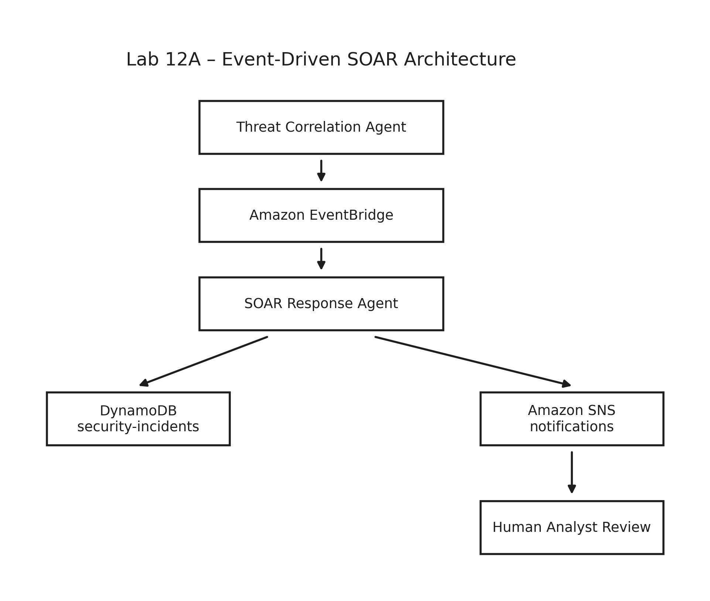

# Lab 12A: Event-Driven SOAR Response

Lab 12A extends the standalone Lab 12 threat-correlation deployment with an
event-driven Security Orchestration, Automation, and Response (SOAR) workflow.

The implementation receives threat-finding events from Amazon EventBridge,
retrieves the authoritative finding from DynamoDB, applies a deterministic
severity playbook, records incidents idempotently, publishes notifications,
and preserves a human-approval boundary for containment decisions.

## Architecture



Editable diagram source:

- [`architecture/lab-12a-soar-architecture.excalidraw`](architecture/lab-12a-soar-architecture.excalidraw)

Primary workflow:

```text
AWS WAF
  -> CloudWatch Logs
  -> WAF analyzer Lambda
  -> DynamoDB waf-events
  -> threat-correlation Lambda
  -> DynamoDB waf-correlation-findings
  -> EventBridge
  -> SOAR response Lambda
  -> DynamoDB security-incidents
  -> SNS notifications
  -> human analyst review
```

CRITICAL findings are routed both to the SOAR Lambda and directly to the
critical-alert SNS topic.

## Deterministic response playbook

| Severity | Automated response |
|---|---|
| LOW | Record only |
| MEDIUM | Notify analyst |
| HIGH | Notify analyst and create an incident |
| CRITICAL | Notify analyst, create an incident, and request containment approval |

The system does **not** perform automated containment.

Expected control fields include:

```text
human_review_required = true
containment_performed = false
```

## Authorization boundary

Lab 12A is authorized to:

- retrieve and validate existing correlation findings
- update response-processing status
- create security incident records
- publish analyst and critical notifications
- request human review or containment approval
- optionally generate a Bedrock summary

Lab 12A is not authorized to:

- block IP addresses automatically
- modify WAF rules automatically
- isolate hosts or workloads
- disable users or credentials
- perform any other containment action without explicit human approval

## Key AWS resources

The standalone Terraform configuration creates the Lab 12 baseline and the
Lab 12A response layer, including:

- WAF and protected API resources
- CloudWatch log groups
- analyzer, correlation, and SOAR Lambda functions
- `waf-events` DynamoDB table
- `waf-correlation-findings` DynamoDB table
- `security-incidents` DynamoDB table
- EventBridge routing rules and targets
- standard SOAR notification SNS topic
- critical-alert SNS topic
- least-privilege IAM roles and policies

## SOAR environment variables

The SOAR Lambda uses:

```text
CORRELATION_FINDINGS_TABLE
SECURITY_INCIDENTS_TABLE
SNS_TOPIC_ARN
BEDROCK_MODEL_ID
ENABLE_BEDROCK
```

The correlation Lambda requires permission to publish findings to the default
EventBridge event bus with `events:PutEvents`.

## Repository layout

```text
lab-12a/
├── architecture/
│   ├── lab-12a-soar-architecture.excalidraw
│   └── lab-12a-soar-architecture.png
├── evidence/
│   ├── README.md
│   ├── redactions.example.json
│   └── *.png
├── runbooks/
│   └── lab-12a-soar-response-runbook.md
├── scripts/
│   └── sanitize-evidence.py
├── src/
├── test-events/
└── terraform/
```

## Configuration

Copy the example variable file and provide local values:

```bash
cd terraform
cp terraform.tfvars.example terraform.tfvars
```

The real `terraform.tfvars` is intentionally Git-ignored. The
`notification_email` variable may be marked sensitive to reduce routine CLI
display, but Terraform sensitivity does not encrypt state or plan files.

For production workflows, provide sensitive values through a protected CI/CD
variable store, HCP Terraform, AWS Systems Manager Parameter Store,
AWS Secrets Manager, or an equivalent secrets platform.

## Validation

From the `terraform/` directory:

```bash
terraform fmt -check -recursive
terraform init -backend=false
terraform validate
```

Python source validation:

```bash
python3 -m compileall ../src
```

JSON fixture validation:

```bash
python3 -m json.tool ../test-events/lab12a-soar.json >/dev/null
```

## Deployment boundary

Review the plan before applying:

```bash
terraform plan -out=lab12a.tfplan
terraform apply lab12a.tfplan
```

The completed validation deployment created 47 resources.

Schedules remained disabled during controlled testing.

## Verified behavior

The evidence set demonstrates:

- successful 47-resource Terraform deployment
- confirmed SNS email subscriptions
- EventBridge routing for MEDIUM, HIGH, and CRITICAL findings
- HIGH-severity end-to-end incident creation and notification
- idempotent retry behavior with one incident record
- CRITICAL urgent-review workflow without automated containment
- dual SNS publication for CRITICAL findings
- complete correlation-to-EventBridge-to-SOAR execution
- clean no-drift Terraform plan
- reviewed 47-resource destroy plan
- successful destruction of all 47 resources
- post-destroy state containing zero managed resources

See:

- [`evidence/README.md`](evidence/README.md)
- [`runbooks/lab-12a-soar-response-runbook.md`](runbooks/lab-12a-soar-response-runbook.md)

## Evidence sanitization

The local utility can permanently flatten coordinate-based redactions,
re-encode screenshots without original metadata, preserve source images by
default, and print input and output SHA-256 hashes.

```bash
python3 scripts/sanitize-evidence.py --help
```

The supplied configuration contains example coordinates only. Replace them
with coordinates measured from the actual screenshot before producing a
sanitized copy.

## Teardown

Create and review a saved destroy plan:

```bash
terraform plan -destroy -out=lab12a-destroy.tfplan
terraform apply lab12a-destroy.tfplan
```

Post-destroy verification should report:

```text
Managed resources remaining in Terraform state: 0
No changes. No objects need to be destroyed.
```

The completed Lab 12A teardown removed all 47 managed resources.

## Security notes

- Do not commit `terraform.tfvars`.
- Do not commit Terraform state or saved plan files.
- Do not commit generated Lambda ZIP archives.
- Use fictional account IDs in test fixtures.
- Review screenshots before committing them.
- Keep containment decisions behind explicit human authorization.
