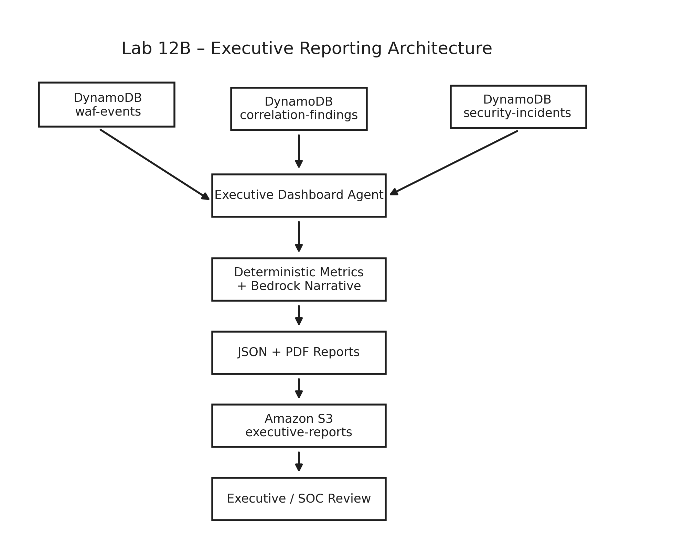

# Lab 12B - Executive Security Reporting

## **Armageddon #2 · SEIR Foundations · Phase 1**

## 1. Lab Purpose and Objectives

Lab 12B extends the Lab 12A event-driven SOAR deployment with an executive security reporting workflow.

The implementation reads authoritative WAF events, correlation findings, and security incidents from DynamoDB, calculates deterministic current-period and previous-period metrics, optionally uses Amazon Bedrock for executive narrative generation, renders a PDF with ReportLab, and publishes synchronized PDF and JSON report artifacts to Amazon S3.

The reporting workflow is informational. It does not perform containment.

### Objectives

- Extend the Lab 12A SOAR workflow with executive security reporting.
- Read WAF events, correlation findings, and security incidents from DynamoDB.
- Calculate deterministic current-period and previous-period metrics.
- Calculate an overall security posture from observed findings and incidents.
- Identify material changes between reporting periods.
- Generate an optional Amazon Bedrock executive narrative.
- Use a deterministic fallback narrative when Bedrock is unavailable.
- Generate synchronized PDF and JSON artifacts from one report document.
- Publish report artifacts to a date-partitioned Amazon S3 prefix.
- Validate S3 security controls and artifact encryption.
- Preserve the existing human-review boundary for containment decisions.
- Verify Terraform reports no drift before controlled teardown.

## 2. Custom Badges

No custom badges are required for the core Lab 12B submission.

## 3. Lab / Task / Project Overview

Lab 12B keeps the Lab 12 and Lab 12A detection and response workflow intact while adding an executive reporting path.

### Architecture



PNG preview:

- [`architecture/lab-12b-executive-reporting-architecture.png`](architecture/lab-12b-executive-reporting-architecture.png)

Editable diagram source:

- [`architecture/lab-12b-executive-reporting-architecture.excalidraw`](architecture/lab-12b-executive-reporting-architecture.excalidraw)

Primary workflow:

```text
AWS WAF
  -> CloudWatch Logs
  -> WAF Analyzer Lambda
  -> DynamoDB waf-events
  -> Threat Correlation Lambda
  -> DynamoDB waf-correlation-findings
  -> EventBridge
  -> SOAR Response Lambda
  -> DynamoDB security-incidents
  -> SNS notifications
  -> human analyst review

DynamoDB waf-events
DynamoDB waf-correlation-findings
DynamoDB security-incidents
  -> Executive Dashboard Lambda
  -> deterministic metrics and period comparison
  -> optional Amazon Bedrock narrative
  -> ReportLab PDF rendering
  -> synchronized PDF and JSON publication
  -> Amazon S3 executive-reports/
  -> executive and SOC review
```

CRITICAL findings continue to route through the Lab 12A SOAR workflow and directly to the CRITICAL SNS notification path.

### Executive Reporting Behavior

The executive reporting Lambda:

- scans the three authoritative DynamoDB tables
- calculates current-period and previous-period metrics
- calculates a deterministic overall security posture
- identifies material changes between reporting periods
- generates a Bedrock narrative when enabled
- uses a deterministic fallback narrative when Bedrock is unavailable
- generates synchronized PDF and JSON artifacts from the same report document
- publishes artifacts to a date-partitioned Amazon S3 prefix
- performs no containment action

### Report Inputs

The executive-dashboard Lambda reads:

```text
WAF_EVENTS_TABLE
CORRELATION_FINDINGS_TABLE
SECURITY_INCIDENTS_TABLE
```

The default reporting period is:

```text
24 hours
```

The function compares the current period with the immediately preceding period of equal length.

### Report Configuration

Environment variables include:

```text
REPORT_BUCKET
REPORT_PREFIX
BEDROCK_MODEL_ID
ENABLE_BEDROCK
REPORT_PERIOD_HOURS
MAX_ITEMS_PER_TABLE
ORGANIZATION_NAME
REPORT_TITLE
```

The default report prefix is:

```text
executive-reports
```

Published object layout:

```text
executive-reports/YYYY/MM/DD/pdf/executive-security-<timestamp>.pdf
executive-reports/YYYY/MM/DD/json/executive-security-<timestamp>.json
```

The PDF and JSON artifacts are generated from the same report document and share the same report ID and reporting period.

### Authorization Boundary

Lab 12B is authorized to:

- read WAF events from DynamoDB
- read correlation findings from DynamoDB
- read security incidents from DynamoDB
- calculate current-period and previous-period metrics
- calculate deterministic posture and material changes
- invoke the configured Bedrock model for narrative generation
- render a PDF in Lambda memory
- publish synchronized PDF and JSON report artifacts
- preserve the inherited SOAR human-review workflow

Lab 12B is not authorized to:

- block source IP addresses automatically
- modify WAF rules automatically
- isolate workloads
- disable users, credentials, or services
- modify incident disposition automatically
- perform containment without explicit human approval

Required control fields remain:

```text
containment_performed = false
human_review_required = true
```

### S3 Security Controls

The executive-report bucket uses:

- S3 Block Public Access
- bucket-owner-enforced object ownership
- AES256 default encryption
- versioning
- an HTTPS-only bucket policy
- a scoped report prefix
- `force_destroy = true` for controlled lab cleanup

## 4. Lab / Task / Project Requirements

### Required Local Tools

- Terraform
- AWS CLI
- Python 3
- Git
- Bash

### AWS Services Used

- AWS WAF
- Amazon API Gateway
- AWS Lambda
- Amazon CloudWatch Logs
- Amazon DynamoDB
- Amazon EventBridge
- Amazon SNS
- Amazon Bedrock
- Amazon S3
- AWS IAM

### ReportLab Layer

Lab 12B adds a Lambda-compatible ReportLab layer.

Requirements file:

```text
layers/reportlab/requirements.txt
```

Required package:

```text
reportlab==4.4.3
```

Build command:

```bash
./scripts/build-reportlab-layer.sh
```

The validated build produced:

```text
Archive: terraform/reportlab-python312-x86_64.zip
Uncompressed size: 27,422,823 bytes
Archive entries: 386
Native libraries: ELF 64-bit x86-64
```

The generated layer ZIP is excluded from Git.

### Local Configuration

Create the local Terraform variables file from the example:

```bash
cd terraform
cp terraform.tfvars.example terraform.tfvars
```

The real `terraform.tfvars` is intentionally excluded from Git.

Terraform sensitivity can suppress routine display of selected values, but it does not encrypt state or plan files.

For production use, environment-specific or sensitive values should be provided through an approved protected mechanism such as a CI/CD secret store, HCP Terraform, AWS Systems Manager Parameter Store, AWS Secrets Manager, or HashiCorp Vault.

## 5. Project / Folder Structure

```text
lab12b/
├── architecture/
│   ├── archived/
│   ├── lab-12b-executive-reporting-architecture.excalidraw
│   └── lab-12b-executive-reporting-architecture.png
├── evidence/
│   ├── README.md
│   ├── redactions.example.json
│   ├── *.png
│   ├── 18-executive-security-report.pdf
│   ├── 20-populated-executive-security-report.pdf
│   └── 20-populated-executive-security-report.json
├── layers/
│   └── reportlab/
│       └── requirements.txt
├── runbooks/
│   ├── lab-12a-soar-response-runbook.md
│   └── lab-12b-executive-reporting-runbook.md
├── scripts/
│   ├── build-reportlab-layer.sh
│   ├── sanitize-evidence.py
│   └── seed-and-run-lab12b-report-test.py
├── src/
│   └── executive_dashboard_agent.py
├── test-events/
│   ├── lab12a-soar.json
│   ├── lab12-correlation.json
│   └── lab12b-executive-report.json
├── terraform/
└── README.md
```

The primary Lab 12B operational runbook is:

```text
runbooks/lab-12b-executive-reporting-runbook.md
```

The Lab 12A runbook is retained because Lab 12B inherits the SOAR workflow and human-review controls from Lab 12A.

## 6. Steps Used to Complete This Lab

1. Reviewed the completed Lab 12A event-driven SOAR workflow.
2. Added the executive-dashboard Lambda.
3. Added reads from the WAF event, correlation finding, and security incident tables.
4. Added deterministic current-period and previous-period metric calculations.
5. Added deterministic security-posture and material-change evaluation.
6. Added optional Bedrock executive narrative generation.
7. Added a deterministic fallback narrative.
8. Added the ReportLab Python 3.12 x86_64 Lambda layer.
9. Added synchronized PDF and JSON report generation from one report document.
10. Added the executive-report S3 bucket and scoped report prefix.
11. Added S3 Block Public Access, encryption, versioning, object ownership, and HTTPS-only controls.
12. Added least-privilege IAM permissions for report generation and publication.
13. Validated Terraform formatting and configuration.
14. Validated Python source, shell syntax, and JSON test fixtures.
15. Created and reviewed the Terraform deployment plan.
16. Verified executive Lambda runtime and layer compatibility.
17. Deployed 58 managed resources.
18. Generated an initial empty-data report.
19. Verified ReportLab PDF rendering.
20. Verified synchronized PDF and JSON S3 publication.
21. Verified AES256 encryption for both report artifacts.
22. Seeded six controlled synthetic WAF records.
23. Generated a HIGH correlation finding with deterministic risk score 60.
24. Verified EventBridge triggered SOAR incident creation.
25. Generated a populated executive report.
26. Verified `ELEVATED` overall security posture.
27. Verified one open incident remained awaiting human review.
28. Verified Bedrock narrative generation.
29. Preserved the populated PDF and JSON report artifacts.
30. Recorded SHA-256 hashes for the preserved report pair.
31. Verified Terraform reported no drift.
32. Created and reviewed the 58-resource destroy plan.
33. Destroyed all 58 managed resources.
34. Verified Terraform state contained zero managed resources.
35. Verified zero matching AWS resources remained across the inspected service categories.

## 7. Artifacts / Screenshots - SHOW YOUR WORK

The `evidence/` directory contains the validation record for Lab 12B.

Key evidence demonstrates:

- Terraform deployment of 58 resources
- Python 3.12 x86_64 executive-dashboard Lambda configuration
- ReportLab layer compatibility and successful loading
- initial empty-data executive report
- synchronized PDF and JSON publication
- AES256 encryption of both artifacts
- six controlled synthetic WAF records
- HIGH correlation finding with deterministic risk score 60
- automatic EventBridge-to-SOAR incident creation
- one incident awaiting human review
- populated executive report with `ELEVATED` posture
- four current-period blocked WAF requests
- one HIGH finding and one open incident
- Bedrock-generated executive narrative
- `containment_performed = false`
- `human_review_required = true`
- synchronized report IDs
- Terraform no-drift validation
- reviewed 58-resource destroy plan
- successful destruction of all 58 resources
- empty post-destroy Terraform state
- zero remaining matching AWS resources

### Preserved Report Artifacts

The populated report pair was copied from S3 before teardown:

```text
evidence/20-populated-executive-security-report.pdf
evidence/20-populated-executive-security-report.json
```

Recorded SHA-256 values:

```text
PDF:
6fa0549fe9a95db91dc276e44259c47a01ff18222a69ec6349b51b93d9ef210b

JSON:
4ddb0df9f218debe8a4718893b94c3a2a2320aa425e0857c6d17a29742668437
```

The retained report uses documentation-only IP addresses:

```text
198.51.100.88
203.0.113.45
```

These values are synthetic test data.

### Evidence Sanitization

Before committing evidence, review and redact:

- AWS account IDs
- ARNs
- API Gateway invoke URLs
- bucket names containing account IDs
- personal email addresses
- credentials or tokens
- real public or private IP addresses
- private environment-specific identifiers

Report IDs, incident IDs, documentation-only IP addresses, synthetic URI paths, WAF rule names, risk scores, severity values, and repository attribution may remain when appropriate.

## 8. Steps Used to Teardown / Clean Up the Lab

Lab 12B uses a reviewed Terraform destroy plan.

The completed teardown reported:

```text
Plan: 0 to add, 0 to change, 58 to destroy.
Apply complete! Resources: 0 added, 0 changed, 58 destroyed.
PASS: Terraform state contains zero managed resources.
```

Post-destroy AWS inventory verification found zero matching resources across:

- Lambda functions
- Lambda layers
- DynamoDB tables
- EventBridge rules
- Scheduler groups
- SNS topics
- API Gateway APIs
- WAF Web ACLs
- executive-report S3 buckets
- Lambda log groups
- WAF log groups

Generated files that should not be committed include:

```text
terraform.tfstate
terraform.tfstate.backup
terraform.tfvars
*.tfplan
*.zip
.terraform/
```

The generated ReportLab layer ZIP is also excluded from Git.

## 9. Lessons Learned

### Reporting Should Be Derived From Authoritative Data

The executive report reads the same DynamoDB event, finding, and incident records used by the operational workflow rather than maintaining a separate reporting database.

### Metrics and Narrative Serve Different Purposes

Current-period metrics, previous-period metrics, material changes, and overall posture are deterministic. Amazon Bedrock adds narrative context but does not determine containment actions or replace the underlying metrics.

### One Report Document Prevents PDF and JSON Drift

Generating the PDF and JSON from the same report document preserves the same report ID, reporting period, and underlying security facts across human-readable and machine-readable outputs.

### Executive Reporting Should Preserve Operational Boundaries

The reporting Lambda is read-oriented except for report publication. It does not change incident disposition, modify WAF rules, or perform containment.

### Artifact Integrity Can Be Verified Independently

Preserving SHA-256 hashes for the populated PDF and JSON artifacts creates an independent way to verify that the retained reports have not changed.

### Synthetic Data Should Be Clearly Identified

Documentation-only IP ranges were used for controlled report validation so the evidence could demonstrate realistic workflows without publishing real source addresses.

### S3 Security Controls Matter Even in a Lab

Block Public Access, bucket-owner-enforced object ownership, encryption, versioning, an HTTPS-only policy, and scoped write permissions demonstrate a secure-by-design approach to report storage.

### Cleanup Validation Should Cover Both Terraform and AWS

Zero Terraform-managed resources alone is useful, but the post-destroy inventory check provides additional evidence that matching AWS resources were actually removed.

## 10. References

- [Amazon S3 documentation](https://docs.aws.amazon.com/s3/)
- [AWS Lambda documentation](https://docs.aws.amazon.com/lambda/)
- [Amazon DynamoDB documentation](https://docs.aws.amazon.com/dynamodb/)
- [Amazon EventBridge documentation](https://docs.aws.amazon.com/eventbridge/)
- [Amazon SNS documentation](https://docs.aws.amazon.com/sns/)
- [Amazon Bedrock documentation](https://docs.aws.amazon.com/bedrock/)
- [AWS IAM documentation](https://docs.aws.amazon.com/iam/)
- [ReportLab documentation](https://docs.reportlab.com/)
- [Terraform plan command](https://developer.hashicorp.com/terraform/cli/commands/plan)
- Armageddon / SEIR Foundations Lab 12B source material

For detailed deployment, validation, evidence, and teardown procedures, see:

```text
runbooks/lab-12b-executive-reporting-runbook.md
```

## 11. Troubleshooting

### ReportLab Layer Compatibility

The executive Lambda requires a Python 3.12 x86_64-compatible ReportLab layer.

If the Lambda cannot import ReportLab:

1. Rebuild the layer with `scripts/build-reportlab-layer.sh`.
2. Verify the Lambda runtime is Python 3.12.
3. Verify the Lambda architecture is x86_64.
4. Verify the built native libraries are x86-64.
5. Confirm the generated layer ZIP is attached to the executive Lambda.

### Report Artifacts Not Published

If the Lambda runs but PDF or JSON artifacts do not appear in S3:

1. Verify `REPORT_BUCKET` and `REPORT_PREFIX`.
2. Confirm IAM write access is restricted to the expected report prefix.
3. Review the executive Lambda CloudWatch logs.
4. Verify S3 bucket policy requirements are satisfied.
5. Confirm the PDF and JSON generation steps completed before upload.

### Report Data Appears Empty

An empty-data report can be valid when no records fall inside the reporting period.

To distinguish a valid empty report from a data-access problem:

1. Confirm the Lambda can read all three DynamoDB tables.
2. Verify `REPORT_PERIOD_HOURS`.
3. Check timestamps on the source records.
4. Run the controlled populated-data validation script.
5. Compare the resulting current and previous period counts.

### Bedrock Narrative Is Missing

The deterministic report can still be generated when Bedrock is disabled or unavailable.

Verify:

```text
ENABLE_BEDROCK
BEDROCK_MODEL_ID
```

and review IAM permissions and Lambda logs.

The reporting workflow should fall back to a deterministic narrative instead of failing the complete report because the optional Bedrock path is unavailable.

### Human-Review Boundary

The final report must not imply that containment occurred when it did not.

Verify:

```text
containment_performed = false
human_review_required = true
```

and confirm the executive reporting Lambda has no automatic containment authority.

## 12. Author & Contributors

### Author and Group Leader

Jacques Payne

### Armageddon #2 Group

- Jacques Payne
- Joe Tolliver, Jr.
- Cautchy Bailly
- Kirk Alton

### Collaboration Model

Armageddon #2 was completed as a group project with members maintaining individual branches and work areas.

This Lab 12B implementation, evidence set, and documentation represent the work maintained in Jacques Payne's project area.

Phase 1 group submission materials were maintained through Kirk Alton's repository.
