# Lab 12A: Event-Driven SOAR Response Runbook

## Purpose

Lab 12A extends the Lab 12 WAF analysis and threat-correlation platform with an event-driven Security Orchestration, Automation, and Response workflow.

The SOAR response agent:

1. Receives a threat-finding routing event from EventBridge.
2. Retrieves the authoritative finding from DynamoDB.
3. Verifies that the finding is eligible for processing.
4. Selects a deterministic response playbook.
5. Uses Amazon Bedrock only for informational summaries.
6. Creates a security incident record.
7. Publishes an SNS notification.
8. Updates the original finding to `RESPONSE_COMPLETED`.

## Authorization boundary

Lab 12A does not perform automated containment.

Every incident retains:

```text
human_review_required = true
containment_performed = false
```

CRITICAL findings request urgent human review rather than automatically blocking an address, changing WAF rules, disabling accounts, or modifying production resources.

## Architecture diagram


The editable source is stored at
`../../lab12a/architecture/lab-12a-soar-architecture.excalidraw`.

## Architecture flow

```text
AWS WAF
  → CloudWatch Logs
  → WAF analyzer Lambda
  → DynamoDB waf-events
  → threat-correlation Lambda
  → DynamoDB correlation-findings
  → EventBridge custom event
      ├─ MEDIUM/HIGH → SOAR response Lambda
      └─ CRITICAL    → SOAR response Lambda
                       + critical-alert SNS topic
  → DynamoDB security-incidents
  → analyst notification and human review
```

The EventBridge event contains routing metadata only. The SOAR Lambda uses `detail.finding_id` to retrieve the complete authoritative finding from DynamoDB.

## Deterministic playbooks

| Severity | Response |
|---|---|
| LOW | Record only |
| MEDIUM | Notify analyst |
| HIGH | Notify and create an incident |
| CRITICAL | Notify, create an incident, and request urgent human review |

Amazon Bedrock does not determine severity or choose the playbook. Those decisions remain deterministic and auditable.

## Idempotency controls

The workflow uses complementary safeguards:

1. Incident IDs follow the deterministic format `INC-<finding_id>`.
2. Incident creation uses a conditional DynamoDB write.
3. Completed findings are changed from `OPEN` to `RESPONSE_COMPLETED`.
4. Replayed events for completed findings are skipped before another incident or notification is created.

## Notification email configuration

For this standalone lab, the SNS subscriber address is supplied through:

```text
terraform/terraform.tfvars
```

Example:

```hcl
notification_email = "user@example.com"
```

The real `terraform.tfvars` file is excluded from Git. A reusable placeholder is stored in:

```text
terraform/terraform.tfvars.example
```

The Terraform variable is marked `sensitive = true` to suppress routine CLI display. This does not remove the value from Terraform plans or state data.

An email address is not an authentication secret, but it is personal information and must not be embedded directly in reusable Terraform source files or exposed in screenshots.

In production, environment-specific values would normally be injected through an approved protected mechanism such as a protected CI/CD variable, an HCP Terraform variable set, AWS Systems Manager Parameter Store, AWS Secrets Manager, or HashiCorp Vault.

The ignored local `terraform.tfvars` approach is used because this is an individual lab deployment rather than a shared production pipeline.

## SNS subscriptions

The deployment creates two separate email subscriptions:

1. Standard SOAR incident notifications
2. Immediate CRITICAL alerts

AWS sends a separate confirmation request for each topic. Both confirmation links must be accepted before message delivery becomes active.

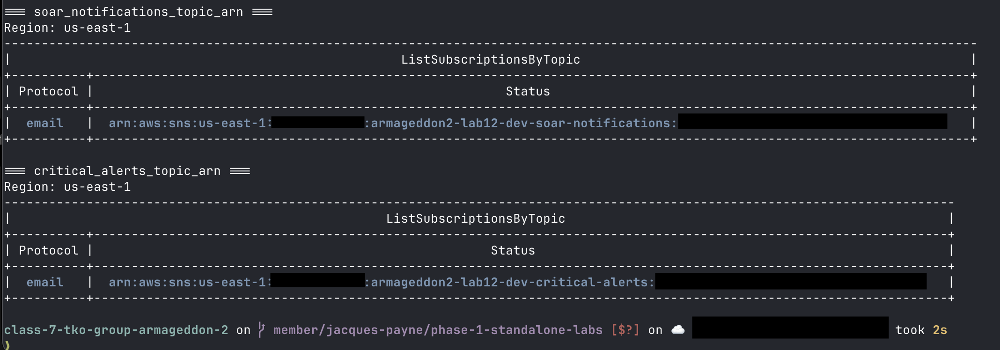

## Deployment evidence

### Terraform plan

The final reviewed plan proposed 47 additions, zero changes, and zero destroys.

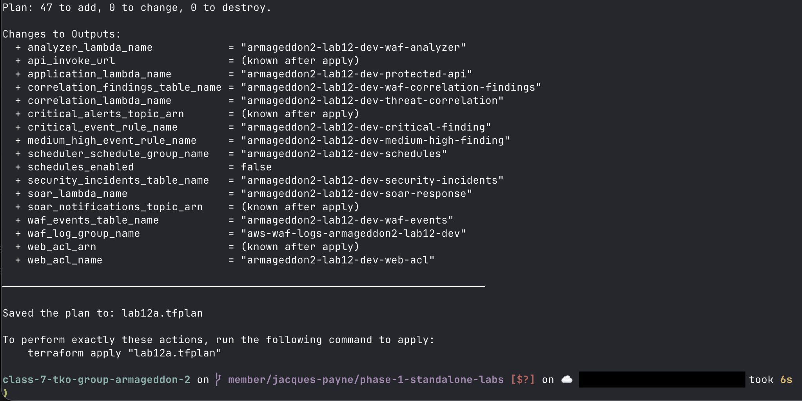

### Terraform apply

The saved plan deployed exactly 47 resources.

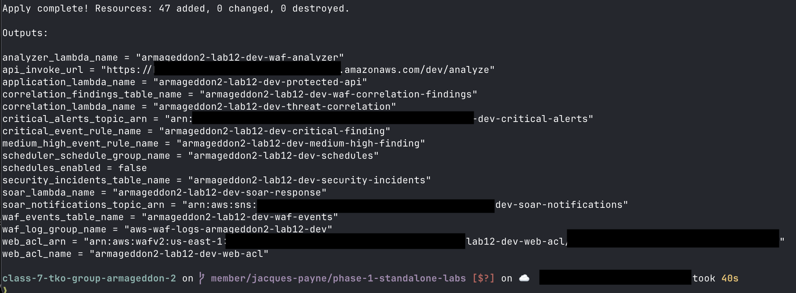

### EventBridge routing

The MEDIUM/HIGH rule has one SOAR target. The CRITICAL rule has both the SOAR target and the immediate critical-alert SNS target.

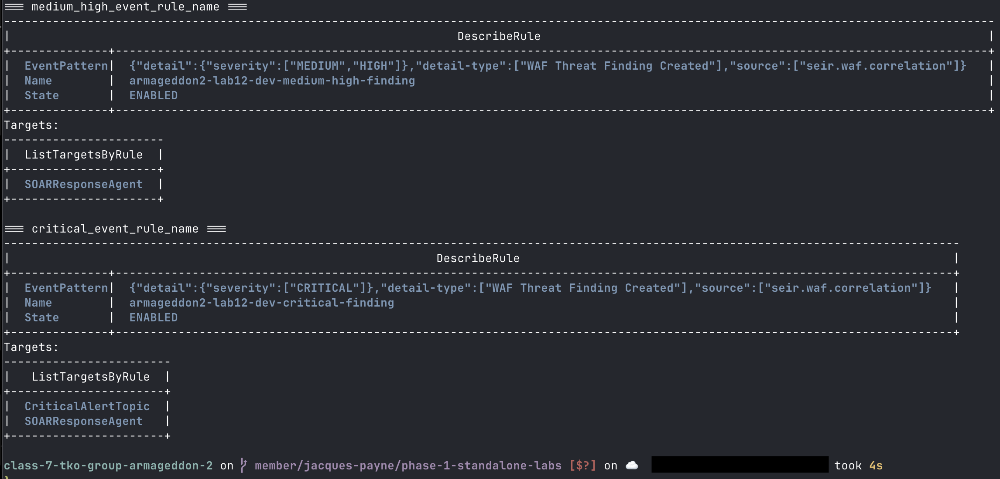

## Operational validation

### HIGH-severity workflow

A synthetic HIGH finding selected `CREATE_AND_ESCALATE_INCIDENT`, created a priority-2 incident, published an SNS notification, and updated the finding to `RESPONSE_COMPLETED`.

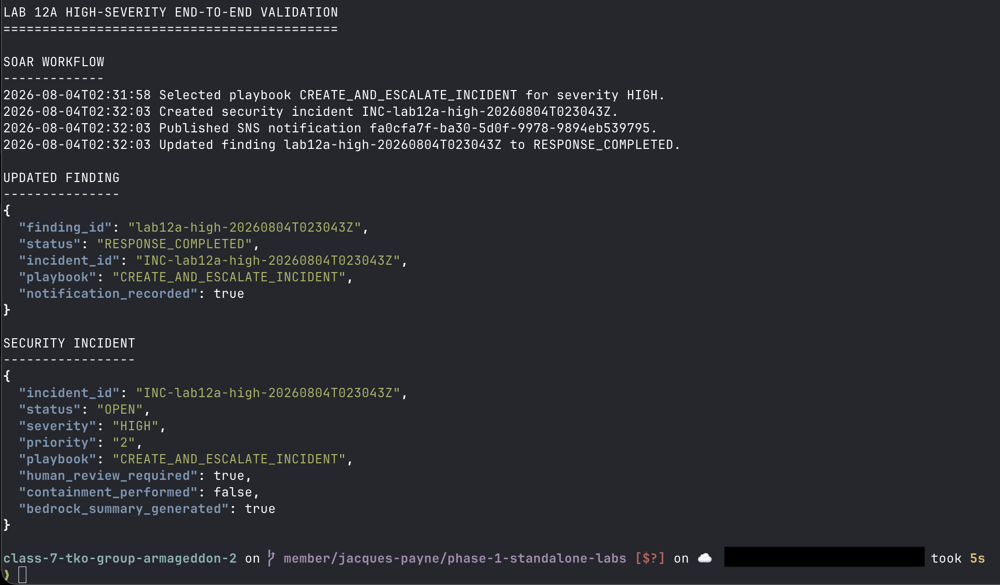

### Idempotent retry

Replaying the same finding after completion returned an already-processed result. Exactly one incident remained associated with the finding.

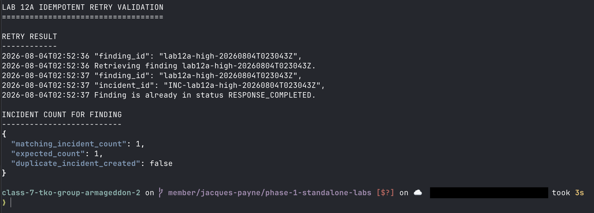

### CRITICAL workflow

A synthetic CRITICAL finding selected `REQUEST_URGENT_REVIEW`, created a priority-1 incident, and preserved the human-approval boundary.

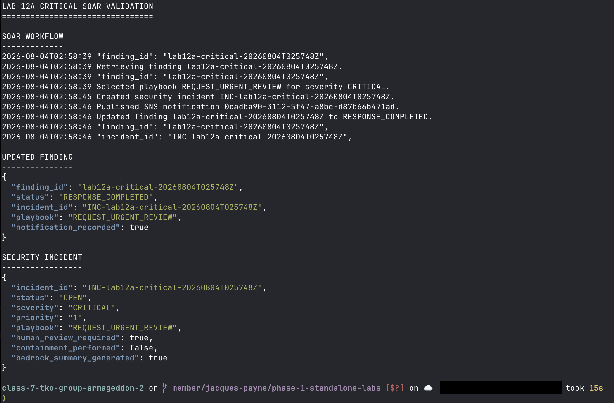

CloudWatch SNS metrics confirmed that the CRITICAL event produced one message on each routing destination.

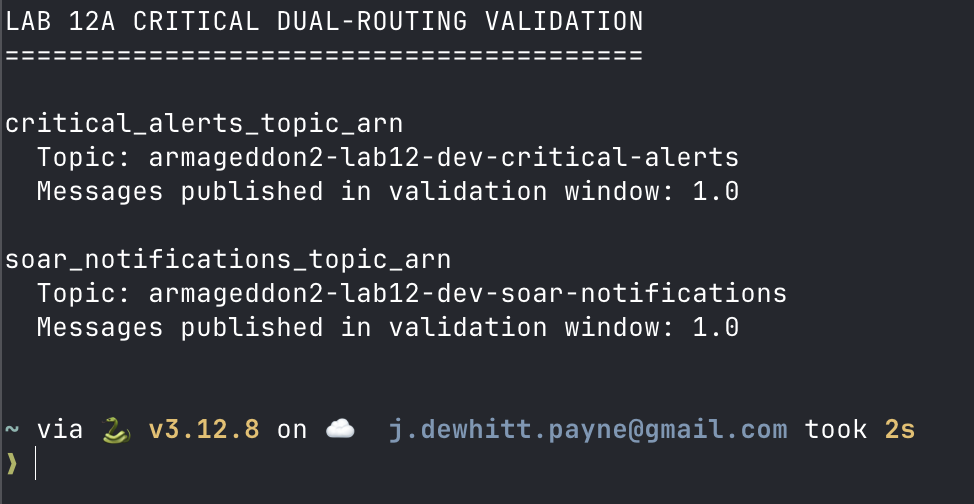

### Automated correlation-to-SOAR workflow

Part A proves that three normalized WAF events were correlated into a HIGH finding with risk score 60 and that the correlation Lambda successfully called EventBridge `PutEvents`.

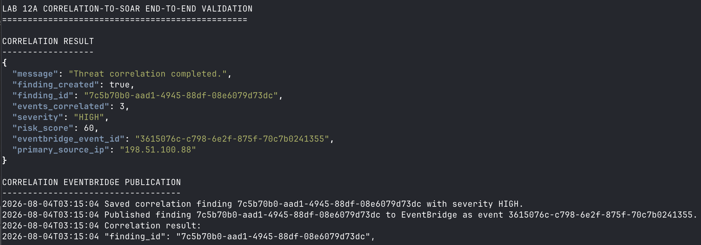

Part B proves that EventBridge invoked the SOAR Lambda automatically, which created the incident, published the notification, and updated the finding to `RESPONSE_COMPLETED`.

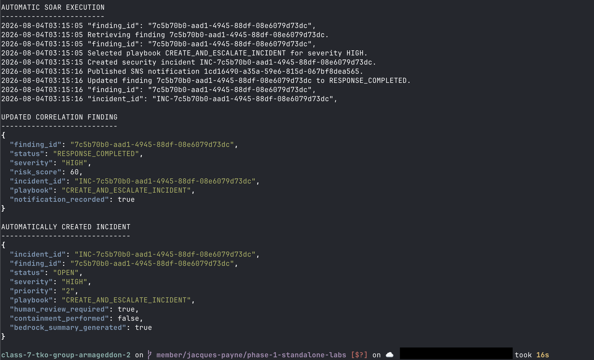

### Terraform no-drift check

After operational testing, Terraform reported that the deployed infrastructure still matched the configuration.

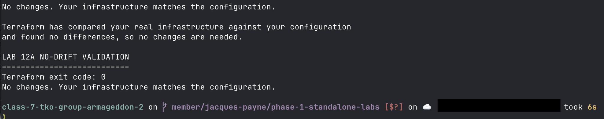

## Security and privacy notes

- The EventBridge event contains routing metadata only.
- The SOAR Lambda retrieves the authoritative finding from DynamoDB.
- IAM permissions are scoped to the required tables, topics, log groups, Bedrock resources, and the default EventBridge bus.
- Test source addresses use documentation-only IP ranges.
- Screenshots intentionally retain the personal repository and branch identity as submission attribution.
- AWS account IDs, email addresses, subscription identifiers, API identifiers, and environment-specific ARNs are redacted.
- Screenshot redactions must be flattened before committing evidence.

## Cleanup

Do not destroy the deployment until all documentation, architecture artifacts, repository validation, and evidence checks are complete.

The final cleanup will use a reviewed Terraform destroy plan, followed by destroy evidence and post-destroy verification.

## Teardown and post-destroy verification

A reviewed destroy plan proposed exactly 47 removals with no additions or
changes.

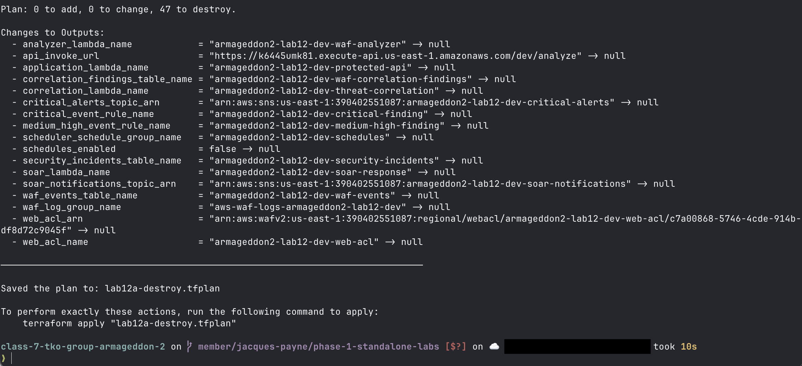

The saved destroy plan removed all 47 managed resources.

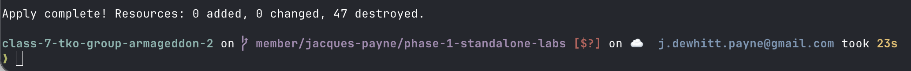

Post-destroy verification confirmed that Terraform state contained zero
managed resources and that no objects remained to destroy.

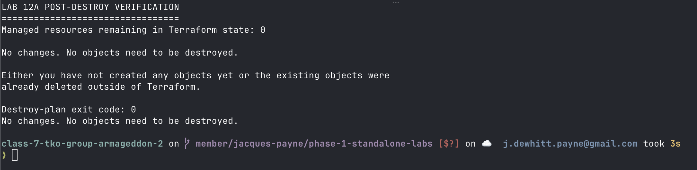
