# Lab 12C: Compliance Evidence Agent Runbook

## Purpose

This runbook documents deployment, validation, operation, evidence capture, troubleshooting, and teardown for the standalone Lab 12C Compliance Agent.

Lab 12C extends the inherited Lab 12B executive-reporting workflow by adding a compliance-evidence Lambda function that:

1. Loads a reusable control library from `controls.json`.
2. Selects controls mapped to the requested compliance framework or frameworks.
3. Evaluates each control with deterministic Python validators.
4. Writes one evidence record per evaluated control to DynamoDB.
5. Calculates a deterministic compliance score.
6. Optionally invokes Amazon Bedrock to explain already-computed results.
7. Generates synchronized PDF and JSON compliance reports.
8. Publishes both report artifacts to Amazon S3.

The core design rule is:

```text
Python evaluates controls.
Bedrock explains the results.
```

Amazon Bedrock does not determine whether a control passes, fails, or requires review.

## Runbook command convention

Exact operational commands are appropriate in a professional runbook when they make a procedure safer, repeatable, and auditable. Read-only verification commands can normally be copied directly. Commands that change or destroy infrastructure should be surrounded by prerequisites, plan review, expected results, and an explicit approval point.

Environment-specific values such as account IDs, email addresses, bucket names, API IDs, and ARNs should be parameterized or replaced with placeholders when the runbook is reused outside this lab.

This runbook therefore keeps the commands beside the operational step they support. A separate quick-reference command guide is also maintained for faster day-to-day use.

## Evidence location

Lab 12C screenshots and preserved artifacts are stored under:

```text
phase-2/lab12c/evidence/
```

Because this runbook is intended to live in `phase-2/lab12c/runbooks/`, evidence links use the relative path:

```text
../evidence/<filename>
```

## Authorization and compliance boundary

Authorized operations include:

- reading configured AWS resources for compliance evidence
- describing and scanning approved DynamoDB tables
- checking the configured S3 executive-report prefix
- evaluating controls with deterministic Python validators
- writing immutable compliance evidence records
- calculating PASS, FAIL, and REVIEW results
- calculating the overall compliance score
- invoking the configured Bedrock model for narrative explanation
- rendering a PDF report in Lambda memory
- publishing synchronized PDF and JSON artifacts to the configured S3 prefix
- writing execution logs to CloudWatch Logs

Unauthorized operations include:

- claiming that the organization is certified
- claiming that an audit has been passed
- declaring that the environment is secure
- allowing Bedrock to determine PASS, FAIL, or REVIEW
- automatically remediating failed controls
- modifying WAF rules
- disabling users, credentials, or services
- performing containment
- changing production resources as a result of a compliance finding

The agent reports only what the available evidence supports.

## Architecture flow

```text
controls.json
    |
    v
Compliance Agent Lambda
    |
    +--> Select requested frameworks
    |
    +--> Deterministic validators
    |       |
    |       +--> DynamoDB table checks
    |       +--> S3 prefix checks
    |       +--> future reusable validators
    |
    +--> DynamoDB compliance-evidence
    |
    +--> Deterministic compliance score
    |
    +--> Optional Amazon Bedrock explanation
    |
    +--> Shared report document
            |
            +--> JSON
            +--> ReportLab PDF
                    |
                    v
              Amazon S3
              compliance-reports/
```

The Compliance Agent consumes evidence from the inherited Lab 12/Lab 12A/Lab 12B workflow:

```text
AWS WAF
  -> CloudWatch Logs
  -> WAF analyzer Lambda
  -> DynamoDB waf-events
  -> threat-correlation Lambda
  -> DynamoDB waf-correlation-findings
  -> EventBridge
  -> SOAR response Lambda
  -> DynamoDB security-incidents
  -> executive-dashboard Lambda
  -> S3 executive-reports/
  -> Compliance Agent
```

## Control library

The Compliance Agent loads:

```text
json/controls.json
```

The control rules remain outside the Python engine. This allows controls and framework mappings to change without rewriting the evaluation engine.

The validated Lab 12C implementation contains four controls:

| Control | Purpose | Validator |
|---|---|---|
| `CTRL-001` | AWS WAF protection | `table_exists` |
| `CTRL-002` | Threat correlation | `table_exists` |
| `CTRL-003` | Incident response | `table_exists` |
| `CTRL-004` | Executive reporting | `s3_prefix` |

The control library references environment-variable names rather than hard-coded environment-specific resource names:

```text
WAF_EVENTS_TABLE
CORRELATION_FINDINGS_TABLE
SECURITY_INCIDENTS_TABLE
REPORT_BUCKET
EXECUTIVE_REPORT_PREFIX
```

The Python helper `resolve_reference()` resolves those names to deployed AWS resource values at runtime.

## Supported validators

The current Compliance Agent includes reusable validator functions such as:

```text
table_exists
table_not_empty
minimum_records
s3_prefix
```

The Lab 12C control library currently uses `table_exists` and `s3_prefix`.

Validator behavior is deterministic. A control that cannot be evaluated must not silently pass.

The configured fallback status is:

```text
UNEVALUATED_STATUS=REVIEW
```

## Framework selection

The test event used during validation requests:

```json
{
  "frameworks": [
    "NIST CSF 2.0",
    "CIS Controls v8"
  ]
}
```

Controls are selected when at least one requested framework matches a framework mapping on the control.

## Evidence model

Each evaluated control immediately creates an evidence record in:

```text
DynamoDB table:
armageddon2-lab12-dev-compliance-evidence
```

The partition key is:

```text
evidence_id
```

Writing evidence after each control preserves partial progress if the Lambda execution fails before report generation.

Evidence records are not overwritten between runs. Each execution generates new evidence IDs.

During validated testing:

```text
Deterministic run:
4 controls evaluated
4 evidence records written

Bedrock-enabled run:
4 controls evaluated
4 additional evidence records written

Final count:
8 evidence records
```

## Compliance scoring

PASS, FAIL, and REVIEW outcomes are computed by Python.

The score is mathematical and deterministic. Amazon Bedrock does not calculate the control status or compliance score.

Validated deterministic execution produced:

```text
overall_status: PASS
score_percent: 100.0
controls_evaluated: 4
evidence_records_written: 4
bedrock_used: false
```

## Report generation

The Compliance Agent creates one shared report document and renders two views:

```text
Shared report document
    |
    +--> JSON
    |
    +--> PDF
```

Both artifacts use the same report ID and are written beneath:

```text
compliance-reports/YYYY/MM/DD/
```

Object layout:

```text
compliance-reports/
└── YYYY/
    └── MM/
        └── DD/
            ├── pdf/
            │   └── compliance-<timestamp>.pdf
            └── json/
                └── compliance-<timestamp>.json
```

The PDF is intended for human review. The JSON artifact is intended for machines, automation, analytics, and future agent workflows.

## ReportLab layer

Lab 12C reuses the ReportLab Lambda layer inherited from Lab 12B.

Validated layer:

```text
Python runtime: python3.12
Architecture: x86_64
ReportLab: 4.4.3
```

The Lambda deployment ZIP contains only:

```text
compliance.py
controls.json
```

Verify the package:

```bash
unzip -l compliance-agent.zip
```

Validate the packaged control library:

```bash
unzip -p compliance-agent.zip controls.json
```

## Pre-deployment AWS baseline

Before deployment, verify whether matching lab resources already exist. These commands are read-only and help distinguish a clean environment from an update or drift-recovery scenario.

```bash
aws dynamodb list-tables \
  --region us-east-1 \
  --no-cli-pager

aws lambda list-functions \
  --region us-east-1 \
  --query "Functions[?contains(FunctionName, 'armageddon2-lab12-dev')].FunctionName" \
  --output text \
  --no-cli-pager

aws events list-rules \
  --region us-east-1 \
  --name-prefix armageddon2-lab12-dev \
  --query "Rules[].Name" \
  --output text \
  --no-cli-pager

aws sns list-topics \
  --region us-east-1 \
  --query "Topics[?contains(TopicArn, ':armageddon2-lab12-dev')].TopicArn" \
  --output text \
  --no-cli-pager
```

Evidence:

No dedicated predeployment-baseline screenshot was retained for this run. The AWS-side baseline was verified from the CLI before deployment.

## Local validation

From the Lab 12C Terraform directory:

```bash
terraform fmt -recursive
terraform validate
```

Validate the test event:

```bash
ls -l ../json/compliance_test_event.json
cat ../json/compliance_test_event.json
```

Validate the Lambda deployment package and the packaged control library:

```bash
unzip -l compliance-agent.zip
unzip -p compliance-agent.zip controls.json
```

Expected result:

```text
Success! The configuration is valid.
```

Evidence:

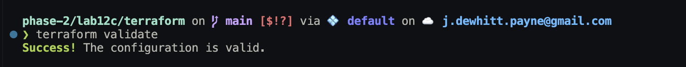

## Terraform plan review

Create and preserve a saved plan:

```bash
terraform plan -out=lab12c.tfplan
terraform show -no-color lab12c.tfplan > lab12c-03-terraform-plan.txt
```

Inspect the saved plan summary and outputs:

```bash
terraform show -no-color lab12c.tfplan | tail -n 40
```

Verify required IAM permissions are present:

```bash
terraform show -no-color lab12c.tfplan | \
grep -E 'dynamodb:Scan|dynamodb:PutItem|events:DescribeRule|scheduler:GetSchedule|sns:GetTopicAttributes|lambda:GetFunctionConfiguration'
```

The initial reviewed Lab 12C plan reported:

```text
Plan: 63 to add, 0 to change, 0 to destroy.
```

Review the following before applying:

- Compliance Lambda runtime is Python 3.12
- architecture is x86_64
- memory is 512 MB
- timeout is 120 seconds
- handler is `compliance.lambda_handler`
- ReportLab layer is attached
- DynamoDB evidence table uses `evidence_id` as the partition key
- report writes are restricted to the compliance-report prefix
- DynamoDB validator access is restricted to the required Phase 1 tables
- no resources are proposed for destruction

Evidence:


## IAM validation

The Compliance Agent policy must include resource scoping for every policy statement.

The DynamoDB validation statement requires:

```hcl
actions = [
  "dynamodb:DescribeTable",
  "dynamodb:Scan",
]

resources = [
  aws_dynamodb_table.waf_events.arn,
  aws_dynamodb_table.correlation_findings.arn,
  aws_dynamodb_table.security_incidents.arn,
]
```

The evidence-write statement requires:

```hcl
actions = [
  "dynamodb:BatchWriteItem",
  "dynamodb:PutItem",
]

resources = [
  aws_dynamodb_table.compliance_evidence.arn,
]
```

Additional read-only validator permissions include:

```text
events:DescribeRule
scheduler:GetSchedule
sns:GetTopicAttributes
lambda:GetFunctionConfiguration
```

Inspect the rendered plan:

```bash
terraform show -no-color lab12c.tfplan | \
grep -B 15 -A 15 'ValidateDynamoDBControls'
```

Evidence:

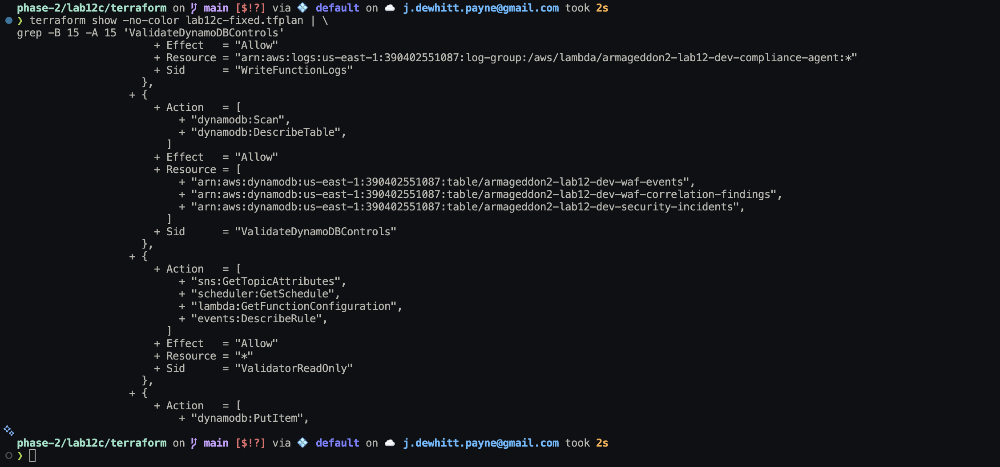

For line-numbered source inspection during IAM troubleshooting:

```bash
nl -ba lab12c-iam-compliance.tf | sed -n '1,150p'
```

## Deployment

Apply the reviewed saved plan:

```bash
terraform apply lab12c.tfplan
```

The first deployment attempt partially succeeded before an IAM policy error stopped the apply.

After correcting the IAM policy and generating a new saved plan, Terraform reported:

```text
Plan: 2 to add, 0 to change, 0 to destroy.
```

Apply the corrected plan:

```bash
terraform apply lab12c-fixed.tfplan
```

Completed result:

```text
Apply complete! Resources: 2 added, 0 changed, 0 destroyed.
```

Terraform preserved the resources that had already been created during the partial apply.

Evidence:


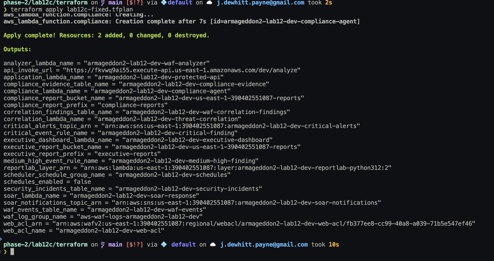

## Post-deployment Lambda validation

Inspect the deployed Lambda:

```bash
aws lambda get-function-configuration \
  --function-name armageddon2-lab12-dev-compliance-agent \
  --region us-east-1 \
  --no-cli-pager
```

Validated configuration:

```text
Runtime: python3.12
Handler: compliance.lambda_handler
Timeout: 120
Memory: 512 MB
ReportLab layer: attached
```

Evidence:

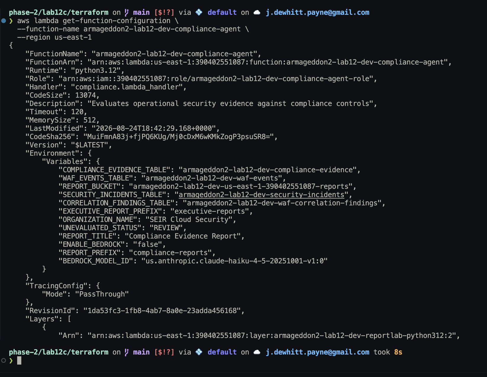

For a compact configuration check:

```bash
aws lambda get-function-configuration \
  --function-name armageddon2-lab12-dev-compliance-agent \
  --region us-east-1 \
  --query '{Runtime:Runtime,Handler:Handler,Timeout:Timeout,MemorySize:MemorySize,Environment:Environment.Variables,Layers:Layers[*].Arn}' \
  --no-cli-pager
```

## DynamoDB evidence-table validation

Verify the evidence table:

```bash
aws dynamodb describe-table \
  --table-name armageddon2-lab12-dev-compliance-evidence \
  --region us-east-1 \
  --query 'Table.{Name:TableName,Status:TableStatus,KeySchema:KeySchema,BillingMode:BillingModeSummary.BillingMode}' \
  --no-cli-pager
```

Expected result:

```text
Status: ACTIVE
Partition key: evidence_id
Key type: HASH
Billing mode: PAY_PER_REQUEST
```

Evidence:

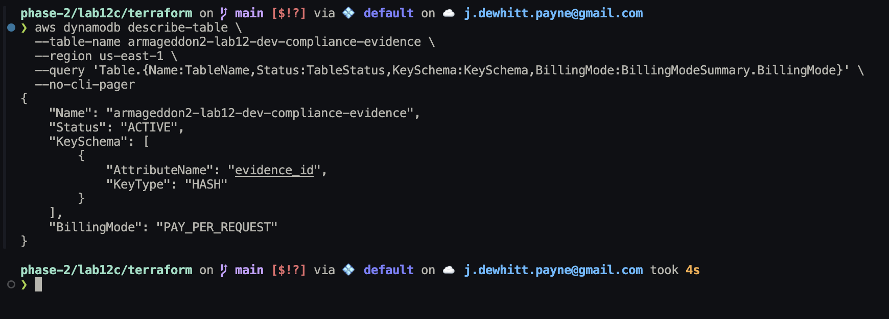

## Executive-report prerequisite

`CTRL-004` validates that an executive security report exists under the configured S3 prefix.

Before running Lab 12C, verify:

```bash
aws s3 ls \
  s3://<REPORT_BUCKET>/executive-reports/ \
  --recursive \
  --region us-east-1 \
  --no-cli-pager
```

If the prefix is empty, invoke the inherited Lab 12B executive-dashboard Lambda:

```bash
aws lambda invoke \
  --function-name armageddon2-lab12-dev-executive-dashboard \
  --payload '{"report_period_hours":24}' \
  --cli-binary-format raw-in-base64-out \
  --region us-east-1 \
  --no-cli-pager \
  lab12b-response.json
```

Successful validation produced:

```text
statusCode: 200
message: Executive security report generated and published.
bedrock_used: true
```

Evidence:

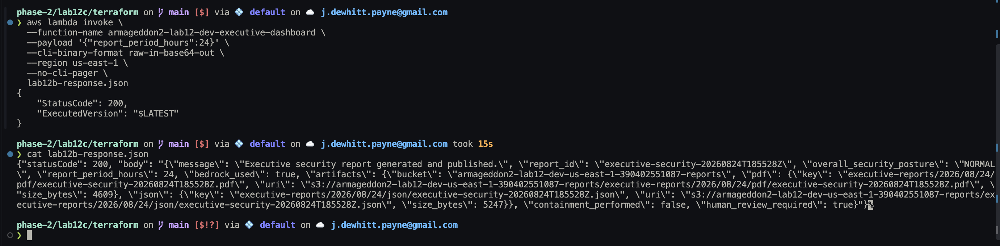
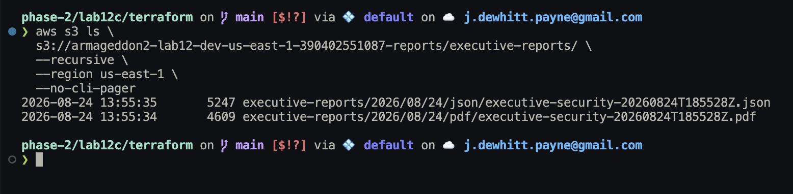

## Deterministic compliance validation

The first controlled Lab 12C execution deliberately disables Bedrock:

```hcl
enable_compliance_bedrock = false
```

Invoke:

```bash
aws lambda invoke \
  --function-name armageddon2-lab12-dev-compliance-agent \
  --payload file://../json/compliance_test_event.json \
  --cli-binary-format raw-in-base64-out \
  --region us-east-1 \
  --no-cli-pager \
  lab12c-response.json
```

Inspect:

```bash
cat lab12c-response.json
```

Validated result:

```text
statusCode: 200
overall_status: PASS
score_percent: 100.0
controls_evaluated: 4
evidence_records_written: 4
bedrock_used: false
certification_claimed: false
human_review_required: false
```

Evidence:

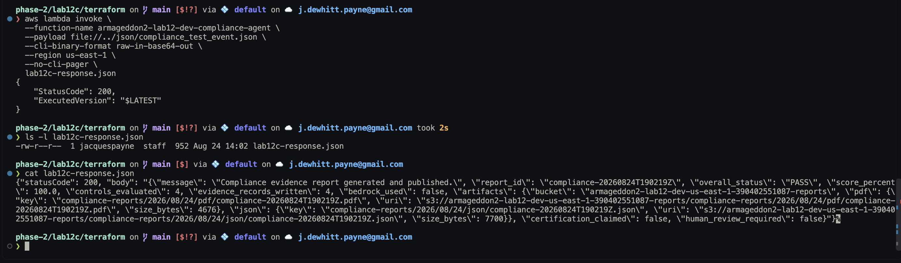

## Compliance-report validation

```bash
aws s3 ls \
  s3://<REPORT_BUCKET>/compliance-reports/ \
  --recursive \
  --region us-east-1 \
  --no-cli-pager
```

Evidence:

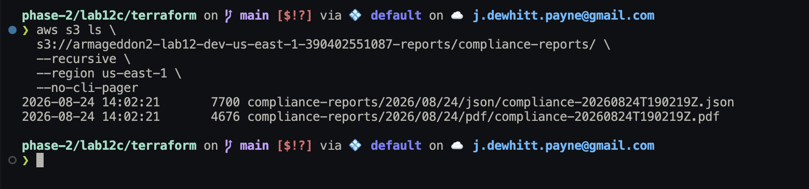

## Compliance-evidence validation

Count records:

```bash
aws dynamodb scan \
  --table-name armageddon2-lab12-dev-compliance-evidence \
  --region us-east-1 \
  --select COUNT \
  --no-cli-pager
```

After the deterministic run:

```text
Count: 4
ScannedCount: 4
```

Inspect evidence:

```bash
aws dynamodb scan \
  --table-name armageddon2-lab12-dev-compliance-evidence \
  --region us-east-1 \
  --projection-expression "control_id,#s,observation,evidence_id" \
  --expression-attribute-names '{"#s":"status"}' \
  --no-cli-pager
```

Compact summary:

```bash
aws dynamodb scan \
  --table-name armageddon2-lab12-dev-compliance-evidence \
  --region us-east-1 \
  --projection-expression "control_id,#s" \
  --expression-attribute-names '{"#s":"status"}' \
  --query 'sort_by(Items,&control_id.S)[].{Control:control_id.S,Status:status.S}' \
  --output table \
  --no-cli-pager
```

Validated results:

```text
CTRL-001 PASS
CTRL-002 PASS
CTRL-003 PASS
CTRL-004 PASS
```

Evidence:

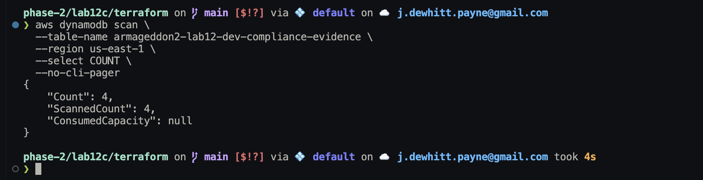
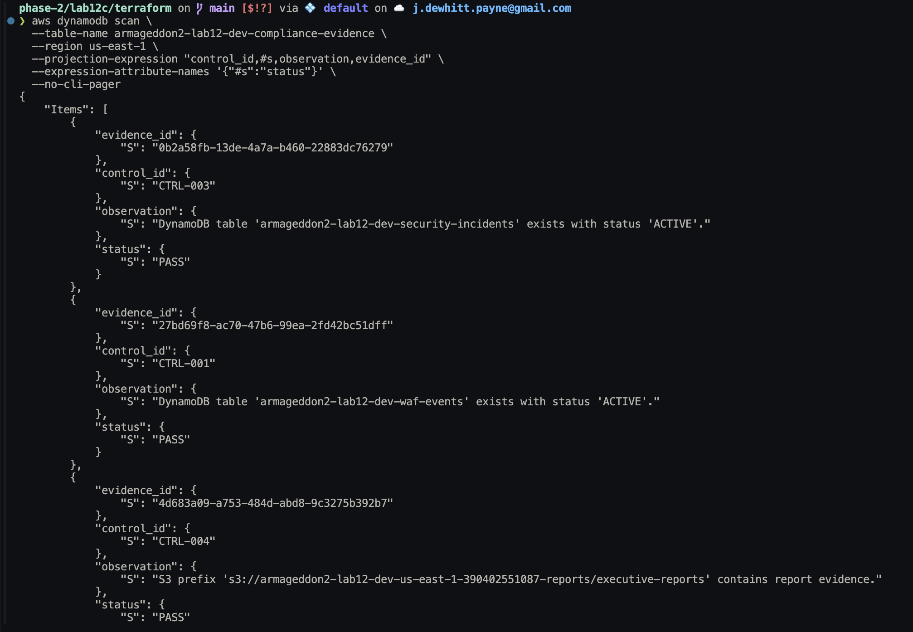
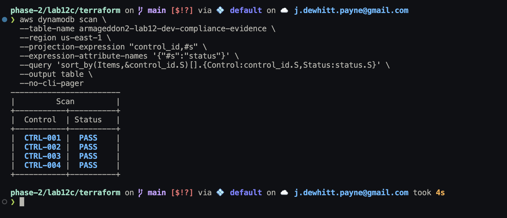

## CloudWatch validation

```bash
aws logs tail \
  /aws/lambda/armageddon2-lab12-dev-compliance-agent \
  --since 15m \
  --region us-east-1 \
  --format short \
  --no-cli-pager
```

Validated deterministic run:

```text
Bedrock is disabled. Using deterministic fallback.
overall_status: PASS
score_percent: 100.0
controls_evaluated: 4
evidence_records_written: 4
bedrock_used: false
```

Evidence:

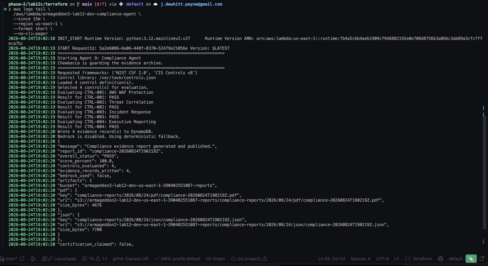

## Bedrock-enabled validation

Enable Bedrock through Terraform:

```hcl
enable_compliance_bedrock = true
```

Validate and plan:

```bash
terraform fmt terraform.tfvars
terraform validate
terraform plan -out=lab12c-bedrock.tfplan
```

Reviewed plan:

```text
ENABLE_BEDROCK = "false" -> "true"

Plan: 0 to add, 1 to change, 0 to destroy.
```

Apply:

```bash
terraform apply lab12c-bedrock.tfplan
```

Completed result:

```text
Apply complete! Resources: 0 added, 1 changed, 0 destroyed.
```

Evidence:

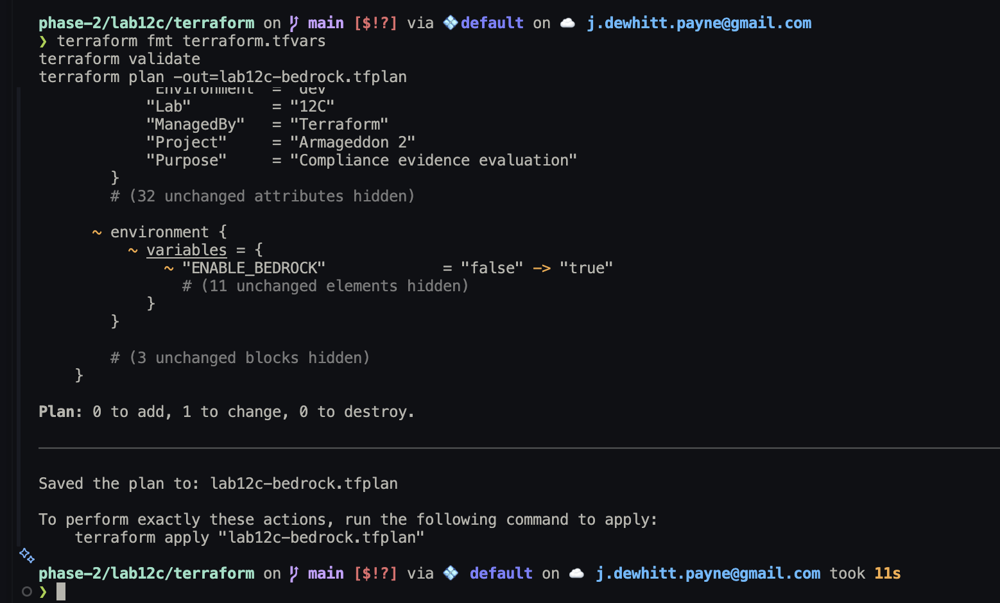
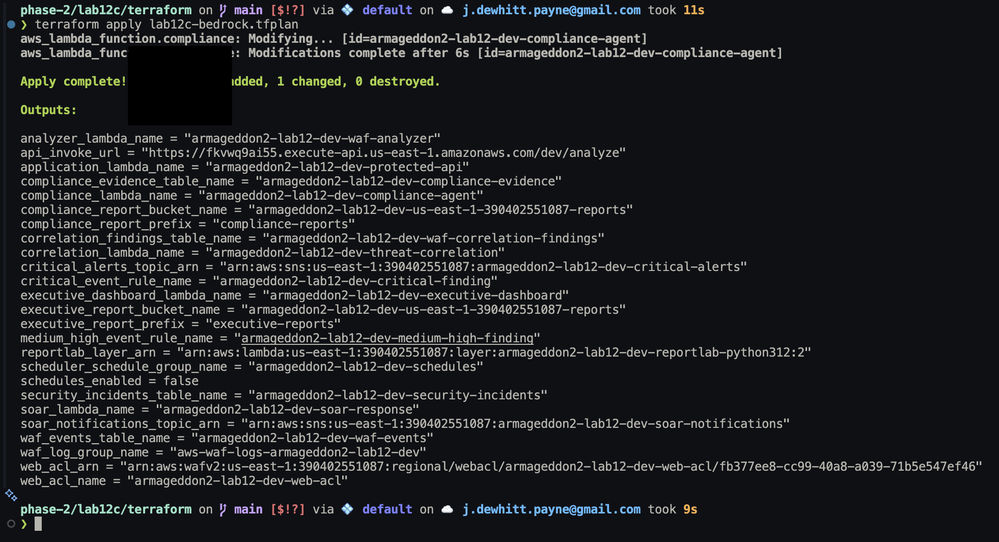

Verify configuration:

```bash
aws lambda get-function-configuration \
  --function-name armageddon2-lab12-dev-compliance-agent \
  --region us-east-1 \
  --query 'Environment.Variables.ENABLE_BEDROCK' \
  --output text \
  --no-cli-pager
```

Expected:

```text
true
```

Evidence:

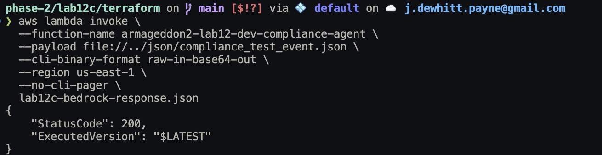

Invoke again:

```bash
aws lambda invoke \
  --function-name armageddon2-lab12-dev-compliance-agent \
  --payload file://../json/compliance_test_event.json \
  --cli-binary-format raw-in-base64-out \
  --region us-east-1 \
  --no-cli-pager \
  lab12c-bedrock-response.json
```

Validated result:

```text
statusCode: 200
overall_status: PASS
score_percent: 100.0
controls_evaluated: 4
evidence_records_written: 4
bedrock_used: true
certification_claimed: false
human_review_required: false
```

Evidence:

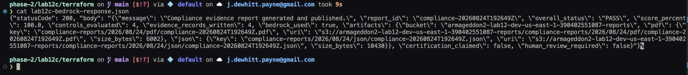

## Evidence history after repeated runs

```bash
aws dynamodb scan \
  --table-name armageddon2-lab12-dev-compliance-evidence \
  --region us-east-1 \
  --select COUNT \
  --no-cli-pager
```

After both controlled runs:

```text
Count: 8
ScannedCount: 8
```

Evidence:

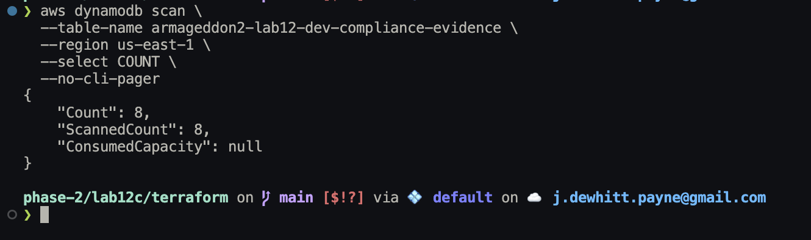

## Troubleshooting

### IAM `MalformedPolicyDocument`

Initial symptom:

```text
MalformedPolicyDocument: Policy statement must contain resources.
```

Root cause:

The `ValidateDynamoDBControls` statement contained actions but no `resources` block.

Broken pattern:

```hcl
statement {
  sid    = "ValidateDynamoDBControls"
  effect = "Allow"

  actions = [
    "dynamodb:DescribeTable",
    "dynamodb:Scan",
  ]
}
```

Correct pattern:

```hcl
statement {
  sid    = "ValidateDynamoDBControls"
  effect = "Allow"

  actions = [
    "dynamodb:DescribeTable",
    "dynamodb:Scan",
  ]

  resources = [
    aws_dynamodb_table.waf_events.arn,
    aws_dynamodb_table.correlation_findings.arn,
    aws_dynamodb_table.security_incidents.arn,
  ]
}
```

`terraform validate` succeeded because it validates Terraform configuration structure. AWS rejected the resulting IAM policy during service-side validation.

Correct recovery:

1. Fix the IAM policy.
2. Run `terraform fmt`.
3. Run `terraform validate`.
4. Generate a new saved plan.
5. Review the plan.
6. Confirm zero destroys.
7. Apply the new saved plan.

Do not reuse a stale plan after changing configuration or after a partial apply.

Troubleshooting evidence:

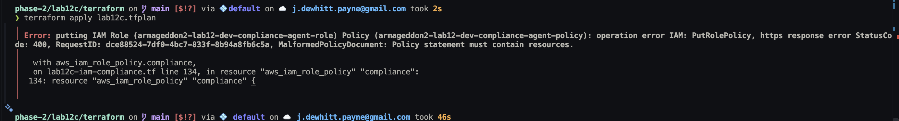


## AWS CLI pager behavior

Disable paging for one command:

```bash
aws <service> <operation> ... --no-cli-pager
```

Disable for the current shell:

```bash
export AWS_PAGER=""
```

Disable persistently:

```bash
aws configure set cli_pager ""
```

## Terraform ownership and drift prevention

Terraform owns the Lab 12C resources.

Do not manually modify Terraform-managed:

- Lambda environment variables
- IAM policies
- DynamoDB tables
- S3 configuration
- Lambda layers
- CloudWatch log groups

Manual console inspection is acceptable. Manual console mutation creates drift.

## No-drift validation

After operational testing:

```bash
terraform plan \
  -detailed-exitcode \
  -input=false \
  -no-color
```

Validated result:

```text
No changes. Your infrastructure matches the configuration.
```

Evidence:

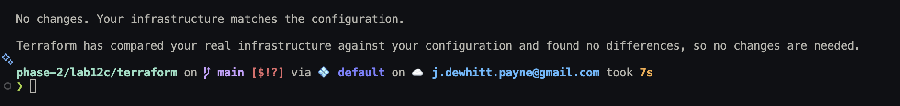

## Evidence handling

Before committing evidence, redact or remove:

- AWS account IDs
- email addresses
- API Gateway invoke URLs
- environment-specific ARNs when not required
- bucket names containing account IDs
- credentials or tokens
- private or real source IP addresses
- environment-specific identifiers that are not required for the evidence claim

Do not commit:

- `terraform.tfvars`
- Terraform state
- Terraform saved plans
- generated Lambda ZIP files
- generated ReportLab layer ZIP files
- credentials, tokens, or secrets

Flatten screenshot redactions into the final PNG pixels before committing them.

## Known implementation boundaries

### `compliance-findings`

The instructor playbook describes a future `compliance-findings` table.

The validated Lab 12C implementation does **not** currently create or use that table.

Current persistent compliance storage is:

```text
compliance-evidence
```

`compliance-findings` remains a future extension and must not be described as deployed functionality.

### Compliance claims

A `PASS` result means only that the configured deterministic validator found evidence satisfying the control definition at evaluation time.

It does not mean:

```text
certified
audit passed
secure
compliant with every requirement of a framework
```

## Command execution conventions

The commands in this runbook are intentionally included so the procedure is reproducible.

Use the following operating pattern for infrastructure changes:

```text
inspect
  -> validate
  -> plan
  -> review
  -> apply saved plan
  -> verify
  -> preserve evidence
```

For destructive actions:

```text
preserve required artifacts
  -> create destroy plan
  -> review destroy count and resources
  -> apply the saved destroy plan
  -> verify Terraform state
  -> verify AWS inventory
```

Do not paste secrets into shell history, screenshots, Terraform source, or reusable documentation. Replace environment-specific identifiers with variables or placeholders when adapting this runbook for another environment.

## Operational notes

- Always pass `--region us-east-1` to AWS CLI commands for this deployment.
- Keep `terraform.tfvars` out of Git.
- Use saved Terraform plans for reviewed infrastructure changes.
- Generate a new plan after any configuration change or partial apply.
- Keep Bedrock disabled until the deterministic workflow has been validated.
- Bedrock explanations must never control PASS, FAIL, or REVIEW.
- Preserve PDF and JSON report pairs before destroying the report bucket.
- Preserve evidence screenshots before teardown.
- Verify Lab 12B executive-report evidence before testing `CTRL-004`.
- DynamoDB `Scan` does not guarantee item ordering.
- Use `sort_by()` in AWS CLI queries when ordered screenshot output is useful.

## Preserve final compliance artifacts

Before teardown, preserve the final Bedrock-enabled PDF and JSON report pair locally.

Create the artifact directory:

```bash
mkdir -p ../evidence/artifacts
```

Download the validated final report pair:

```bash
aws s3 cp \
  s3://armageddon2-lab12-dev-us-east-1-<AWS_ACCOUNT_ID>-reports/compliance-reports/2026/08/24/pdf/compliance-20260824T192649Z.pdf \
  ../evidence/artifacts/lab12c-final-compliance-report.pdf \
  --region us-east-1

aws s3 cp \
  s3://armageddon2-lab12-dev-us-east-1-<AWS_ACCOUNT_ID>-reports/compliance-reports/2026/08/24/json/compliance-20260824T192649Z.json \
  ../evidence/artifacts/lab12c-final-compliance-report.json \
  --region us-east-1
```

Verify the local files:

```bash
ls -lh ../evidence/artifacts/
```

Calculate SHA-256 hashes:

```bash
shasum -a 256 \
  ../evidence/artifacts/lab12c-final-compliance-report.pdf \
  ../evidence/artifacts/lab12c-final-compliance-report.json
```

Preserved hashes:

```text
lab12c-final-compliance-report.pdf
876d720e1d9ba5d905acaedbf40e34dc4380649437df4784bb9f0c4e5b986b77

lab12c-final-compliance-report.json
82a5924dec6845bf7d97efe21c385f5abfeed142b084921871be543a8c21538d
```

Evidence (stored with the preserved report artifacts in `evidence/artifacts/`):

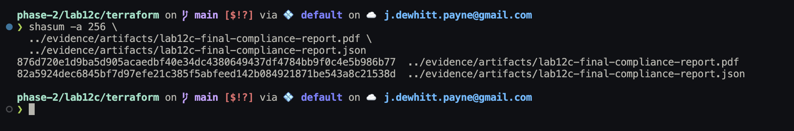
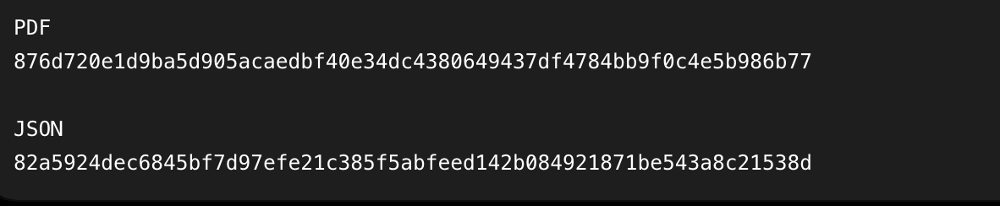

Preserved artifacts:

- [Final compliance PDF](../evidence/artifacts/lab12c-final-compliance-report.pdf)
- [Final compliance JSON](../evidence/artifacts/lab12c-final-compliance-report.json)

## Teardown

Do not destroy the deployment until:

- Lab 12C documentation is complete
- evidence screenshots are preserved
- required PDF and JSON reports are preserved
- artifact hashes are recorded
- architecture artifacts are complete
- repository validation is complete
- no-drift evidence is captured
- the team no longer needs inherited Lab 12/Lab 12A/Lab 12B resources

Create a reviewed destroy plan:

```bash
terraform plan \
  -destroy \
  -input=false \
  -out=lab12c-destroy.tfplan
```

Inspect the saved destroy plan before applying it:

```bash
terraform show -no-color lab12c-destroy.tfplan | tail -n 40

terraform show -no-color lab12c-destroy.tfplan | \
grep '^  # .* will be destroyed'
```

Validated destroy plan:

```text
Plan: 0 to add, 0 to change, 63 to destroy.
```

Evidence:

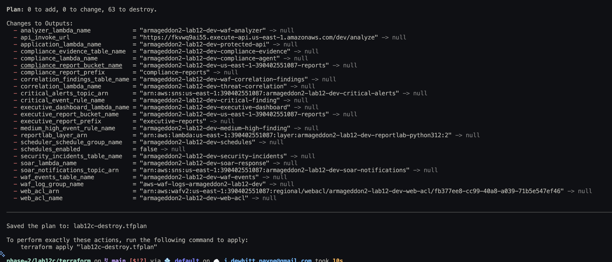

Apply the exact reviewed saved plan:

```bash
terraform apply lab12c-destroy.tfplan
```

Completed result:

```text
Apply complete! Resources: 0 added, 0 changed, 63 destroyed.
```

Evidence:

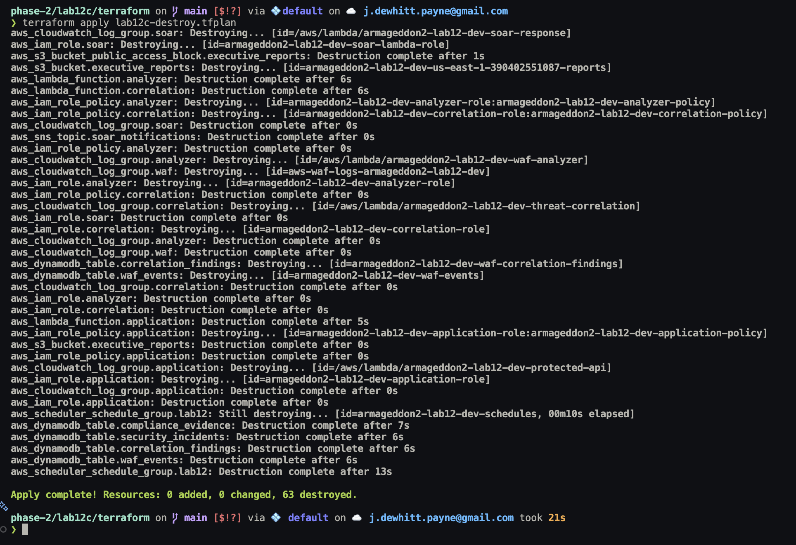

## Post-destroy verification

Verify Terraform state is empty:

```bash
terraform state list
```

The validated result produced no output.

Then confirm Terraform has nothing left to destroy:

```bash
terraform plan \
  -destroy \
  -input=false \
  -no-color
```

Validated result:

```text
No changes. No objects need to be destroyed.
```

Evidence:

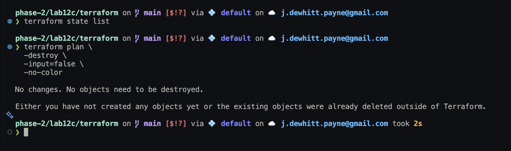

Verify that no matching Armageddon resources remain in AWS:

```bash
echo "=== Lambda Functions ==="
aws lambda list-functions \
  --region us-east-1 \
  --query "Functions[?contains(FunctionName, 'armageddon2-lab12-dev')].FunctionName" \
  --output text \
  --no-cli-pager

echo "=== DynamoDB Tables ==="
aws dynamodb list-tables \
  --region us-east-1 \
  --query "TableNames[?contains(@, 'armageddon2-lab12-dev')]" \
  --output text \
  --no-cli-pager

echo "=== S3 Buckets ==="
aws s3api list-buckets \
  --query "Buckets[?contains(Name, 'armageddon2-lab12-dev')].Name" \
  --output text \
  --no-cli-pager

echo "=== IAM Roles ==="
aws iam list-roles \
  --query "Roles[?contains(RoleName, 'armageddon2-lab12-dev')].RoleName" \
  --output text \
  --no-cli-pager

echo "=== EventBridge Rules ==="
aws events list-rules \
  --region us-east-1 \
  --name-prefix armageddon2-lab12-dev \
  --query "Rules[].Name" \
  --output text \
  --no-cli-pager

echo "=== Scheduler Groups ==="
aws scheduler list-schedule-groups \
  --region us-east-1 \
  --query "ScheduleGroups[?contains(Name, 'armageddon2-lab12-dev')].Name" \
  --output text \
  --no-cli-pager

echo "=== SNS Topics ==="
aws sns list-topics \
  --region us-east-1 \
  --query "Topics[?contains(TopicArn, ':armageddon2-lab12-dev')].TopicArn" \
  --output text \
  --no-cli-pager

echo "=== WAF Web ACLs ==="
aws wafv2 list-web-acls \
  --scope REGIONAL \
  --region us-east-1 \
  --query "WebACLs[?contains(Name, 'armageddon2-lab12-dev')].Name" \
  --output text \
  --no-cli-pager

echo "=== API Gateway APIs ==="
aws apigateway get-rest-apis \
  --region us-east-1 \
  --query "items[?contains(name, 'armageddon2-lab12-dev')].name" \
  --output text \
  --no-cli-pager

echo "=== Lambda Log Groups ==="
aws logs describe-log-groups \
  --region us-east-1 \
  --log-group-name-prefix "/aws/lambda/armageddon2-lab12-dev" \
  --query "logGroups[].logGroupName" \
  --output text \
  --no-cli-pager

echo "=== WAF Log Groups ==="
aws logs describe-log-groups \
  --region us-east-1 \
  --log-group-name-prefix "aws-waf-logs-armageddon2-lab12-dev" \
  --query "logGroups[].logGroupName" \
  --output text \
  --no-cli-pager
```

Validated result: every category returned no matching resources.

Evidence:

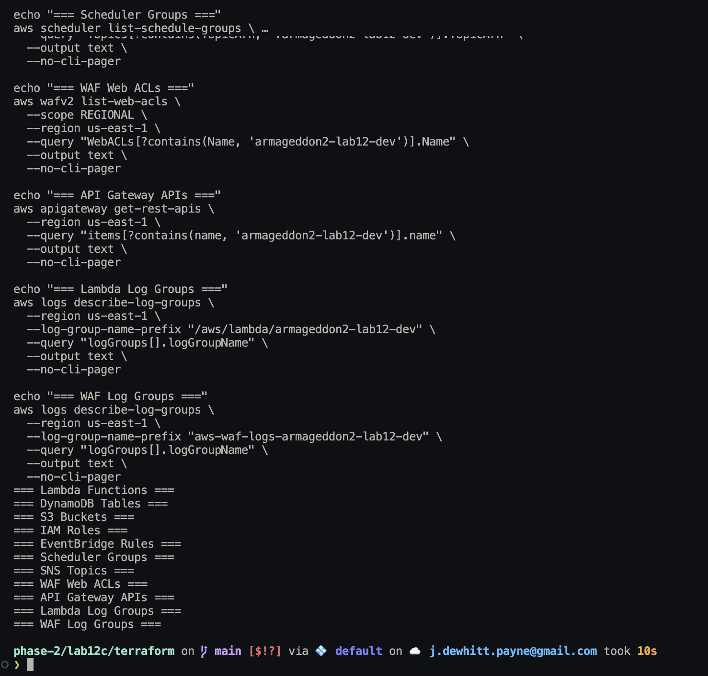

## Validation summary

The completed Lab 12C validation demonstrated:

```text
Terraform deployment
    |
    v
Compliance Lambda configuration verified
    |
    v
DynamoDB evidence table ACTIVE
    |
    v
Lab 12B executive-report prerequisite created
    |
    v
4 deterministic controls evaluated
    |
    v
4 evidence records persisted
    |
    v
100% deterministic PASS
    |
    v
PDF + JSON compliance reports published
    |
    v
CloudWatch execution verified
    |
    v
Bedrock enabled through Terraform
    |
    v
Same 4 deterministic controls evaluated
    |
    v
Bedrock narrative used
    |
    v
4 additional evidence records persisted
    |
    v
8 total evidence records
```

The final implementation preserves the separation of responsibilities:

```text
Python evaluates.
DynamoDB preserves evidence.
Bedrock explains.
PDF serves people.
JSON serves platforms.
Terraform owns the infrastructure.
```
