# Lab 12D - Gen2X Shared Domain Models and Validation

## **Armageddon #2 · SEIR Foundations · Phase 2**


**Implementation and documentation:** August 2026
**Documentation version:** 1.0

---

## 1. Lab Purpose and Objectives

Lab 12D builds the shared **domain-model layer** for the Gen2X Security Engineering Platform.

Unlike Labs 12A–12C, this lab does not deploy AWS infrastructure. Its purpose is to create a shared dictionary and rulebook that Gen2X components can use to describe security information consistently.

For example, values such as:

```text
CRITICAL
VERIFIED
CONTAIN
APPROVED
FINAL
```

should have the same meaning everywhere they appear in the platform.

Lab 12D uses **Pydantic v2**, a Python library for defining structured data models and validating the information placed into those models.

The core Gen2X concepts used throughout the lab are:

- **Provider** - the source of security information, such as an external API, security service, platform, or tool.
- **Evidence** - a structured record of an observation that preserves what was found, where it came from, and when it was observed.
- **Threat** - a security conclusion derived from evaluated evidence. It represents what the evidence means.
- **Response** - a structured recommendation describing what should be done, such as investigate, contain, remediate, or monitor.
- **Governance / Approval** - the rules and authorization state that determine whether a recommended response may proceed and whether human approval is required.
- **Report** - a structured representation of established findings, conclusions, recommendations, and approval state for a person or another system.

A generic example is a security service discovering a company login credential published somewhere it should not be.

```text
Provider
   ↓
Evidence
   ↓
Threat
   ↓
Response
   ↓
Governance / Approval
   ↓
Report
```

In that example, the Provider is the service that discovered the credential; Evidence records the observation; Threat represents the risk of unauthorized access; Response recommends disabling and replacing the credential; Governance determines whether the response requires human authorization; and the Report communicates the finding, risk, recommended action, and approval state without changing the underlying facts.

Separating these responsibilities makes the platform easier to extend. A new Provider should not require the core models to be rewritten, and a new Report format should not require changes to threat-analysis logic.

### Objectives

By the end of Lab 12D, the implementation should demonstrate that Gen2X can:

- use a consistent controlled vocabulary;
- reject invalid or unexpected data;
- validate changes made after model creation;
- serialize structured data into JSON and reconstruct it;
- connect Evidence, Threat, Response, and Report models;
- distinguish recommendation from approval and execution;
- preserve established facts when generating report summaries;
- enforce a controlled Report lifecycle;
- pass automated regression tests; and
- produce evidence showing that the expected behaviors were validated.

---

## 2. Custom Badges

The badges at the top of this README identify the main technologies and context used in Lab 12D:

```text
Python 3.12
Pydantic v2
pytest
Git
Gen2X Security Engineering
Lab / Educational
```

AWS, Terraform, Lambda, Bedrock, and DynamoDB badges are intentionally not included because Lab 12D does not deploy or directly exercise those services.

---

## 3. Lab / Task / Project Overview

Lab 12D establishes the shared domain-model layer for Gen2X.

The architecture follows a simple separation of responsibilities:

```text
ENUMS
  define the allowed vocabulary

MODELS
  define the validated data contracts

AGENTS
  perform work using those contracts
```

### Enums: Controlled Vocabulary

Enums define allowed values such as:

```python
ThreatSeverity.CRITICAL
ThreatConfidence.VERIFIED
ResponseAction.CONTAIN
ResponseApproval.APPROVED
ReportStatus.FINAL
```

A component cannot simply invent a new value because it sounds reasonable. The vocabulary itself is part of the contract.

### Models: Validated Contracts

Models define required fields, data types, validation rules, relationships, and serialization behavior. The model layer includes concepts for indicators, providers, evidence, threats, responses, and reports.

### Providers: Information Sources

Providers represent the systems from which security observations or intelligence originate. A Provider identifies the source. It does not decide what the observation means.

### Agents: Perform Work

Agents perform operational tasks using the shared domain models. The models themselves do not investigate, contain, remediate, or execute actions. They define the contracts that allow those tasks to exchange information consistently.

### Response Governance

A recommendation does not automatically authorize execution.

```text
Recommended
     ↓
Approval required?
     ↓
Approved
     ↓
Eligible for execution
```

That distinction creates an explicit governance boundary for security automation.

### Reporting

Reporting transforms established domain information for a particular audience or format.

```text
Security engineer  → Detailed evidence and technical context
Executive          → Concise risk and business impact
Auditor            → Provenance, approval, and accountability
Application        → Structured JSON
```

The presentation may change. The established facts should not.

### What This Lab Validates

```text
Controlled vocabulary
Valid and invalid input
Assignment-time validation
Serialization and restoration
Threat / Response relationships
Approval and governance behavior
Report projections
Report lifecycle behavior
Regression tests
Generated artifact integrity
```

---

## 4. Lab / Task / Project Requirements

### Required Tools

| Tool | Purpose |
|---|---|
| Python 3.12 | Runs the Gen2X Python models and validation scripts |
| Pydantic v2 | Defines and validates the domain models |
| pytest | Runs the automated regression tests |
| uv | Installs Python dependencies into the virtual environment |
| Git | Source control and repository access |
| Terminal / shell | Runs setup, validation, testing, and inspection commands |
| Code editor | Used to inspect and edit Python and Markdown files |

This implementation was validated with:

```text
Python      3.12.8
uv          0.12.5
Pydantic    2.13.4
pytest      9.1.1
Shell       zsh on macOS
```

### Cloud Requirements

Lab 12D itself does **not** require AWS, Terraform, or cloud credentials because it does not deploy infrastructure.

Those tools are required by the broader **Gen2X Security Engineering Platform**, including the AWS-based components developed in Labs 12A–12C.

### Getting the Lab Files

The easiest way to reproduce this Lab 12D implementation is to clone the Armageddon #2 group repository.

Enter the following command in a terminal:

```bash
git clone https://github.com/jdpayne68/class-7-tko-group-armageddon-2.git
```

Move into the Lab 12D directory:

```bash
cd class-7-tko-group-armageddon-2/members/jacques-payne/phase-2/lab12d
```

Confirm the current location:

```bash
pwd
```

The path should end with:

```text
members/jacques-payne/phase-2/lab12d
```

If Git is not being used, GitHub also provides **Code → Download ZIP**. Extract the archive and navigate to the same Lab 12D directory.

### Git Prerequisite

This lab assumes basic familiarity with Git for cloning a repository, checking file status, staging changes, committing work, and pushing changes to GitHub.

If you are new to Git, review GitHub's introductory guide before beginning:

https://docs.github.com/en/get-started/learning-to-code/getting-started-with-git

Lab 12D does not attempt to serve as a separate Git tutorial. Project-specific Git commands are explained where they are relevant.

### Create the Python Virtual Environment

From the Lab 12D project directory:

```bash
python3 -m venv .venv
```

Activate it on macOS or Linux:

```bash
source .venv/bin/activate
```

On Windows PowerShell:

```powershell
.venv\Scripts\Activate.ps1
```

The terminal prompt should show `(.venv)`.

Verify the interpreter.

macOS / Linux:

```bash
which python
python --version
```

Windows PowerShell:

```powershell
Get-Command python
python --version
```

### Install Dependencies

With the virtual environment active:

```bash
uv pip install -r requirements.txt
uv pip install pytest
```

When finished working in the environment:

```bash
deactivate
```

The local `.venv/` directory is excluded from source control and can be recreated from the project requirements.

---

## 5. Project / Folder Structure

A completed Lab 12D working directory contains the Gen2X source, tests, custom validation scripts, and collected evidence.

```text
lab12d/
├── agents/
├── env/
├── evidence/
│   ├── lab12d-01-project-baseline.png
│   ├── lab12d-02-python-environment.png
│   ├── lab12d-03-test-suite-9-passed.png
│   ├── lab12d-04-first-domain-model-roundtrip.png
│   ├── lab12d-05-contract-validation-rejection.png
│   ├── lab12d-06-assignment-validation.png
│   ├── lab12d-07-serialization-roundtrip.png
│   ├── lab12d-07-threat-evidence.json
│   ├── lab12d-08-troubleshooting-invalid-threat-confidence-enum.png
│   ├── lab12d-09-threat-response-composition.png
│   ├── lab12d-10-report-projection.png
│   ├── lab12d-11-troubleshooting-report-status-contract-mismatch.png
│   ├── lab12d-12-report-status-contract-remediated.png
│   ├── lab12d-13-complete-report-lifecycle.png
│   ├── lab12d-13-final-gen2x-report.json
│   └── lab12d-14-final-validation.png
├── general/
├── models/
│   ├── enums/
│   ├── base_model.py
│   ├── evidence.py
│   ├── indicator.py
│   ├── provider.py
│   ├── report.py
│   ├── response.py
│   ├── threat.py
│   └── time_utils.py
├── providers/
├── tests/
│   ├── test_enums_public_api.py
│   └── test_models_roundtrip.py
├── utils/
├── break_model.py
├── compose_models.py
├── first_model.py
├── full_report_lifecycle.py
├── install.md
├── mutate_model.py
├── playbook.md
├── readme.md
├── report_projection.py
├── requirements.txt
└── serialize_model.py
```

### Folder Responsibilities

| Path | Responsibility |
|---|---|
| `models/` | Shared Gen2X data contracts |
| `models/enums/` | Controlled vocabulary used by the contracts |
| `providers/` | Provider interfaces and implementations |
| `agents/` | Components that perform work using the shared contracts |
| `tests/` | Automated baseline and regression tests |
| `utils/` | Shared utility functions |
| `general/` | Supporting explanatory documentation |
| `evidence/` | Screenshots and generated artifacts collected during validation |

### Validation Scripts Added for This Implementation

| Script | Validation Purpose |
|---|---|
| `first_model.py` | First domain-model creation and round trip |
| `break_model.py` | Rejection of unexpected input |
| `mutate_model.py` | Assignment-time validation |
| `serialize_model.py` | JSON serialization and restoration |
| `compose_models.py` | Threat and governed Response composition |
| `report_projection.py` | Preservation of facts in report summaries |
| `full_report_lifecycle.py` | Complete Report lifecycle and final artifact |

Generated Python caches, `.venv/`, and other local environment files are not shown in the project tree.

---

## 6. Steps Used to Complete This Lab

The following procedure follows the order used to build and validate Lab 12D. Major checkpoints are tied to screenshots or generated artifacts in the `evidence/` directory.

> **Unless otherwise noted, enter all commands in this section in a terminal from the Lab 12D project directory.**

Confirm the working directory with:

```bash
pwd
```

The path should end with:

```text
.../members/jacques-payne/phase-2/lab12d
```

### Step 1. Confirm the Project Baseline

Inspect the project structure:

```bash
find . \
  -maxdepth 3 \
  -not -path './.venv*' \
  -not -path './evidence*' \
  -not -path '*/__pycache__*' \
  -not -path './.pytest_cache*' \
  -print | sort
```

**Evidence:** `evidence/lab12d-01-project-baseline.png`

### Step 2. Create and Verify the Python Environment

```bash
python3 -m venv .venv
source .venv/bin/activate
which python
python --version
```

Validated version:

```text
Python 3.12.8
```

**Evidence:** `evidence/lab12d-02-python-environment.png`

### Step 3. Install the Python Packages

```bash
uv pip install -r requirements.txt
uv pip install pytest
```

Validated versions:

```text
Pydantic 2.13.4
pytest 9.1.1
```

Verify the shared vocabulary and UTC utility:

```bash
python -c "
from models.enums import ThreatSeverity
from utils.time import utc_now

print('Vocabulary:', ThreatSeverity.CRITICAL.describe())
print('Timestamp:', utc_now().isoformat())
print('Agent 10 is installed correctly.')
"
```

A successful result includes:

```text
Vocabulary: Severe impact requiring immediate attention.
Agent 10 is installed correctly.
```

### Step 4. Run the Baseline Test Suite

```bash
python tests/test_enums_public_api.py
python tests/test_models_roundtrip.py
python -m pytest tests/ -q
```

Baseline result:

```text
9 passed
```

**Evidence:** `evidence/lab12d-03-test-suite-9-passed.png`

### Step 5. Build the First Domain Model

```bash
python first_model.py
```

Result:

```text
GitHub observed TOKEN_EXPOSURE for ghp_example
Round trip: True
```

**Evidence:** `evidence/lab12d-04-first-domain-model-roundtrip.png`

### Step 6. Verify That Unexpected Data Is Rejected

```bash
python break_model.py
```

Expected result:

```text
PASS: Gen2X rejected the unexpected field.
Extra inputs are not permitted
```

**Evidence:** `evidence/lab12d-05-contract-validation-rejection.png`

### Step 7. Verify Assignment-Time Validation

```bash
python mutate_model.py
```

Expected result:

```text
Original provider: GitHub
PASS: Gen2X rejected the invalid mutation.
provider_name cannot be empty.
Provider after failed mutation: GitHub
```

**Evidence:** `evidence/lab12d-06-assignment-validation.png`

### Step 8. Serialize and Restore the Domain Model

```bash
python serialize_model.py
```

Key result:

```text
Restored severity type: ThreatSeverity
Round trip equal: True
```

Generated artifact:

```text
evidence/lab12d-07-threat-evidence.json
```

Inspect it if desired:

```bash
cat evidence/lab12d-07-threat-evidence.json
```

**Evidence:** `evidence/lab12d-07-serialization-roundtrip.png`

### Step 9. Compose Threat and Response Models

Run:

```bash
python compose_models.py
```

The first attempt exposed a controlled-vocabulary error:

```text
AttributeError: type object 'ThreatConfidence' has no attribute 'HIGH'
```

The initial implementation attempted `ThreatConfidence.HIGH`. Gen2X distinguishes severity from confidence:

```text
Severity   → How serious could the impact be?
Confidence → How strongly does the evidence support the conclusion?
```

The valid confidence vocabulary was inspected:

```text
UNKNOWN
OBSERVED
SUSPECTED
CORRELATED
VALIDATED
VERIFIED
```

The scenario represented verified evidence, so the value was corrected to:

```python
ThreatConfidence.VERIFIED
```

After correction, the script returned:

```text
Threat linkage valid: True
Requires approval: True
Pending approval: True
Executable before approval: False
Approval status: APPROVED
Approved by: security-lead
Executable after approval: True
```

**Evidence:**

```text
evidence/lab12d-08-troubleshooting-invalid-threat-confidence-enum.png
evidence/lab12d-09-threat-response-composition.png
```

### Step 10. Verify That Report Projection Preserves Facts

```bash
python report_projection.py
```

The output included:

```text
Verified GitHub Token Exposure
[condition=TOKEN_EXPOSURE, severity=CRITICAL, confidence=VERIFIED]

CONTAIN
[priority=CRITICAL, investigation=NEW, approval=APPROVED]
```

The script verified:

```text
Severity preserved: True
Confidence preserved: True
Evidence count preserved: True
Response action preserved: True
Approval status preserved: True
```

**Evidence:** `evidence/lab12d-10-report-projection.png`

### Step 11. Identify the `ReportStatus` Contract Mismatch

The Report model expects the lifecycle:

```text
DRAFT → REVIEW → FINAL → ARCHIVED
```

Inspect the defined statuses:

```bash
python -c "
from models.enums import ReportStatus

print('=== Gen2X ReportStatus Contract Check ===')
print('Defined statuses:', [item.value for item in ReportStatus])
print('REVIEW exists:', hasattr(ReportStatus, 'REVIEW'))
print('FINAL exists:', hasattr(ReportStatus, 'FINAL'))
"
```

The original result showed:

```text
REVIEW exists: False
FINAL exists: False
```

**Evidence:** `evidence/lab12d-11-troubleshooting-report-status-contract-mismatch.png`

### Step 12. Correct the Contract and Run Regression Tests

Update `models/enums/report_enums.py` to include:

```python
REVIEW = "REVIEW"
FINAL = "FINAL"
```

Descriptions were also added:

```text
REVIEW - The report is under review before finalization.
FINAL  - The report has been finalized as a historical record.
```

Run the regression suite:

```bash
python -m pytest tests/ -q
```

Result:

```text
9 passed in 0.12s
```

Repeat the contract check. The corrected result should include:

```text
REVIEW exists: True
FINAL exists: True
```

**Evidence:** `evidence/lab12d-12-report-status-contract-remediated.png`

### Step 13. Exercise the Complete Report Lifecycle

```bash
python full_report_lifecycle.py
```

The lifecycle test produced:

```text
Initial status: DRAFT
Finding count: 1
Evidence count: 1
Provider count: 1
Approval status: APPROVED
After review submission: REVIEW
After finalization: FINAL
```

The script then attempted to modify the finalized report. Gen2X rejected the mutation:

```text
PASS: Final report rejected mutation.
Mutation guard: Finalized or archived reports cannot be modified.
Issue a new report or revision instead.
```

The report was then archived:

```text
Archived status: ARCHIVED
PASS: Complete Gen2X report lifecycle validated.
```

**Evidence:** `evidence/lab12d-13-complete-report-lifecycle.png`

### Step 14. Generate the Final JSON Report

The lifecycle test produces:

```text
evidence/lab12d-13-final-gen2x-report.json
```

This machine-readable artifact represents the finalized Gen2X report and can be consumed by another application, API, storage service, reporting engine, or audit workflow.

### Step 15. Perform Final Validation

```bash
echo "=== LAB 12D FINAL VALIDATION ==="

echo
echo "--- Final Report Artifact ---"
ls -lh evidence/lab12d-13-final-gen2x-report.json

echo
echo "--- SHA-256 ---"
shasum -a 256 evidence/lab12d-13-final-gen2x-report.json

echo
echo "--- Regression Tests ---"
python -m pytest tests/ -q

echo
echo "--- Virtual Environment Hygiene ---"
git check-ignore -v .venv || echo ".venv is NOT currently ignored"

echo
echo "--- Lab 12D Git Status ---"
git status --short .
```

The final JSON artifact was approximately `3.2 KB`.

Recorded SHA-256:

```text
49fe44fcec8b0ec8b7131c547fcbcc8788d2a9318a57bc22f80046d4e5df0687
```

Regression result:

```text
9 passed in 0.12s
```

**Evidence:** `evidence/lab12d-14-final-validation.png`

### Step 16. Verify the Evidence Set

```bash
find evidence -maxdepth 1 -type f -print | sort
```

The evidence set documents the progression from project baseline through final report validation.

---

## 7. Artifacts / Screenshots

This section presents the evidence collected while completing Lab 12D. The screenshots are arranged chronologically so the reader can follow the progression from initial setup through validation, troubleshooting, remediation, and final verification.

### 7.1 Project Baseline

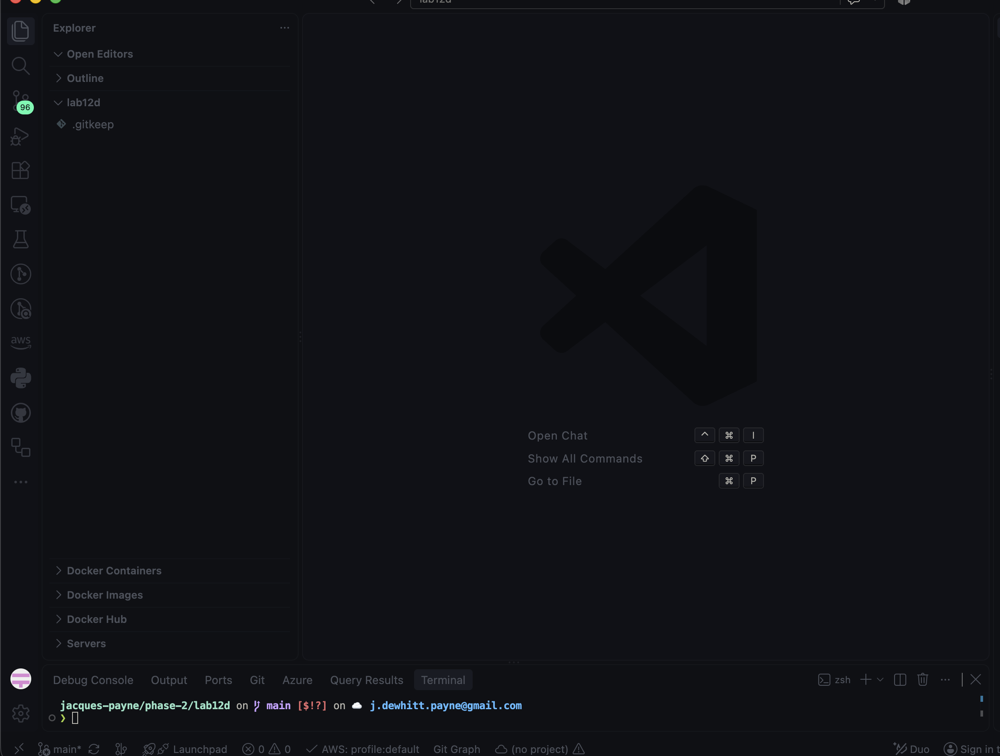

Establishes the starting Lab 12D project structure.

### 7.2 Python Environment

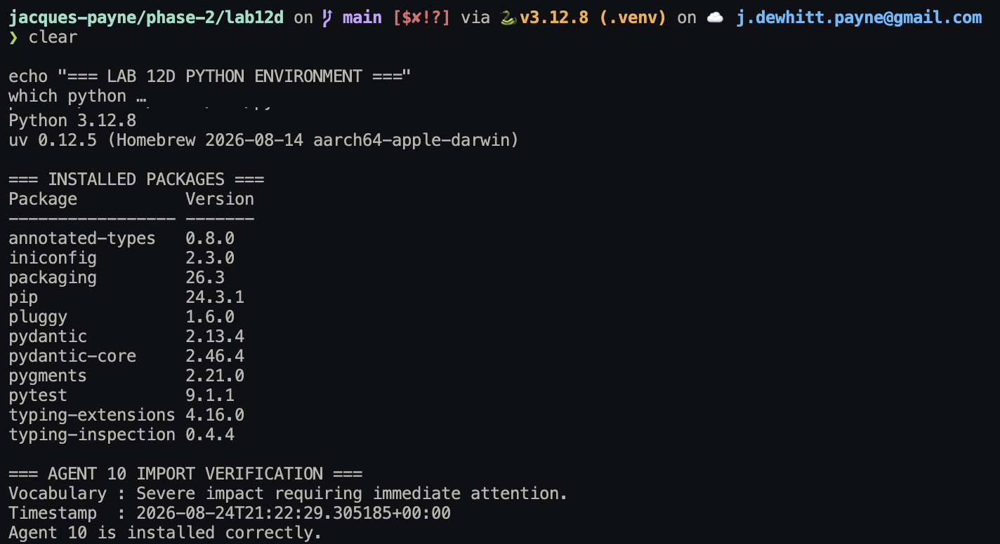

Confirms that the lab was run inside an isolated Python 3.12 environment.

### 7.3 Baseline Test Suite

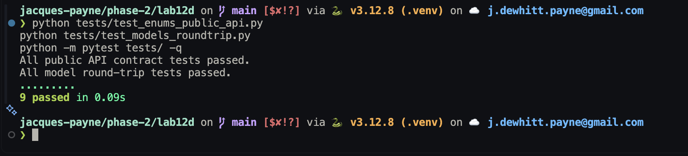

Establishes the known-good baseline: `9 passed`.

### 7.4 First Domain Model Round Trip

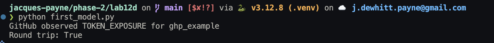

Demonstrates successful model creation and restoration.

### 7.5 Contract Validation Rejection

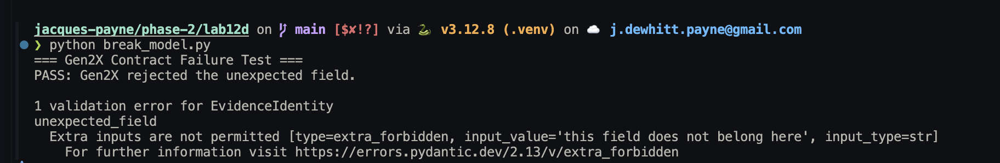

Demonstrates strict rejection of undeclared fields.

### 7.6 Assignment Validation

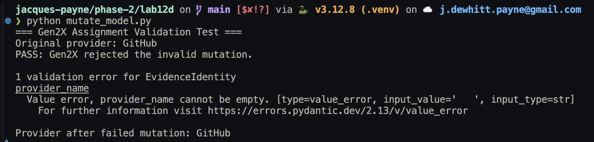

Shows that invalid mutation is rejected and the valid state remains intact.

### 7.7 Serialization and JSON Round Trip

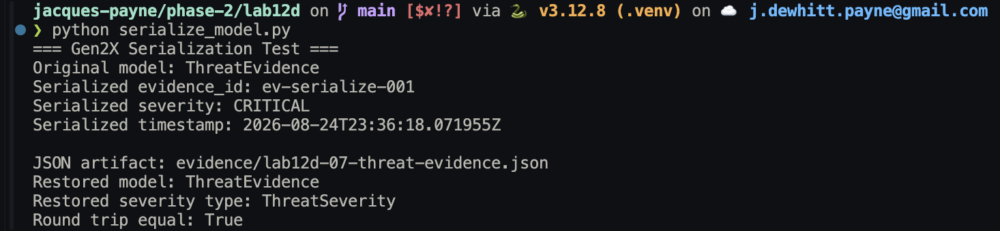

Generated artifact: `evidence/lab12d-07-threat-evidence.json`.

### 7.8 Troubleshooting Invalid `ThreatConfidence`

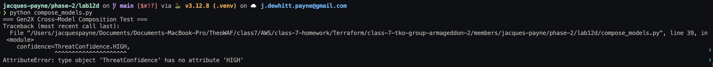

Documents the distinction between threat severity and evidence confidence.

### 7.9 Threat and Response Composition

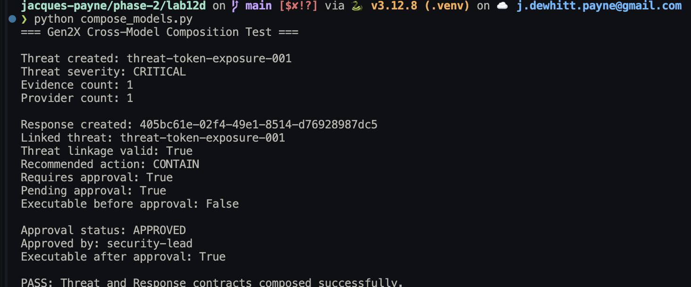

Demonstrates Threat linkage, approval requirements, and executable state.

### 7.10 Report Projection

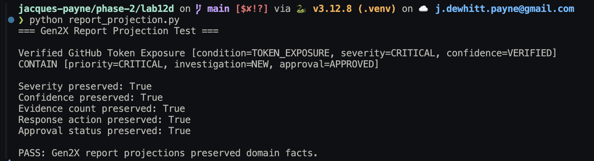

Demonstrates that presentation changes without changing established facts.

### 7.11 ReportStatus Contract Mismatch

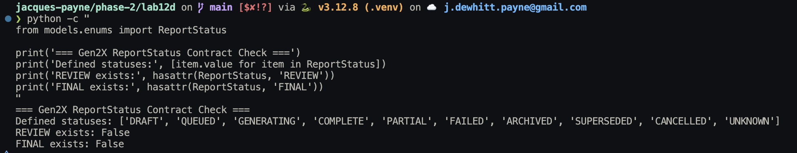

Shows that `REVIEW` and `FINAL` were referenced by the Report lifecycle but missing from the controlled vocabulary.

### 7.12 ReportStatus Contract Remediation

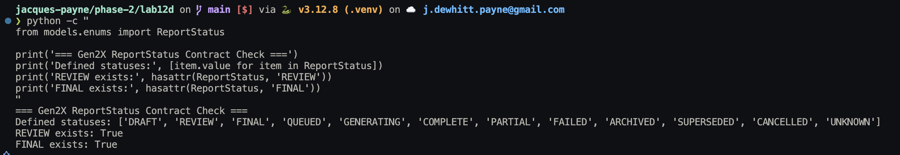

Confirms the missing states were added and all nine regression tests continued to pass.

### 7.13 Complete Report Lifecycle

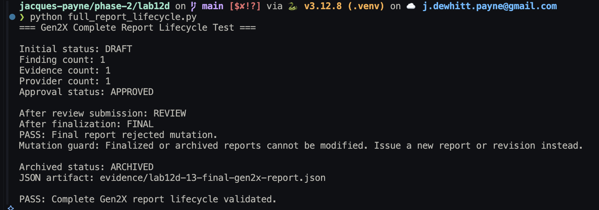

Validates `DRAFT → REVIEW → FINAL → ARCHIVED` and confirms that a finalized report rejects modification.

Generated artifact: `evidence/lab12d-13-final-gen2x-report.json`.

### 7.14 Final Validation

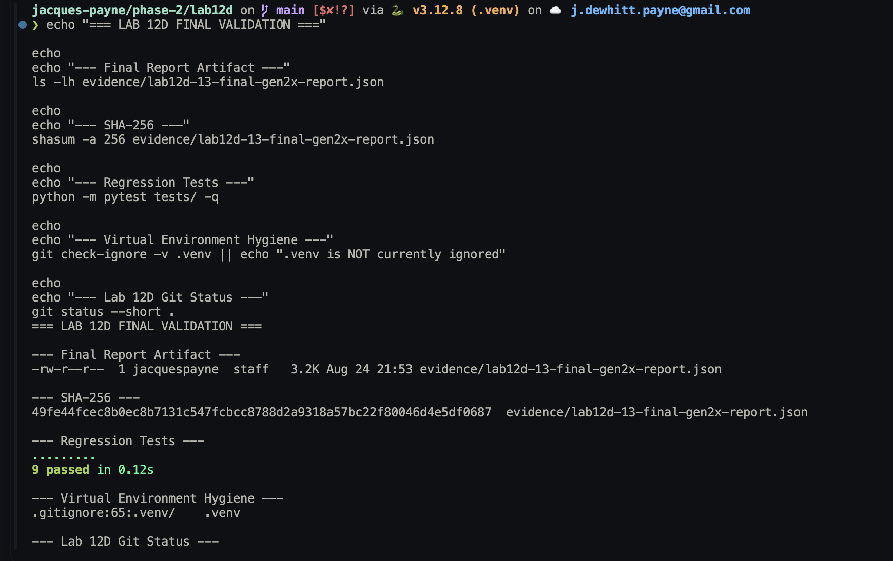

Confirms the final artifact, SHA-256 fingerprint, regression-test result, and repository hygiene checks.

### Machine-Readable Artifacts

| Artifact | Purpose |
|---|---|
| `lab12d-07-threat-evidence.json` | Serialized `ThreatEvidence` used to validate model round-trip behavior |
| `lab12d-13-final-gen2x-report.json` | Final serialized Report produced after completing the Report lifecycle |

---

## 8. Steps Used to Teardown / Clean Up the Lab

Lab 12D does **not** deploy AWS infrastructure, so there are no cloud resources to destroy and no AWS teardown commands required for this lab.

### Deactivate the Virtual Environment

```bash
deactivate
```

### Optional: Remove the Virtual Environment

macOS / Linux:

```bash
rm -rf .venv
```

Windows PowerShell:

```powershell
Remove-Item -Recurse -Force .venv
```

The environment can be recreated later with the commands in Section 4.

### Optional: Remove Python Cache Files

```bash
find . -type d -name "__pycache__" -prune -exec rm -rf {} +
rm -rf .pytest_cache
```

These files are generated automatically and are not part of the project source.

### Preserve the Evidence

Do **not** remove `evidence/` during normal cleanup. The screenshots and JSON artifacts document the completed validation work.

### Verify Repository Status

```bash
git status --short .
```

### Cloud Cost Considerations

Lab 12D runs locally and creates no Lab 12D AWS resources that can continue generating charges.

The broader Gen2X platform uses cloud infrastructure in other labs. Those resources should be torn down according to the documentation for the lab that created them.

---

## 9. Lessons Learned

### Controlled Vocabulary Prevents Ambiguity

The failed use of `ThreatConfidence.HIGH` demonstrated why shared vocabulary matters. Gen2X distinguishes the potential impact of a threat from the strength of the evidence supporting the conclusion. The appropriate value for the validated scenario was `ThreatConfidence.VERIFIED`.

### Validation Should Continue After Object Creation

The assignment-validation test showed that creating valid data is only the beginning. Gen2X rejected an attempt to replace a valid Provider name with a blank value and preserved the original valid state.

### Strict Contracts Catch Unexpected Input Early

Pydantic rejected an undeclared field with `Extra inputs are not permitted`. Rejecting malformed input near the boundary prevents it from being treated as trusted information elsewhere in the platform.

### Serialization Is Part of the Contract

Security information may need to move through APIs, files, databases, queues, logs, and other applications. The round-trip tests showed that the Gen2X models can be serialized and restored while preserving their types and meaning.

### Recommendation, Approval, and Execution Are Different

```text
Threat identified
      ↓
Response recommended
      ↓
Approval required
      ↓
Approval granted
      ↓
Response becomes executable
```

A recommendation is not approval, and approval is not execution. That separation creates a clear governance point for security automation.

### Reports Should Change Presentation, Not Facts

Different audiences may need different views of the same security event, but severity, confidence, evidence, recommended action, and approval state should remain consistent.

### Passing Unit Tests Does Not Guarantee Integration Correctness

The supplied suite reported `9 passed`, yet complete Report lifecycle testing still exposed a mismatch between the Report model and `ReportStatus`. Cross-model and lifecycle testing are therefore necessary in addition to unit tests.

### Make the Smallest Change Necessary

The ReportStatus correction was limited to the missing states required by the existing lifecycle. After the change, the original regression suite still passed.

```text
Understand the defect
        ↓
Make the smallest justified change
        ↓
Retest existing behavior
```

### Finalized Records Should Be Protected

After the Report reached `FINAL`, Gen2X rejected attempts to modify it. Material changes should be handled through a new report or revision rather than silently rewriting a finalized record.

### Evidence Makes Troubleshooting More Useful

Capturing evidence preserved what failed, why it failed, what changed, and what happened afterward. The evidence therefore documents engineering reasoning, not only the final successful result.

### Overall Takeaway

```text
ENUMS
  define what values mean

MODELS
  define what valid data looks like

GOVERNANCE
  defines what actions are authorized

REPORTS
  preserve and communicate established facts
```

The lab demonstrated that strong contracts require more than successful object creation. They need invalid-input testing, mutation testing, serialization testing, cross-model integration testing, lifecycle testing, regression testing, and evidence showing that those behaviors work.

---

## 10. References

The following sources were used to understand, reproduce, validate, and document Lab 12D. Primary project materials and official technical documentation are preferred.

### Gen2X / Armageddon Source

**BalericaAI Armageddon - Lab 12D**
https://github.com/BalericaAI/armageddon/tree/main/SEIR_Foundations/lab12/lab12d

The Lab 12D source provides the core Gen2X architecture, models, enums, agents, providers, tests, installation material, and playbook used as the foundation for this implementation.

### Provider-Specific References

The `providers/` package integrates three external threat-intelligence sources: AbuseIPDB, CISA Known Exploited Vulnerabilities (KEV), and MITRE ATT&CK. The links below point to the official service, catalog, documentation, or data source associated with each provider.

| Provider | Role in Lab 12D | Official References |
|---|---|---|
| **AbuseIPDB** | Looks up IPv4 and IPv6 reputation and abuse information using the AbuseIPDB API v2 `check` endpoint. | [AbuseIPDB](https://www.abuseipdb.com/) · [API v2 Documentation](https://docs.abuseipdb.com/) |
| **CISA Known Exploited Vulnerabilities (KEV)** | Checks CVE identifiers against CISA's catalog of vulnerabilities known to have been exploited in the wild. | [CISA KEV Catalog](https://www.cisa.gov/known-exploited-vulnerabilities-catalog) · [KEV JSON Feed](https://www.cisa.gov/sites/default/files/feeds/known_exploited_vulnerabilities.json) |
| **MITRE ATT&CK** | Enriches candidate ATT&CK technique IDs with technique names, descriptions, tactics, platforms, and related metadata. | [MITRE ATT&CK](https://attack.mitre.org/) · [Enterprise ATT&CK Techniques](https://attack.mitre.org/techniques/enterprise/) · [ATT&CK STIX Data](https://github.com/mitre-attack/attack-stix-data) |

#### AbuseIPDB

The Lab 12D `AbuseIpDbProvider` uses the AbuseIPDB API v2 `check` endpoint:

```text
https://api.abuseipdb.com/api/v2/check
```

The provider retrieves IP reputation information such as abuse confidence score, country, usage type, ISP, hostnames, report counts, and related metadata.

Official references:

- [AbuseIPDB](https://www.abuseipdb.com/)
- [AbuseIPDB API v2 Documentation](https://docs.abuseipdb.com/)

#### CISA Known Exploited Vulnerabilities

The `CisaKevProvider` retrieves the official CISA Known Exploited Vulnerabilities catalog as JSON and indexes it by CVE identifier.

The configured source is:

```text
https://www.cisa.gov/sites/default/files/feeds/known_exploited_vulnerabilities.json
```

Official references:

- [CISA Known Exploited Vulnerabilities Catalog](https://www.cisa.gov/known-exploited-vulnerabilities-catalog)
- [CISA KEV JSON Feed](https://www.cisa.gov/sites/default/files/feeds/known_exploited_vulnerabilities.json)

A CVE not appearing in KEV should **not** be interpreted as safe. It only means that the CVE was not present in the catalog version retrieved by the provider.

#### MITRE ATT&CK

The `MitreAttackProvider` enriches ATT&CK technique identifiers that have already been inferred by an earlier deterministic correlation process. It does not decide whether an indicator is malicious.

The provider retrieves the Enterprise ATT&CK STIX dataset from the MITRE ATT&CK data repository.

Official references:

- [MITRE ATT&CK](https://attack.mitre.org/)
- [Enterprise ATT&CK Techniques](https://attack.mitre.org/techniques/enterprise/)
- [MITRE ATT&CK STIX Data Repository](https://github.com/mitre-attack/attack-stix-data)

The implementation currently references the Enterprise ATT&CK JSON collection through the configurable `MITRE_STIX_URL`. Production use should pin and validate a known ATT&CK dataset version rather than relying indefinitely on a moving branch.

### Technical Documentation

| Reference | Use |
|---|---|
| Pydantic Models | Model definitions, validation, and model behavior |
| Pydantic Serialization | Serialization and restoration concepts |
| Python `venv` | Virtual-environment creation and activation |
| uv pip interface | Dependency installation |
| pytest | Automated test execution |
| GitHub Getting Started with Git | Git prerequisite reference |

**Pydantic - Models**
https://docs.pydantic.dev/latest/concepts/models/

**Pydantic - Serialization**
https://docs.pydantic.dev/latest/concepts/serialization/

**Python - Virtual Environments and Packages**
https://docs.python.org/3/tutorial/venv.html

**uv - Using the pip Interface**
https://docs.astral.sh/uv/pip/

**pytest - Get Started**
https://docs.pytest.org/en/stable/getting-started.html

**GitHub Docs - Getting Started with Git**
https://docs.github.com/en/get-started/learning-to-code/getting-started-with-git

### Source and Implementation Attribution

The source project established the core Gen2X domain architecture. This implementation adds documented validation of baseline regression behavior, domain-model contracts, assignment validation, serialization and restoration, Threat / Response composition, governance and approval state, Report projection, cross-model integration, Report lifecycle behavior, and artifact integrity.

---

## 11. Troubleshooting

This section documents technical issues encountered while validating the Gen2X domain-model layer. It focuses on problems that exposed meaningful behavior in the data contracts or integration boundaries.

### 11.1 Invalid `ThreatConfidence` Value

#### Symptom

The initial Threat and Response composition test attempted:

```python
confidence=ThreatConfidence.HIGH
```

and returned:

```text
AttributeError: type object 'ThreatConfidence' has no attribute 'HIGH'
```

#### Diagnosis

The defined `ThreatConfidence` vocabulary was inspected instead of guessing at a replacement.

```text
UNKNOWN
OBSERVED
SUSPECTED
CORRELATED
VALIDATED
VERIFIED
```

The problem demonstrated that Gen2X treats severity and confidence as different concepts.

#### Resolution

The value was corrected to:

```python
confidence=ThreatConfidence.VERIFIED
```

The composition test was rerun successfully.

**Evidence**

```text
evidence/lab12d-08-troubleshooting-invalid-threat-confidence-enum.png
evidence/lab12d-09-threat-response-composition.png
```

**Lesson learned:** Controlled vocabulary prevents different components from assigning inconsistent meanings to security information.

### 11.2 `ReportStatus` Cross-Model Contract Mismatch

#### Symptom

The baseline suite reported `9 passed`, but complete Report lifecycle testing exposed a mismatch.

The Report model expected:

```text
DRAFT → REVIEW → FINAL → ARCHIVED
```

while the `ReportStatus` enum did not define `REVIEW` or `FINAL`.

#### Diagnosis

```bash
python -c "
from models.enums import ReportStatus

print('Defined statuses:', [item.value for item in ReportStatus])
print('REVIEW exists:', hasattr(ReportStatus, 'REVIEW'))
print('FINAL exists:', hasattr(ReportStatus, 'FINAL'))
"
```

Original result:

```text
REVIEW exists: False
FINAL exists: False
```

Two parts of the shared domain contract therefore disagreed.

#### Resolution

The missing lifecycle states were added to `models/enums/report_enums.py`:

```python
REVIEW = "REVIEW"
FINAL = "FINAL"
```

The regression suite was rerun:

```bash
python -m pytest tests/ -q
```

Result:

```text
9 passed in 0.12s
```

The contract check subsequently confirmed:

```text
REVIEW exists: True
FINAL exists: True
```

**Evidence**

```text
evidence/lab12d-11-troubleshooting-report-status-contract-mismatch.png
evidence/lab12d-12-report-status-contract-remediated.png
```

**Lesson learned:** Passing unit tests do not guarantee that independently defined components agree when combined. Cross-model and lifecycle testing are necessary to uncover integration defects.

### Troubleshooting Method

```text
Observe the failure
        ↓
Read the actual error
        ↓
Inspect the relevant contract
        ↓
Verify the cause
        ↓
Make the smallest justified correction
        ↓
Rerun the affected test
        ↓
Run regression tests
        ↓
Capture evidence
```

---

## 12. Author & Contributors

### Author and Group Leader

**Jacques Payne**
**Group Leader, Armageddon #2**

SEIR Foundations
Phase 2 · Lab 12D
Gen2X Security Engineering Platform

**Implementation and documentation:** August 2026
**Documentation version:** 1.0

### Armageddon #2 Group

The Armageddon #2 project was completed collaboratively by:

- **Jacques Payne** - Group Leader
- **Joe Tolliver, Jr.** - Group Member
- **Cautchy Bailly** - Group Member
- **Kirk Alton** - Group Member

Each group member maintained their own branch or working area for assigned lab work. This preserved individual implementations and evidence while supporting collaboration across the larger Armageddon #2 project.

For **Phase 1**, the group submission was made through **Kirk Alton's repository**.

For **Phase 2**, this README documents the Lab 12D implementation maintained under:

```text
members/
└── jacques-payne/
    └── phase-2/
        └── lab12d/
```

The validation scripts, screenshots, generated artifacts, troubleshooting work, and technical documentation described here are specific to this Lab 12D implementation unless otherwise noted.

### Collaboration Model

```text
Armageddon #2
      │
      ├── Jacques Payne - Group Leader
      │     └── Individual branch / lab work
      │
      ├── Joe Tolliver, Jr.
      │     └── Individual branch / lab work
      │
      ├── Cautchy Bailly
      │     └── Individual branch / lab work
      │
      └── Kirk Alton
            └── Individual branch / lab work
```

The individual work was coordinated as part of the larger group submission process. This structure preserved individual ownership of implementation work while supporting collaboration, review, and integration at the group level.

### Source Project

Lab 12D is based on the Gen2X Security Engineering Platform materials in:

```text
BalericaAI/armageddon
SEIR_Foundations/lab12/lab12d
```

Source:
https://github.com/BalericaAI/armageddon/tree/main/SEIR_Foundations/lab12/lab12d

The source project established the core Gen2X architecture and domain models used in this lab.

This implementation documents the additional validation, integration testing, evidence collection, troubleshooting, and report-lifecycle verification performed while completing Lab 12D.
