# Lab 12 — WAF-to-Bedrock SOAR Pipeline

## 1. What is this lab supposed to do?

This lab builds a serverless **SOAR (Security Orchestration, Automation, and Response) pipeline** that automatically detects, stores, and interprets malicious traffic hitting a protected API — using AWS WAF for detection, DynamoDB for structured storage, and Amazon Bedrock (Claude Haiku 4.5) for AI-generated SOC analyst narratives on top of deterministic, rules-based risk scoring.

In plain terms: attackers hit an API → WAF blocks/logs it → a scheduled Lambda normalizes and stores each event → a second scheduled Lambda correlates events by source IP/URI/rule, scores the risk deterministically, and asks an LLM to write a human-readable incident summary a SOC analyst could act on.

**Lab 12a extends this into a closed-loop SOAR pipeline.** Once the correlation agent writes a finding to `waf-correlation-findings`, it publishes a small routing event to EventBridge. A third Lambda — `soar_response_agent` — is invoked by that event (not on a schedule), pulls the *complete* finding back out of DynamoDB, selects a deterministic response playbook by severity, asks Bedrock for both an analyst-facing and a management-facing summary, opens an incident record, sends an SNS notification, and marks the finding as processed so it can't be actioned twice. That turns the pipeline from "detect and score" into "detect, score, and respond."

### High-Level Flow

```text
API Gateway + Cognito
    ↓
AWS WAF v2
    ↓
CloudWatch Logs
    ↓
waf-bedrock-analyzer lambda  (scheduled, every 10 min)
    ↓
waf-events (DynamoDB)
    ↓
waf-threat-correlation-agent lambda  (scheduled, every 60 min)
    ↓
waf-correlation-findings (DynamoDB)
    ↓  events:PutEvents → "WAF Threat Finding Created"
Amazon EventBridge  (event-pattern rule, not a schedule)
    ↓
soar_response_agent lambda
    ↓
security-incidents (DynamoDB)   +   SNS notification
```
---
## 2. Badges

!


---

## 3. Project overview

The pipeline has two independent, EventBridge-scheduled Lambda functions sitting on top of a shared data layer:

| Component | Role |
|---|---|
| **API Gateway + Cognito** | A protected REST endpoint (`POST /seir_analyze`), authenticated with a Cognito User Pool authorizer |
| **AWS WAF v2** | Inspects traffic to the API stage; blocks common web attacks, SQL, and rate-based abuse; logs every match to CloudWatch |
| **CloudWatch Logs** | Landing zone for raw WAF JSON records |
| **`waf-bedrock-analyzer` Lambda** | Runs every 10 minutes — reads recent WAF logs, normalizes and deduplicates them into DynamoDB, and asks Bedrock for a per-event SOC summary |
| **`waf-events` (DynamoDB)** | Structured, deduplicated store of individual WAF events |
| **`waf-threat-correlation-agent` Lambda** | Runs every 60 minutes — scans `waf-events`, groups activity by source IP / URI / rule, computes a deterministic 0–100 risk score, asks Bedrock to turn that evidence into an analyst-facing narrative, writes the finding to `waf-correlation-findings`, and publishes a `WAF Threat Finding Created` event to EventBridge |
| **`waf-correlation-findings` (DynamoDB)** | Store of aggregated, severity-ranked findings for analyst review |
| **Amazon EventBridge (event-pattern rule)** | Fires on `detail-type: "WAF Threat Finding Created"` — distinct from the two schedule-based rules — and invokes `soar_response_agent` with routing info only (`finding_id`, `severity`, `risk_score`) |
| **`soar_response_agent` Lambda** | Event-driven, not scheduled — retrieves the *complete* finding from DynamoDB by `finding_id`, validates it hasn't already been processed, selects a deterministic response playbook by severity, asks Bedrock for an analyst summary and a management summary, writes an incident, publishes an SNS notification, and updates the finding's workflow status |
| **`security-incidents` (DynamoDB)** | Store of opened incidents, keyed by a deterministic `INC-<finding_id>` ID so retried events can't create duplicates |

The design deliberately separates **deterministic math** (risk scoring, correlation, counts, playbook selection — all plain Python) from **AI interpretation** (Bedrock is only ever asked to explain/narrate evidence and decisions that have already been calculated, never to invent numbers or choose the response itself).

---

## 4. Requirements

To build and run this lab, you'll need:

- [ ] **Terraform** ≥ 1.5.0, AWS provider `~> 6.0`
- [ ] **AWS Console access** with permissions to create IAM roles/policies, Lambda, API Gateway, Cognito, DynamoDB, CloudWatch, WAFv2, and EventBridge resources
- [ ] **Amazon Bedrock model access** enabled in your target region, including the one-time AWS Marketplace model subscription
- [ ] **Python** 3.14 (matches the Lambda runtime) with `boto3` for local testing/token scripts
- [ ] **VS Code** (or your editor of choice) with the HashiCorp Terraform extension
- [ ] **Git Bash** (or an equivalent shell) for running Terraform/AWS CLI commands on Windows
- [ ] **AWS CLI**, configured with credentials that match the IAM permissions above
---

## 5. Project / folder structure

```
LAB12/
├── .terraform/                         # Terraform provider plugin cache (auto-generated, gitignored)
├── code/
│   ├── soar_response_agent.py          # Lambda #3 source
│   ├── waf_bedrock_analyzer.py         # Lambda #1 source
│   └── waf_threat_correlation_agent.py # Lambda #2 source
├── correlation_findings/
│   └── log-events-viewer-result.csv    # exported view of correlation findings/log review
├── function/                           # terraform-generated zip artifacts (git-ignored)
│   ├── waf_bedrock_analyzer.zip
│   └── waf_threat_correlation_agent.zip
├── screenshots/                        # artifacts for section 7 — see below
├── troubleshooting/                    # notes/logs referenced in section 11
├── .gitignore
├── .terraform.lock.hcl                 # provider dependency lock (safe to commit)
├── apigateway.tf                       # REST API, resource, method, Lambda proxy integration, stage
├── cloudwatch.tf                       # WAF log group
├── cognito.tf                          # User pool, resource server/scopes, app client, test user, authorizer
├── dynamodb.tf                         # waf-events + waf-correlation-findings tables
├── eventbridge.tf                      # Both schedule rules + lambda invoke permissions
├── iam.tf                              # Shared Lambda execution role + inline policy
├── lambda.tf                           # Both Lambda function resources + archive_file packaging
├── output.tf                           # Cognito app client ID, API Gateway invoke URL
├── provider.tf                         # AWS provider + Terraform version pin
├── README.md                           # this file
├── sns.tf                              # sns topic, subscription, policy
├── terraform.tfstate                   # Terraform state — contains sensitive values, should be gitignored
├── terraform.tfstate.backup            # same as above
├── variables.tf                        # region, Cognito test user credentials, notification email
└── waf.tf                              # Web ACL, managed rule groups, rate-based rule, association, logging
```
---

## 6. Steps used to complete this lab

1. **Provider & variables** — pinned the AWS provider version and defined `region`, the test Cognito user's username/password, and a notification email.
2. **Identity layer** — created the Cognito User Pool, resource server with `admin-scope`/`user-scope`, an app client with `generate_secret = false` and `ALLOW_USER_PASSWORD_AUTH`, a suppressed-invite test user, and a `COGNITO_USER_POOLS` API Gateway authorizer.
3. **Edge layer** — built the REST API, the `/seir_analyze` resource and `POST` method (Cognito-authorized), an `AWS_PROXY` integration to the analyzer Lambda, and deployed it to a `prod` stage.
4. **WAF layer** — created the Web ACL with the AWS Managed Common Rule Set, the Managed SQLi Rule Set, and a custom rate-based rule (15 requests/IP), then associated the Web ACL with the API Gateway stage and enabled logging to CloudWatch.
5. **Logging & storage** — created the `aws-waf-logs-events` log group (7-day retention) and the three DynamoDB tables (`waf-events`, `waf-correlation-findings`, `security-incidents`), all with PITR and encryption enabled.
6. **IAM** — split the original shared Lambda execution role into purpose-specific roles per function (analyzer, correlation agent, SOAR response agent), each scoped to only the CloudWatch Logs, DynamoDB, SNS, EventBridge, and Bedrock `InvokeModel` permissions it actually needs (both foundation-model and cross-region inference-profile ARNs), plus the one-time AWS Marketplace subscribe permissions Bedrock needs for third-party models.
7. **Lambda #1 — analyzer** — wrote `waf_bedrock_analyzer.py` to pull recent WAF logs, normalize/deduplicate events into `waf-events`, and call Bedrock for a per-event SOC summary; packaged and deployed via `archive_file`.
8. **Lambda #2 — correlation agent** — wrote `waf_threat_correlation_agent.py` to scan `waf-events`, group by source IP/URI/rule, score risk deterministically, call Bedrock for a narrative, save findings to `waf-correlation-findings`, and publish a `WAF Threat Finding Created` event to EventBridge (routing info only — `finding_id`, `severity`, `risk_score`).
9. **Scheduling** — created the two EventBridge schedule rules (`rate(10 minutes)` and `rate(60 minutes)`) and the matching Lambda invoke permissions for Lambdas #1 and #2.
10. **Incident storage** — added the `security-incidents` DynamoDB table (primary key `incident_id`) to hold opened incidents.
11. **Lambda #3 — SOAR response agent** — wrote `soar_response_agent.py` to:
    - Retrieve the *complete* finding from `waf-correlation-findings` by `finding_id` rather than trusting the small EventBridge payload as authoritative
    - Validate the finding exists, is still `OPEN`, hasn't already been processed, has a valid severity, and has the required evidence fields
    - Select a deterministic response playbook by severity (table below)
    - Call Bedrock for an analyst summary and a management summary
    - Write a `security-incidents` record using a deterministic ID (`INC-<finding_id>`) via a conditional `PutItem`, so a retried EventBridge delivery can't create a duplicate incident
    - Publish the SNS notification
    - Update the original finding's workflow status so it can't be reprocessed
12. **Event-pattern rule** — added a third EventBridge rule matching `detail-type: "WAF Threat Finding Created"` (an event pattern, not a schedule) with an invoke permission scoped to `soar_response_agent`.
13. **Deploy** — `terraform init` → `terraform plan` → `terraform apply`, resolving cross-file resource reference issues as they came up (including a broken SNS topic ARN reference and an EventBridge severity case mismatch — see Troubleshooting).
14. **Validation** — ran `get-token-easy_updated.py` to obtain a Cognito bearer token, called the protected `/seir_analyze` endpoint, and confirmed events landing in `waf-events`, findings landing in `waf-correlation-findings`, and — once a finding crossed the severity threshold — an incident landing in `security-incidents` with a matching SNS notification.
15. **Log review** — checked each Lambda's CloudWatch execution logs (including `soar_response_agent`) to confirm the Bedrock SOC summaries, correlation narratives, and analyst/management incident summaries were all generating as expected.
16. **Idempotency check** — manually re-published the same `finding_id` event through EventBridge and confirmed the conditional `PutItem` blocked a duplicate incident from being created.

### Playbook selection (soar_response_agent)

| Severity | Playbook |
|----------|----------|
| Low | Record only |
| Medium | Notify analyst |
| High | Notify and create incident |
| Critical | Notify, create incident, request containment approval |

### Expected EventBridge input (WAF Threat Finding Created)

```json
{
  "version": "0",
  "id": "example-event-id",
  "detail-type": "WAF Threat Finding Created",
  "source": "seir.waf.correlation",
  "account": "123456789012",
  "time": "2026-07-14T20:10:00Z",
  "region": "us-east-1",
  "resources": [],
  "detail": {
    "finding_id": "7ea476d0-1fea-4ff0-a95a-6377faac5cb4",
    "severity": "HIGH",
    "risk_score": 75
  }
}
```
The event envelope carries standard EventBridge fields (`source`, `detail-type`, `detail`); `soar_response_agent` only reads `detail.finding_id` for routing, then retrieves the authoritative finding from DynamoDB.

---

## 7. Screenshots
1. `Init`, `Validate`, `Plan`, And `Apply` showing all steps having successed


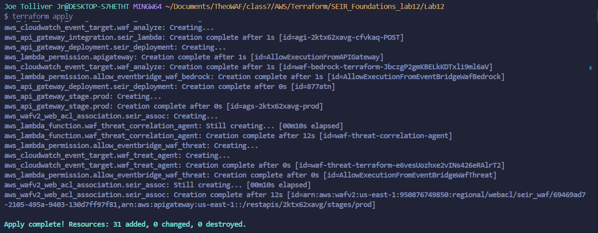

2. Shows that the `WAF ACL` was created and its rules the actions it takes an the priority of each one. 


3. This show how it looks when logged into correctly with a `Access Token` 


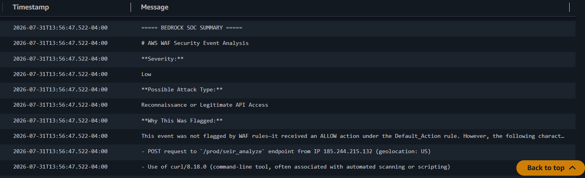

4. Shows the lambda functions both the `waf-bedrock-analyzer` This is set up to run every `10 minutes` and `waf-threat-correlation-agent` This is set up to run every `60 minutes` and the `envirnoment variables` for both 

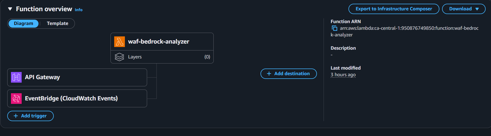

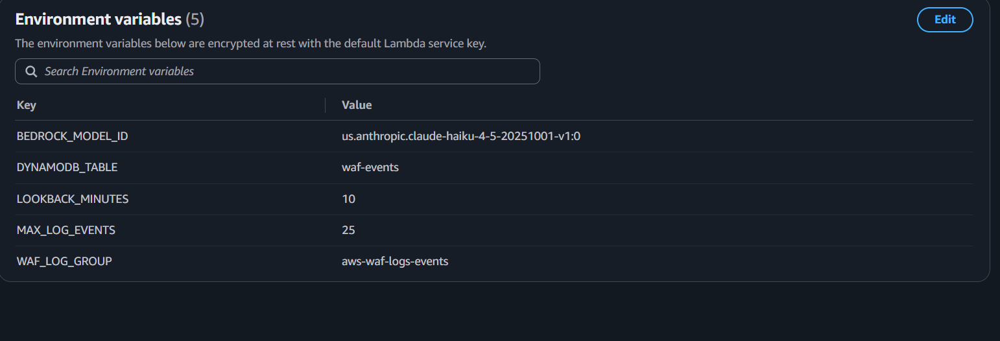


5. Shows the the Dynamodb table created after the lambda function `Waf Bedrock Analyzer` has been run. 

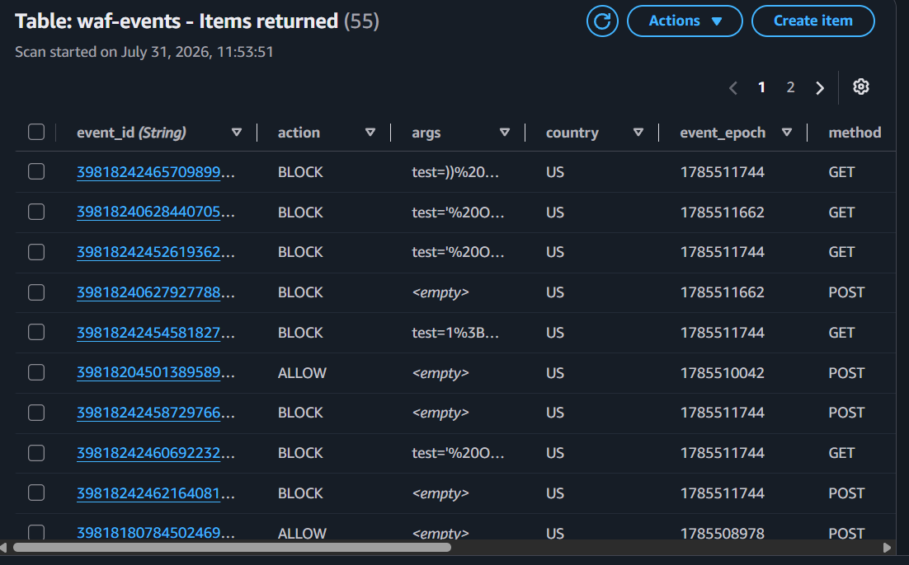

6. Shows the Waf blocking attacks and the information being captured by the `CloudWatch Logs`.  This also shows the `Waf SOC Summary` and what was actually blocked.

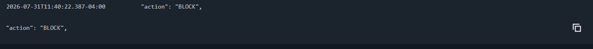


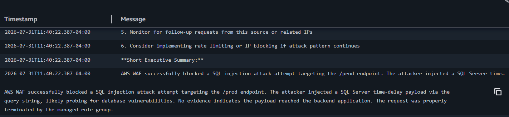

7. This shows the `waf-threat-correlation-agent` after taking the information from the Waf Bedrock Anaylzer after `60 minutes`.  The Dynamodb table is also created.

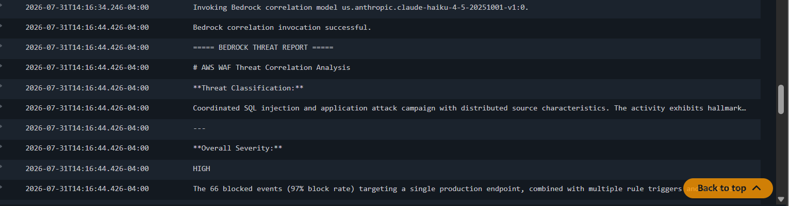

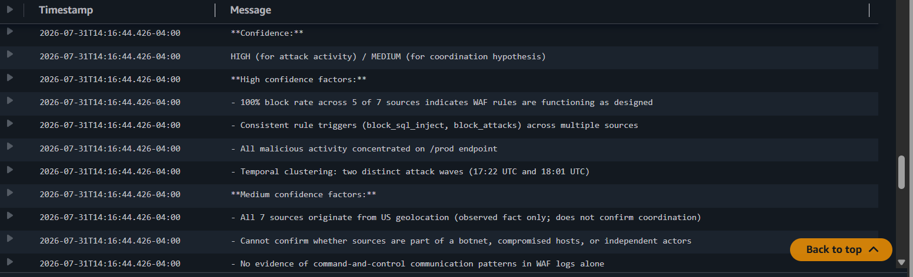


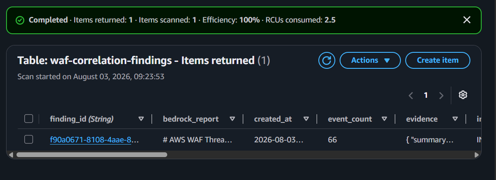

8. This shows the new function the `SOAR Response Agent` along with its environment variables it takes the information from the `waf-correlation-findings` and validates the finding has not already been processed, selects a response from the playbook, ask bedrock to create summaries, incident records, and send notifications.


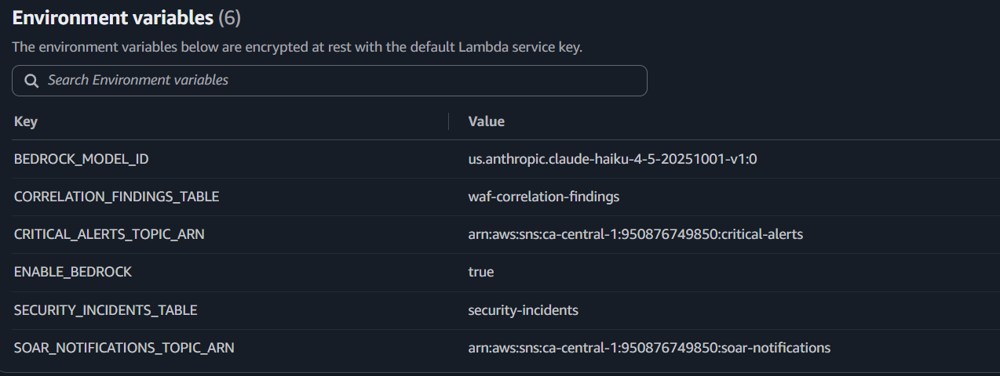

9. The correlation information is sent to the `SOAR agent` it can now create incident record and alerts.  It creates the Dynamodb table for `Security Incidents` and `CloudWatch Logs` along with sending `SNS` depending on the `Severity` from the `Playbook`

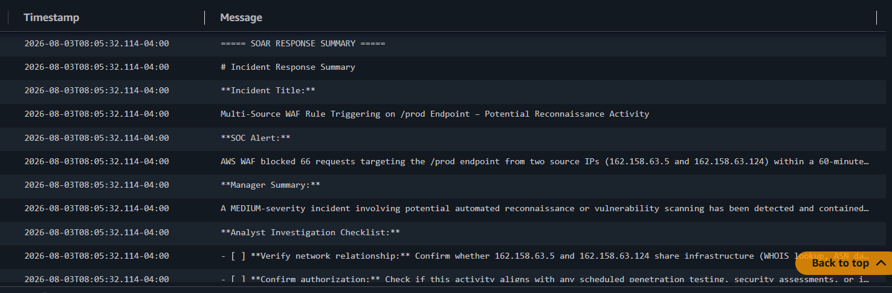

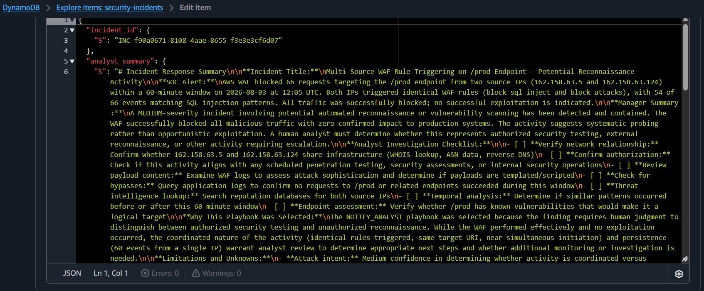


---

## 8. Steps used to teardown / destroy the infrastructure


1. Run `terraform destroy` from the project root and review the destroy plan before confirming.
2. Verify in the AWS Console that the Web ACL, API Gateway, Cognito User Pool, both Lambdas, both DynamoDB tables, the CloudWatch log group, and both EventBridge rules are gone.
3. Note: the **AWS Marketplace subscription** to the Bedrock model is an account-level grant, not a Terraform-managed resource — it is not removed by `destroy` and does not need to be, since it costs nothing on its own (you're only billed for actual model invocations).
4. Double-check CloudWatch for any orphaned log groups Lambda auto-creates (`/aws/lambda/...`) that Terraform doesn't manage, since those keep incurring storage cost until deleted manually.

---

## 9. Lessons learned

### What Did You Learn While Building This Lab?

This lab helped demonstrate how AWS security logs can be used as evidence for automated threat analysis. Instead of only viewing raw WAF logs manually, the project shows how logs can be normalized, stored, scored, and summarized using cloud-native services.

Key learning areas:

- How AWS WAF logs can be read from CloudWatch Logs.
- How Lambda functions can process security events automatically.
- How DynamoDB can store normalized security evidence and final findings.
- How Amazon Bedrock can generate incident summaries from structured security data.
- How a second Lambda function can correlate multiple WAF events instead of analyzing only one event at a time.
- How environment variables make Lambda functions configurable without hardcoding values.
- How to move from a scheduled/batch pattern to an **event-driven** one using EventBridge event patterns instead of `rate()` schedules.
- How to make automation **idempotent** using a deterministic resource ID (`INC-<finding_id>`) plus a DynamoDB conditional write, so a retried event can't create a duplicate incident.
- Why an EventBridge event payload should carry only routing information, while the authoritative record stays in DynamoDB — it keeps downstream consumers from acting on stale or incomplete event data.
- How splitting one shared IAM role into purpose-specific roles per Lambda makes it much easier to reason about (and fix) permission errors one function at a time.

### What struggles did you have while completing this project?
- Scoping IAM correctly for Bedrock: invoking Claude Haiku 4.5 requires authorizing *both* the foundation-model ARN and the cross-region inference-profile ARN (the `us.`-prefixed one) — missing either produces an `AccessDenied` on invoke.
- Remembering the one-time AWS Marketplace subscription step Bedrock needs before a third-party model can be invoked at all.
- The WAF logging destination naming rule: the CloudWatch log group **must** be prefixed `aws-waf-logs-`, or the logging configuration silently fails to attach.
- Timeout issue with Lambda Functions: have to set a timeout default is 3 seconds which isn't enough time to run the labs.
- Dynamodb table was not creating return items when when the WAF information was coming through.  How to make changes to the script to push it through.
- A broken cross-file Terraform reference on the SNS topic ARN (pointing at the wrong resource) caused `sns:Publish` calls from `soar_response_agent` to fail until it was corrected.

### How Did You Save Money After Completing the Teardown?

To reduce cost, the infrastructure should be destroyed when the lab is complete.


---

## 10. References

**a. AWS / Terraform documentation**
- [AWS WAFv2 Web ACL — Terraform Registry](https://registry.terraform.io/providers/hashicorp/aws/latest/docs/resources/wafv2_web_acl)
- [AWS WAFv2 Web ACL Rule — Terraform Registry](https://registry.terraform.io/providers/hashicorp/aws/latest/docs/resources/wafv2_web_acl_rule)
- [AWS WAFv2 Web ACL Association — Terraform Registry](https://registry.terraform.io/providers/hashicorp/aws/latest/docs/resources/wafv2_web_acl_association)
- [AWS WAFv2 Logging Configuration — Terraform Registry](https://registry.terraform.io/providers/hashicorp/aws/latest/docs/resources/wafv2_web_acl_logging_configuration)
- [API Gateway REST API — Terraform Registry](https://registry.terraform.io/providers/hashicorp/aws/latest/docs/resources/api_gateway_rest_api)
- [API Gateway Method — Terraform Registry](https://registry.terraform.io/providers/hashicorp/aws/latest/docs/resources/api_gateway_method)
- [API Gateway Integration — Terraform Registry](https://registry.terraform.io/providers/hashicorp/aws/latest/docs/resources/api_gateway_integration)
- [API Gateway Authorizer — Terraform Registry](https://registry.terraform.io/providers/hashicorp/aws/latest/docs/resources/api_gateway_authorizer)
- [Cognito User Pool — Terraform Registry](https://registry.terraform.io/providers/hashicorp/aws/latest/docs/resources/cognito_user_pool)
- [Cognito Resource Server — Terraform Registry](https://registry.terraform.io/providers/hashicorp/aws/latest/docs/resources/cognito_resource_server)
- [Cognito User Pool Client — Terraform Registry](https://registry.terraform.io/providers/hashicorp/aws/latest/docs/resources/cognito_user_pool_client)
- [DynamoDB Table — Terraform Registry](https://registry.terraform.io/providers/hashicorp/aws/latest/docs/resources/dynamodb_table)
- [Lambda Function — Terraform Registry](https://registry.terraform.io/providers/hashicorp/aws/latest/docs/resources/lambda_function)
- [CloudWatch Event Rule — Terraform Registry](https://registry.terraform.io/providers/hashicorp/aws/latest/docs/resources/cloudwatch_event_rule)
- [CloudWatch Log Group — Terraform Registry](https://registry.terraform.io/providers/hashicorp/aws/latest/docs/resources/cloudwatch_log_group)
- [Amazon Bedrock — Model Access & Permissions](https://docs.aws.amazon.com/bedrock/latest/userguide/model-access.html#model-access-permissions)
- [Cross Region Inference](https://docs.aws.amazon.com/bedrock/latest/userguide/geographic-cross-region-inference.html)
- [Region Compatibility](https://docs.aws.amazon.com/bedrock/latest/userguide/models-region-compatibility.html)
- [Models Region Compatibility](https://docs.aws.amazon.com/bedrock/latest/userguide/models-region-compatibility.html)

---

## 11. Troubleshooting

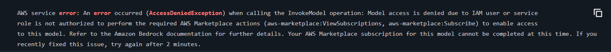

## AWS Marketplace

`aws-marketplace:Subscribe` = Allows an IAM entity to subscribe to AWS Marketplace products, including Amazon Bedrock foundation models.

`aws-marketplace:ViewSubscriptions` = Allows an IAM identity to return a list of AWS Marketplace products, including Amazon Bedrock foundation models.

`aws-marketplace:Unsubscribe` = Allows an IAM identity to unsubscribe from AWS Marketplace products, including Amazon Bedrock foundation models.

Once any identity in your account successfully subscribes to this model (in any region), every role/user in the account can invoke it without marketplace permissions going forward
       
one-time AWS Marketplace subscription that Bedrock automatically tries to create the first time any identity in your account invokes a third-party model like Claude.

```      
Loose
{
  "Effect" : "Allow"
  "Action" : ["aws-marketplace:Subscribe",
  "aws-marketplace:ViewSubscriptions"
   ]
   Resource = "*"
}


Tighten 
{
  Effect = "Allow"
  Action = ["aws-marketplace:Subscribe", 
"aws-marketplace:ViewSubscriptions"]
  Resource = "*"
  Condition = {
    "ForAllValues:StringEquals" = {
      "aws-marketplace:ProductId" = ["<the specific product ID for this model>"]
    }
```

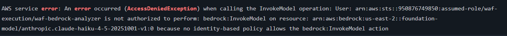

If you get this error with a model with cross-region inference profile: the us. prefix means Bedrock can route your request to any of several underlying regions (typically us-east-1, us-east-2, us-west-2) — not necessarily whichever region your Lambda itself runs in. 

When it does this the fix is widen the foundation-model resource to cover all regions the us. profile can use

This applies to the other regions as well eu and apac prefixes as well.

```
Hardcode Ex.
{
  "Effect" : "Allow"
  "Action" : ["bedrock:InvokeModel"],
  "Resource" : [
    "arn:aws:bedrock:us-east-1::foundation-model/anthropic.claude-haiku-4-5-20251001-v1:0",
    "arn:aws:bedrock:us-east-2::foundation-model/anthropic.claude-haiku-4-5-20251001-v1:0",
    "arn:aws:bedrock:us-west-2::foundation-model/anthropic.claude-haiku-4-5-20251001-v1:0",
    "arn:aws:bedrock:${var.region}:${data.aws_caller_identity.current.account_id}:inference-profile/us.anthropic.claude-haiku-4-5-20251001-v1:0"
  ]
}

Wildcard Ex.
{
  "Effect" : "Allow"
  "Action" : ["bedrock:InvokeModel"],
  "Resource" : [
    "arn:aws:bedrock:*::foundation-model/anthropic.claude-haiku-4-5-202,51001-v1:0"
    "arn:aws:bedrock:${var.region}:${data.aws_caller_identity.current.account_id}:inference-profile/us.anthropic.claude-haiku-4-5-20251001-v1:0"
  ]
}
```

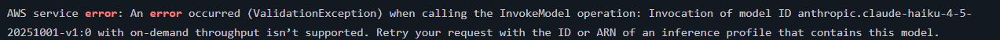

when using a model with Cross-region inference the resource for the IAM needs 2 the foundational-model and the inference-profile and for the inference-profile the model need to have the us. prefix.  And when using the Environmental Variable and BEDROCK_MODEL_ID point it to the us. prefix model. ex:BEDROCK_MODEL_ID = "us.anthropic.claude-haiku-4-5-20251001-v1:0"
The prefix also depends on the region you are using if it not in the US the us. prefix is incorrect. AWS group-level geographic prefixes are restricted to major multi-region zones like us (United States), eu (Europe), and apac (Asia-Pacific). 

```
{
        "Effect" : "Allow"
        "Action" : [
          "bedrock:InvokeModel"
        ],
        "Resource" : [ 
          "arn:aws:bedrock:*::foundation-model/anthropic.claude-haiku-4-5-20251001-v1:0", "arn:aws:bedrock:${var.region}:${data.aws_caller_identity.current.account_id}:inference-profile/us.anthropic.claude-haiku-4-5-20251001-v1:0",
        ]
      }
```


This error is from the `waf_threat_corelation_agent.py`, its rejecting the float values and needs to go in as Decimal. 

change `decimal_to_native` to `native_to_decimal` on all of the `decimal_to_native` in the code

add this line into the code `findings_table.put_item(Item=native_to_decimal(item))`

```
# ============================================================
# Finding persistence
# ============================================================

def determine_overall_risk(
    evidence_package: dict[str, Any],
) -> tuple[int, str, str | None]:
    """Determine the highest deterministic risk in the window."""

    source_findings = evidence_package.get(
        "top_source_ips",
        [],
    )

    if not source_findings:
        return 0, "LOW", None

    highest = source_findings[0]

    return (
        highest.get("risk_score", 0),
        highest.get("severity", "LOW"),
        highest.get("source_ip"),
    )


def save_finding(
    evidence_package: dict[str, Any],
    bedrock_report: str,
) -> str:
    """Store the final correlation finding."""

    finding_id = str(uuid.uuid4())
    created_at = datetime.now(timezone.utc).isoformat()

    risk_score, severity, primary_source_ip = (
        determine_overall_risk(evidence_package)
    )

    targeted_uris = evidence_package.get(
        "top_targeted_uris",
        [],
    )

    primary_target = (
        targeted_uris[0].get("uri")
        if targeted_uris
        else None
    )

    item = {
        "finding_id": finding_id,
        "created_at": created_at,
        "window_start": evidence_package[
            "analysis_window"
        ]["start"],
        "window_end": evidence_package[
            "analysis_window"
        ]["end"],
        "severity": severity,
        "risk_score": risk_score,
        "event_count": evidence_package["summary"][
            "total_events"
        ],
        "primary_source_ip": (
            primary_source_ip or "NONE"
        ),
        "primary_target": primary_target or "NONE",
        "status": "OPEN",
        "bedrock_report": bedrock_report,
        "evidence": evidence_package,
    }

    findings_table.put_item(Item=native_to_decimal(item))

    print(
        f"Saved correlation finding {finding_id} "
        f"with severity {severity}."
    )

    return finding_id
  ```
---

## 12. Useful Code

### Get Access Token

aws cognito-idp initiate-auth \
  --auth-flow USER_PASSWORD_AUTH \
  --client-id <your id> \
  --auth-parameters USERNAME=<your username>,PASSWORD=<your password> \
  --region <your region>


  curl -i -X Post https://abc123xyz9.execute-api.<your region>.amazonaws.com/<stage name> \-H "Authorization: Bearer"

## 13. Author & Contributors

- **Author:** Joe Tolliver
- **Group Leader:** Jaqcues Payne
- **Group Name:** TKO
- **Date / Version:** 8-11-2026 (Lab 12a)
