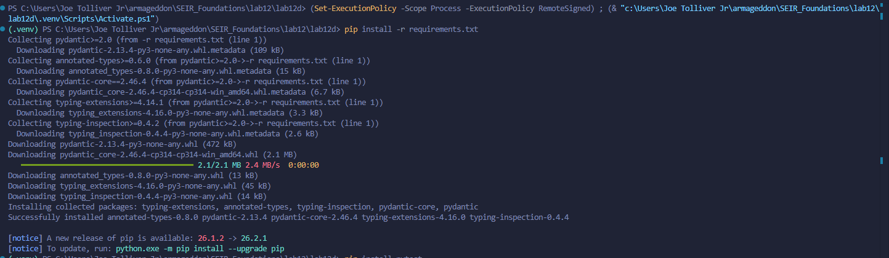
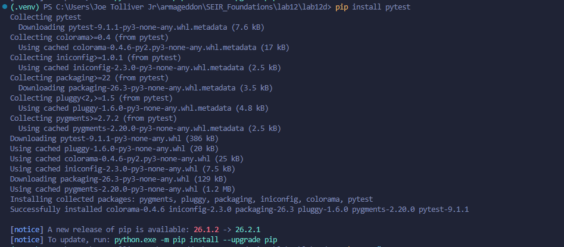
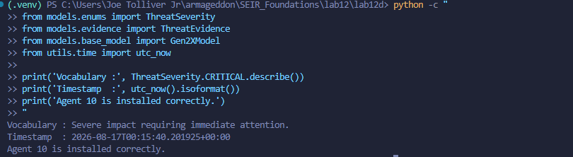
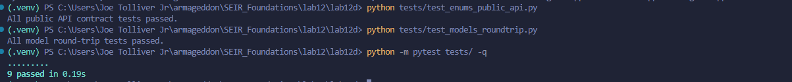
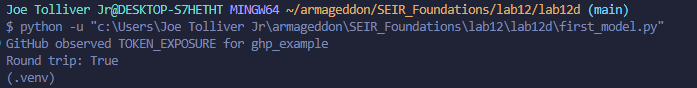
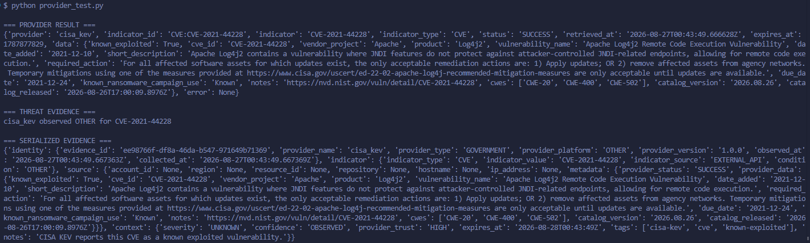
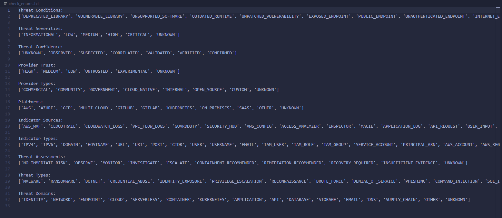
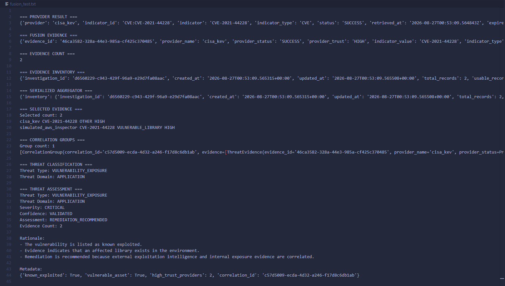
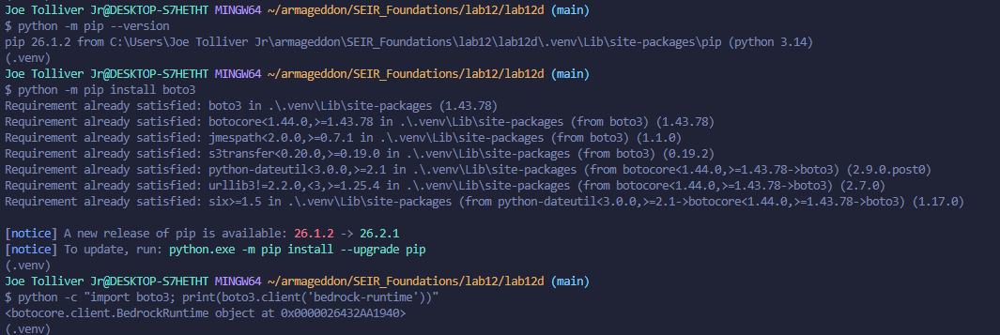
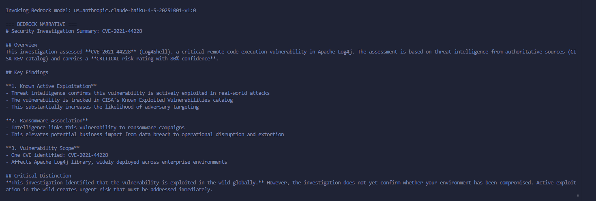

# Lab 12d - Agent 10 — Gen2X Domain Models, Trust, Response, and Reporting Lab

---

## 1. Title — What Is This Lab Supposed to Do?

This lab documents **Agent 10**, a local Python-based security architecture project for the Gen2X investigation engine.

The purpose of Agent 10 is to define the shared **domain models**, **enums**, **trust boundaries**, **response structures**, and **reporting contracts** used by the larger Gen2X agent system.

Instead of each security agent using its own loose strings and custom data structures, Agent 10 creates a common language for concepts such as:

- Provider
- Evidence
- Indicator
- Threat
- Severity
- Confidence
- Trust
- Response
- Authorization
- Report
- Accountability

This lab helps prove that the project can represent security evidence, model threats, recommend responses, and prepare reporting structures in a consistent and testable way.

---

## 2. Custom Badges


---

## 3. Lab / Task / Project Overview

Agent 10 is the **domain-model layer** of the Gen2X security architecture.

The project focuses on defining what security data should look like before other agents collect, analyze, correlate, respond to, or report on that data.

Conceptually, the Agent 10 flow is:

```text
Provider / Agent
      |
      v
Observation
      |
      v
Evidence
      |
      v
Analysis / Fusion
      |
      v
Threat
      |
      v
Response
      |
      v
Report
      |
      v
Human Decision / Authorized Execution
```

The key idea is that **observation is not the same as conclusion**, and **recommendation is not the same as execution**.

Agent 10 helps separate the following security concepts:

| Concept | Meaning |
|---|---|
| Trust | How much the system should trust the source |
| Provenance | Where the information came from |
| Confidence | How strongly evidence supports the conclusion |
| Severity | How serious the condition would be |
| Authority | Who or what is permitted to take action |
| Accountability | Who made a decision and why |

This project also supports future security agents by giving them shared objects instead of forcing every agent to invent its own vocabulary.

---

## 4. Lab / Task / Project Requirements

### Required Tools

| Requirement | Used? | Purpose |
|---|---:|---|
| Python | Yes | Main programming language for Agent 10 |
| VS Code | Yes | Code editor used to build and inspect the project |
| Virtual Environment | Yes | Keeps Python dependencies isolated |
| pip | Yes | Installs project dependencies from `requirements.txt` |
| Pydantic | Yes | Provides model validation and structured data contracts |
| Pytest | Yes | Used to test the model and provider behavior |
| Git | Recommended | Tracks project changes and supports GitHub documentation |


### Suggested Environment

```text
Operating System: Windows
Editor: VS Code
Shell: PowerShell, Command Prompt, Git Bash, or VS Code Terminal
Language: Python 3.x
Project Type: Local security architecture / agent model lab
```

---

## 5. Project / Folder Structure

The project folder shown in the screenshot uses the following layout:

```text
Agent10-Project/
|
├── .pytest_cache/
├── .venv/
├── agents/
├── env/
├── general/
├── models/
├── providers/
├── screenshots/
├── tests/
├── utils/
|
├── check_enums.py
├── check_enums.txt
├── first_model.py
├── fusion_test.py
├── fusion_test.txt
├── install.md
├── playbook.md
├── provider_test.py
├── provider_test.txt
├── readme.md
└── requirements.txt
```

### Folder Breakdown

| Folder / File | Purpose |
|---|---|
| `.pytest_cache/` | Created by Pytest after test execution |
| `.venv/` | Local Python virtual environment |
| `agents/` | Agent logic that can perform work such as fusion, response, or reporting |
| `env/` | Environment-related configuration or notes |
| `general/` | General project files or shared notes |
| `models/` | Core Agent 10 domain models and enums |
| `providers/` | Provider-related logic and tests for evidence sources |
| `screenshots/` | Folder used to store documentation screenshots |
| `tests/` | Test files used to validate behavior |
| `utils/` | Shared helper functions |
| `check_enums.py` | Script used to validate enum behavior |
| `check_enums.txt` | Captured output or notes from enum validation |
| `first_model.py` | Early model validation or demonstration script |
| `fusion_test.py` | Script used to test fusion behavior |
| `fusion_test.txt` | Captured output from fusion testing |
| `install.md` | Installation instructions or setup notes |
| `playbook.md` | Project playbook or operating notes |
| `provider_test.py` | Script used to test provider behavior |
| `provider_test.txt` | Captured output from provider testing |
| `readme.md` | Existing readme or notes file |
| `requirements.txt` | Python dependency list |

### Agent 10 Model Structure

Agent 10 primarily lives in the `models/` folder. A typical model layout may include:

```text
models/
|
├── __init__.py
├── base_model.py
|
├── enums/
|   |
|   ├── __init__.py
|   ├── base_enum.py
|   ├── indicator_enums.py
|   ├── provider_enums.py
|   ├── threat_enums.py
|   ├── report_enums.py
|   ├── response_enums.py
|   ├── cache_enums.py
|   └── platform_enums.py
|
├── indicator.py
├── provider.py
├── evidence.py
├── threat.py
├── response.py
└── report.py
```

---

## 6. Steps Used to Complete This Lab

### Step 1 - Create and Activate the Virtual Environment 


Create a virtual environment.

```bash
python -m venv .venv
```

Activate it in PowerShell:

```powershell
.\.venv\Scripts\Activate.ps1
```

Activate it in Command Prompt:

```cmd
.venv\Scripts\activate.bat
```

Activate it in Git Bash:

```bash
source .venv/Scripts/activate
```

### Step 4 — Install Dependencies

Install the required packages.

```bash
pip install -r requirements.txt
```

Confirm installed packages if needed.

```bash
pip list
```

### Step 5 — Build the Agent 10 Domain Model Layer

The `models/` folder defines the shared model layer for the Gen2X architecture.

Important model categories include:

```text
Indicator
Provider
Evidence
Threat
Response
Report
```

Important enum categories include:

```text
ThreatSeverity
ThreatConfidence
ThreatCondition
ResponseAction
ResponsePriority
InvestigationStatus
ApprovalStatus
ExecutionMode
ReportStatus
PlatformTrustLevel
PlatformService
```

### Step 6 — Validate Enum Behavior

Run the enum validation script.

```bash
python check_enums.py
```

Save or review the output in:

```text
check_enums.txt
```

This helps verify that the controlled vocabulary works as expected.

### Step 7 — Test the First Model

Run the first model script.

```bash
python first_model.py
```

This step helps confirm that the basic Pydantic model structure is working.

### Step 8 — Test Provider Behavior

Run the provider test.

```bash
python provider_test.py
```

Review or save output in:

```text
provider_test.txt
```

This helps verify that provider-related structures can represent where evidence comes from.

### Step 9 — Test Fusion Behavior

Run the fusion test.

```bash
python fusion_test.py
```

Review or save output in:

```text
fusion_test.txt
```

This helps test how evidence can move toward analysis and threat conclusions.

### Step 10 — Run Pytest

Run the full test suite.

```bash
pytest -q
```

If Pytest is not installed, install it:

```bash
pip install pytest
```

Then run the test again:

```bash
pytest -q
```

---

## 7. Screenshots
1. Shows the Lab12d virtual environment activated and the required Python dependencies being installed successfully.



2. Shows pytest being installed successfully inside the Lab12d Python virtual environment so the project's automated tests can be executed.



3. Confirms the Agent 10 installation by successfully importing core models, enums, and utility functions, then displaying a severity description and UTC timestamp.



4. Shows the Agent 10 validation tests completing successfully, including enum API tests, model round-trip tests, and the full pytest suite with 9 tests passed.



5. Shows first_model.py executing successfully.



6. Shows the CISA KEV provider successfully retrieving real intelligence for CVE-2021-44228, converting the provider response into Threat Evidence, and serializing the normalized evidence.



7. Displays the available Agent 10 security vocabulary, including threat conditions, severities, confidence levels, provider trust levels, indicator types, threat assessments, threat types, and threat domains.



8. Shows the Fusion pipeline successfully combining CISA KEV and simulated AWS Inspector evidence, correlating them into one investigation, and classifying the result as a Vulnerability Exposure in the Application domain with Critical severity and Validated confidence.



9. Confirms that Boto3 is installed in the active virtual environment and that Python can successfully create an Amazon Bedrock Runtime client.



10. Shows Amazon Bedrock successfully generating a security-manager narrative from the completed investigation while preserving the deterministic findings, including critical risk, known exploitation, ransomware association, and the distinction between exposure and confirmed compromise.



---

## 8. Steps Used to Teardown or Destroy Infrastructure / Resources

This lab is a local Python project, so there is no cloud infrastructure to destroy unless this project is later connected to AWS, GCP, or another cloud provider.

### Local Teardown Steps

Deactivate the virtual environment:

```bash
deactivate
```

Remove temporary Pytest cache if desired:

```bash
rm -rf .pytest_cache
```

On Windows PowerShell:

```powershell
Remove-Item -Recurse -Force .pytest_cache
```

Remove Python cache folders if needed:

```bash
find . -type d -name "__pycache__" -exec rm -rf {} +
```

On Windows PowerShell:

```powershell
Get-ChildItem -Recurse -Directory -Filter "__pycache__" | Remove-Item -Recurse -Force
```

Remove the virtual environment only if you want to rebuild dependencies from scratch:

```bash
rm -rf .venv
```

On Windows PowerShell:

```powershell
Remove-Item -Recurse -Force .venv
```

### Cost-Saving Note

Because this lab is local, it should not create cloud costs by itself.

If Agent 10 is later connected to AWS or GCP resources, confirm that cloud resources are destroyed after testing.

---

## 9. Lessons Learned

### What Did You Learn While Building This Lab?

This lab teaches that agentic security systems need disciplined architecture.

The most important lesson is that a security system should not mix up evidence, conclusions, recommendations, authorization, execution, and reporting.

Agent 10 makes those boundaries easier to see.

### What Is Relatable to the User or Customer?

A customer or user does not only need to know that a security system detected something.

They also need to know:

- What was observed
- Where the observation came from
- Why the system believes it matters
- How confident the system is
- How serious the issue could be
- What action is recommended
- Whether anyone is authorized to take that action
- Who is accountable for the final decision
- What was reported to humans at the time

This helps turn raw security data into an explainable security record.

### What Struggles Came Up During the Project?

Possible struggles include:

- Understanding the difference between severity and confidence
- Understanding the difference between trust and confidence
- Making sure models do not become too broad or unclear
- Keeping recommendations separate from execution
- Making sure provider evidence preserves provenance


### How Did You Save Money After Completing the Teardown?

This lab is local, so there should be no direct cloud cost.

Cost savings come from:

- Avoiding unnecessary cloud deployments during early model design
- Testing locally before integrating with AWS or GCP
- Keeping the project focused on Python models before adding paid services
- Removing local cache files and unused virtual environments when finished

---

## 10. References

### Documentation

- Python Software Foundation. (n.d.). *Python documentation*. https://docs.python.org/3/
- Pydantic. (n.d.). *Pydantic documentation*. https://docs.pydantic.dev/
- Pytest. (n.d.). *pytest documentation*. https://docs.pytest.org/


### Project References

- `install.md`
- `playbook.md`
- `readme.md`
- `requirements.txt`
- Agent 10 local project files
- Gen2X class/lab notes

### Related Architecture Concepts

- Domain-driven design
- Security evidence provenance
- Threat modeling
- Security investigation lifecycle
- Accountable reporting
- Human approval and response governance

---

## 11. Troubleshooting Section


### Virtual Environment Problems

If the virtual environment does not activate in PowerShell, the execution policy may be blocking scripts.

Temporary PowerShell option:

```powershell
Set-ExecutionPolicy -Scope Process -ExecutionPolicy Bypass
```

Then activate again:

```powershell
.\.venv\Scripts\Activate.ps1
```

### Pytest Problems

If Pytest is not found:

```bash
pip install pytest
```

Then run:

```bash
pytest -q
```

### Cache Cleanup

Remove Pytest cache:

```bash
rm -rf .pytest_cache
```

Remove Python cache folders:

```bash
find . -type d -name "__pycache__" -exec rm -rf {} +
```

---

## 12. Author & Contributors

- **Author:** Joe Tolliver
- **Group Leader:** Jaqcues Payne
- **Group Name:** TKO
- **Date / Version:** 8-25-2026 (Lab 12d)

---

## Final Notes

Agent 10 is not just a Python model lab.

It is the foundation for building an accountable security system where agents can communicate using the same vocabulary, preserve evidence provenance, separate recommendations from execution, and produce reports that explain what was known at the time.

