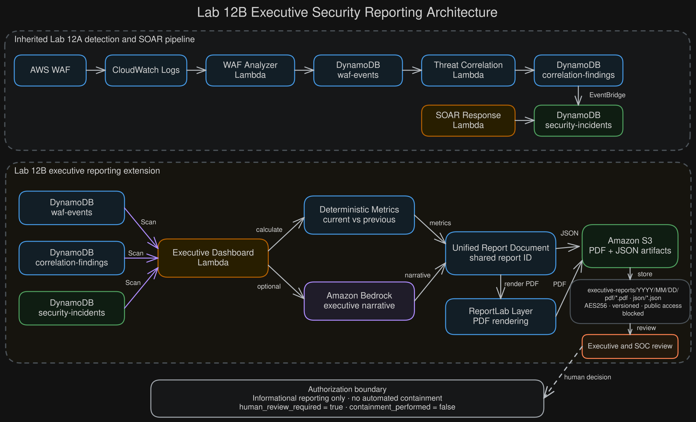

# Lab 12B: Executive Security Reporting

Lab 12B extends the standalone Lab 12A event-driven SOAR deployment with an
executive security reporting workflow.

The implementation reads WAF events, correlation findings, and security
incidents from DynamoDB, calculates deterministic current-period and
previous-period metrics, optionally uses Amazon Bedrock for executive
narrative generation, renders a PDF with ReportLab, publishes synchronized
PDF and JSON artifacts to Amazon S3, and preserves the existing human-review
boundary for containment decisions.

## Architecture



PNG preview:

- [`architecture/lab-12b-executive-reporting-architecture.png`](architecture/lab-12b-executive-reporting-architecture.png)

Editable diagram source:

- [`architecture/lab-12b-executive-reporting-architecture.excalidraw`](architecture/lab-12b-executive-reporting-architecture.excalidraw)

Inherited Lab 12A SOAR architecture:

- [`architecture/lab-12a-soar-architecture.svg`](architecture/lab-12a-soar-architecture.svg)
- [`architecture/lab-12a-soar-architecture.excalidraw`](architecture/lab-12a-soar-architecture.excalidraw)

Primary workflow:

```text
AWS WAF
  -> CloudWatch Logs
  -> WAF analyzer Lambda
  -> DynamoDB waf-events
  -> threat-correlation Lambda
  -> DynamoDB waf-correlation-findings
  -> EventBridge
  -> SOAR response Lambda
  -> DynamoDB security-incidents
  -> SNS notifications
  -> human analyst review

DynamoDB waf-events
DynamoDB waf-correlation-findings
DynamoDB security-incidents
  -> executive-dashboard Lambda
  -> deterministic metrics and period comparison
  -> optional Amazon Bedrock narrative
  -> ReportLab PDF rendering
  -> Amazon S3 PDF and JSON artifacts
  -> executive and SOC review
```

CRITICAL findings continue to route both to the SOAR Lambda and directly to
the critical-alert SNS topic.

## Deterministic response and reporting behavior

The inherited Lab 12A SOAR playbook remains:

| Severity | Automated response |
|---|---|
| LOW | Record only |
| MEDIUM | Notify analyst |
| HIGH | Notify analyst and create an incident |
| CRITICAL | Notify analyst, create an incident, and request containment approval |

The executive reporting Lambda:

- scans the three authoritative DynamoDB tables
- calculates current-period and previous-period metrics
- calculates security posture from observed findings and incidents
- identifies material changes between reporting periods
- generates a Bedrock narrative when enabled
- uses a deterministic fallback narrative when Bedrock is unavailable
- generates synchronized PDF and JSON artifacts from the same report document
- publishes artifacts under a date-partitioned S3 prefix
- performs no containment action

Expected control fields include:

```text
human_review_required = true
containment_performed = false
```

## Authorization boundary

Lab 12B is authorized to:

- retrieve and validate existing WAF events
- retrieve existing correlation findings
- retrieve existing security incidents
- calculate deterministic report metrics
- compare current and previous reporting periods
- invoke the configured Bedrock model for narrative generation
- render an executive PDF in Lambda memory
- publish synchronized PDF and JSON report objects to the designated S3 prefix
- retain the existing SOAR notification and human-review workflow

Lab 12B is not authorized to:

- block IP addresses automatically
- modify WAF rules automatically
- isolate hosts or workloads
- disable users or credentials
- modify incident disposition automatically
- perform any containment action without explicit human approval

## Key AWS resources

The standalone Terraform configuration creates the Lab 12 baseline, Lab 12A
SOAR layer, and Lab 12B executive reporting layer, including:

- WAF and protected API resources
- CloudWatch log groups
- analyzer, correlation, SOAR, and executive-dashboard Lambda functions
- `waf-events` DynamoDB table
- `waf-correlation-findings` DynamoDB table
- `security-incidents` DynamoDB table
- EventBridge routing rules and targets
- standard SOAR notification SNS topic
- critical-alert SNS topic
- executive report S3 bucket
- ReportLab Python 3.12 x86_64 Lambda layer
- least-privilege IAM roles and policies

The report bucket uses:

- S3 Block Public Access
- bucket-owner-enforced object ownership
- AES256 default encryption
- versioning
- an HTTPS-only bucket policy
- a scoped report prefix
- `force_destroy = true` for controlled lab teardown

## Executive reporting environment variables

The executive-dashboard Lambda uses:

```text
WAF_EVENTS_TABLE
CORRELATION_FINDINGS_TABLE
SECURITY_INCIDENTS_TABLE
REPORT_BUCKET
REPORT_PREFIX
BEDROCK_MODEL_ID
ENABLE_BEDROCK
REPORT_PERIOD_HOURS
MAX_ITEMS_PER_TABLE
ORGANIZATION_NAME
REPORT_TITLE
```

The inherited SOAR Lambda uses:

```text
CORRELATION_FINDINGS_TABLE
SECURITY_INCIDENTS_TABLE
SNS_TOPIC_ARN
BEDROCK_MODEL_ID
ENABLE_BEDROCK
```

## Repository layout

```text
lab-12b/
├── architecture/
│   ├── lab-12a-soar-architecture.excalidraw
│   ├── lab-12a-soar-architecture.png
│   ├── lab-12a-soar-architecture.svg
│   ├── lab-12b-executive-reporting-architecture.excalidraw
│   ├── lab-12b-executive-reporting-architecture.png
│   └── lab-12b-executive-reporting-architecture.svg
├── evidence/
│   ├── README.md
│   ├── redactions.example.json
│   ├── 01-*.png through 25-*.png
│   ├── 18-executive-security-report.pdf
│   ├── 20-populated-executive-security-report.pdf
│   └── 20-populated-executive-security-report.json
├── layers/
│   └── reportlab/
│       └── requirements.txt
├── runbooks/
│   ├── lab-12a-soar-response-runbook.md
│   └── lab-12b-executive-reporting-runbook.md
├── scripts/
│   ├── build-reportlab-layer.sh
│   ├── sanitize-evidence.py
│   └── seed-and-run-lab12b-report-test.py
├── src/
│   └── executive_dashboard_agent.py
├── test-events/
│   ├── lab12a-soar.json
│   ├── lab12-correlation.json
│   └── lab12b-executive-report.json
└── terraform/
```

Generated Terraform state, saved plans, local variable files, Lambda archives,
and the built ReportLab layer ZIP are intentionally Git-ignored.

## Configuration

Copy the example variable file and provide local values:

```bash
cd terraform
cp terraform.tfvars.example terraform.tfvars
```

The real `terraform.tfvars` is intentionally Git-ignored. The
`notification_email` variable may be marked sensitive to reduce routine CLI
display, but Terraform sensitivity does not encrypt state or plan files.

For production workflows, provide sensitive values through a protected CI/CD
variable store, HCP Terraform, AWS Systems Manager Parameter Store,
AWS Secrets Manager, or an equivalent secrets platform.

## ReportLab layer build

The build script creates a Lambda-compatible Python 3.12 x86_64 layer without
requiring the local computer to use the same processor architecture:

```bash
./scripts/build-reportlab-layer.sh
```

The completed validation build produced:

```text
Archive: terraform/reportlab-python312-x86_64.zip
Uncompressed size: 27,422,823 bytes
Archive entries: 386
Native libraries: ELF 64-bit x86-64
```

The generated ZIP is excluded from Git.

## Validation

From the `terraform/` directory:

```bash
terraform fmt -check -recursive
terraform init -backend=false
terraform validate
```

Python source validation:

```bash
python3 -m compileall ../src
python3 -m py_compile ../scripts/seed-and-run-lab12b-report-test.py
```

Shell script validation:

```bash
bash -n ../scripts/build-reportlab-layer.sh
```

JSON fixture validation:

```bash
python3 -m json.tool ../test-events/lab12b-executive-report.json >/dev/null
python3 -m json.tool ../test-events/lab12-correlation.json >/dev/null
```

## Deployment boundary

Review the saved plan before applying:

```bash
terraform plan -out=lab12b.tfplan
terraform apply lab12b.tfplan
```

The completed validation deployment created 58 resources.

Schedules remained disabled during controlled testing.

## Verified behavior

The Lab 12B evidence set demonstrates:

- successful 58-resource Terraform deployment
- Python 3.12 x86_64 executive-dashboard Lambda configuration
- successful ReportLab layer loading and PDF rendering
- encrypted synchronized PDF and JSON publication to S3
- an initial empty-data report with `NORMAL` posture
- six controlled synthetic WAF records
- current-period and previous-period comparison
- HIGH correlation finding with deterministic risk score 60
- automatic EventBridge-to-SOAR incident creation
- one incident awaiting human review
- populated executive report with `ELEVATED` posture
- four blocked current-period WAF requests
- one HIGH finding and one open incident
- Bedrock-generated executive narrative
- `containment_performed = false`
- `human_review_required = true`
- AES256 encryption for both report artifacts
- synchronized report IDs between PDF and JSON
- clean no-drift Terraform plan
- reviewed 58-resource destroy plan
- successful destruction of all 58 resources
- post-destroy Terraform state containing zero managed resources
- zero remaining matching AWS resources across Lambda, Lambda layers,
  DynamoDB, EventBridge, Scheduler, SNS, API Gateway, WAF, S3, and
  CloudWatch Logs

See:

- [`evidence/README.md`](evidence/README.md)
- [`runbooks/lab-12a-soar-response-runbook.md`](runbooks/lab-12a-soar-response-runbook.md)
- [`runbooks/lab-12b-executive-reporting-runbook.md`](runbooks/lab-12b-executive-reporting-runbook.md)

## Preserved report artifacts

The populated report artifacts were copied from the report bucket before
teardown:

```text
evidence/20-populated-executive-security-report.pdf
evidence/20-populated-executive-security-report.json
```

Recorded SHA-256 values:

```text
PDF:
6fa0549fe9a95db91dc276e44259c47a01ff18222a69ec6349b51b93d9ef210b

JSON:
4ddb0df9f218debe8a4718893b94c3a2a2320aa425e0857c6d17a29742668437
```

The retained report uses documentation-only IP addresses:

```text
198.51.100.88
203.0.113.45
```

These values are synthetic test data.

## Evidence sanitization

The local utility can permanently flatten coordinate-based redactions,
re-encode screenshots without original metadata, preserve source images by
default, and print input and output SHA-256 hashes:

```bash
python3 scripts/sanitize-evidence.py --help
```

The supplied configuration contains example coordinates only. Replace them
with coordinates measured from the actual screenshot before producing a
sanitized copy.

Evidence review must remove or redact:

- AWS account IDs
- ARNs
- API Gateway invoke URLs
- report bucket names containing account IDs
- personal email addresses
- credentials or tokens
- real public or private IP addresses

Report IDs, incident IDs, synthetic URI paths, WAF rule names, risk scores,
severity values, and documentation-only IP addresses may remain visible.

## Teardown

Create and review a saved destroy plan:

```bash
terraform plan -destroy -out=lab12b-destroy.tfplan
terraform apply lab12b-destroy.tfplan
```

The completed Lab 12B teardown reported:

```text
Plan: 0 to add, 0 to change, 58 to destroy.
Apply complete! Resources: 0 added, 0 changed, 58 destroyed.
PASS: Terraform state contains zero managed resources.
```

The post-destroy AWS inventory check reported zero remaining matching
resources in all inspected service categories.

## Security notes

- Do not commit `terraform.tfvars`.
- Do not commit Terraform state or saved plan files.
- Do not commit generated Lambda ZIP archives.
- Do not commit the generated ReportLab layer ZIP.
- Use fictional account IDs in test fixtures.
- Use documentation-only IP ranges for synthetic records.
- Review screenshots and report artifacts before committing them.
- Keep containment decisions behind explicit human authorization.
